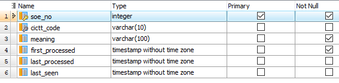

# IO-AVSTATS-DB - Data Dictionary

## 1. General

## 2. Database Tables NTSB

For the data provided by **NTSB** in the form of MS Access databases, the data dictionary was extracted using RazorSQL and transferred to the PostgreSQL database **IO-AVSTATS-DB**. 
This includes the following tables:

- `aircraft`
- `dt_aircraft`
- `dt_events`
- `dt_flight_crew`
- `engines`
- `events`
- `events_sequence`
- `findings`
- `flight_crew`
- `flight_time`
- `injury`
- `narratives`
- `ntsb_admin`
- `occurrences`
- `seq_of_events`

## 3. Database Tables IO-Aero

**IO-Aero** has added the following new tables:

- `io_aviation_occurrence_categories`
- `io_countries`
- `io_lat_long`
- `io_ntsb_2002_2021`
- `io_processed_files`
- `io_states`

### 3.1 `io_aviation_occurrence_categories`

This table contains CICTT codes from the document **Aviation Occurrence Categories**.

<kbd></kbd>

Sample data:

```
Name           |Value                                                                  
---------------+-----------------------------------------------------------------------
cictt_code     |LOC-I                                                                  
identifier     |LOSS OF CONTROL–INFLIGHT                                               
definition     |Loss of aircraft control while, or deviation from intended flightpat...
first_processed|2023-01-18 11:07:38.756                                                
last_processed |                                                                       
last_seen      |2023-01-18 10:07:37.837                                                
```

### 3.2 `io_countries`

This table mainly contains data on latitudes and longitudes of countries.
Currently, only the values of the USA are stored.

The latitude and longitude stored here will be applied to US events that do not themselves contain decimal latitude and longitude and which cannot be determined at the zip code, city or state level.

<kbd></kbd>

Sample data:

```
country|country_name |dec_latitude|dec_longitude|
-------+-------------+------------+-------------+
USA    |United States|    37.09024|   -95.712891|
```

### 3.3 `io_lat_long`

This is the main table for determining missing latitude or longitude for US events.
The table is fed by the following sources:

- `simplemaps United States Cities Database`
- `simplemaps US Zip Codes Database`
- `Zip Codes.org ZIP Code Database`

In addition, the missing values for cities are averaged from the values of the matching zip codes. 

<kbd></kbd>

Sample data:

```
Name           |Value                           |
---------------+--------------------------------+
id             |13620                           |
type           |ZIPCODE                         |
country        |USA                             |
state          |SC                              |
city           |ABBEVILLE                       |
zipcode        |29620                           |
dec_latitude   |34.1813                         |
dec_longitude  |-82.42804                       |
source         |simplemaps US Zip Codes Database|
first_processed|2022-11-29 13:11:16.347         |
last_processed |2022-11-29 13:28:49.520         |
```

### 3.4 `io_ntsb_2002_2021`

In the November 17, 2021, news release [U.S. Civil Aviation Fatalities and Flight Activity Decreased in 2020](https://www.ntsb.gov/news/press-releases/Pages/NR20211117.aspx){:target="_blank"}, the **NTSB** published, among other things, the [US Civil Aviation Accident Statistics](https://www.ntsb.gov/safety/Pages/research.aspx){:target="_blank"}.
These are available on this website at this [link](https://www.ntsb.gov/safety/data/Documents/AviationAccidentStatistics_2002-2021_20221208.xlsx){:target="_blank"} as an MS Excel file.
This file contains 28 worksheets (Table 1 through Table 28) of accumulated data, and in Worksheet 29 (Table 29. Accident Aircraft, 2002 through 2021, US Civil Aviation) (most likely) the underlying event and aircraft details. 
The data from Worksheet 29 were loaded unchanged into this database table.
To simplify the use of the database table, only the columns `ev_year`, `ev_state` and `ev_country`, derived from the columns `event_date`, `state_or_region` and `country`, were added.
The header lines and the empty lines for the loading process were ignored. 

<kbd></kbd>

Sample data:

```
Name                |Value                                           
--------------------+------------------------------------------------
ntsb_number         |MIA02LA056                                      
accident_report     |=HYPERLINK("http://data.ntsb.gov/...","Report")|
event_date          |2002-01-20 00:00:00.000                         
ev_year             |2002                                            
city                |Sarasota                                        
state_or_region     |Florida                                         
ev_state            |FL                                              
country             |United States                                   
ev_country          |USA                                             
latitude            |27.395277                                       
longitude           |-82.553886                                      
fatal_injuries      |                                                
serious_injuries    |                                                
highest_injury_level|None                                            
aircraft_number     |1                                               
damage_level        |Substantial                                     
registration_number |N235AL                                          
aircraft_category   |Airplane                                        
aircraft_make       |Maule                                           
aircraft_model      |M-7-235B                                        
flight_regulation   |Part 91: General aviation                       
flight_schedule_type|                                                
purpose_of_flight   |Personal                                        
intentional_act     |                                                
defining_event      |                                                
phase_of_flight     |                                                
```

### 3.5 `io_processed_files`

This table documents which external files were processed to create and maintain the database content.

<kbd></kbd>

Sample data:

```
Name           |Value                  |
---------------+-----------------------+
file_name      |up22NOV                |
first_processed|2022-11-27 13:40:18.094|
last_processed |2022-12-12 12:08:15.915|
counter        |2                      |
```

### 3.6 `io_sequence_of_events`

This table enables the assignment of CICTT codes via the event sequence number.

<kbd></kbd>

Sample data:

```
soe_no|cictt_code|meaning                                  
------+----------+-----------------------------------------
     0|UNK       |Unknown or undetermined                  
    10|RAMP      |Aircraft loading event                   
    20|RAMP      |Aircraft servicing event                 
    30|          |Preflight or dispatch event              
    40|          |Aircraft maintenance event               
    50|          |Aircraft inspection event                
    60|          |Attempted remediation/recovery           
    70|ADRM      |Airport occurrence                       
    80|RAMP      |Ground handling event                    
    81|RAMP      |AC/prop/rotor contact w person           
    82|RAMP      |Prop/jet/rotor blast/suction             
```

### 3.7 `io_states`

This table mainly contains data on latitudes and longitudes of US states.

The latitude and longitude stored here will be applied to US events that do not themselves contain decimal latitude and longitude and which cannot be determined at the zip code or city level.

<kbd></kbd>

Sample data:

```
country|state|state_name          |dec_latitude |dec_longitude |
-------+-----+--------------------+-------------+--------------+
USA    |AK   |Alaska              |63.7431630974|-151.594035116|
USA    |AL   |Alabama             |32.7570463396| -86.844525962|
```

## 4. Database Views IO-Aero

**IO-Aero** has added the following views:

- `io_app_ae1982`
- `io_lat_long_issues`

### 4.1 `io_app_ae1982`

This materialized view provides all necessary data for **IO-Aero**'s streamlit application `ae1982` (Aviation Events between ...).

<kbd></kbd>

Sample data:

```
Name                         |Value              |
-----------------------------+-------------------+
ev_id                        |20221112106276     |
ntsb_no                      |CEN23MA034         |
ev_type                      |ACC                |
ev_year                      |2022               |
ev_month                     |11                 |
ev_dow                       |SA                 |
country                      |USA                |
state                        |TX                 |
city                         |Dallas             |
zip                          |75237              |
acft_categories              |{AIR,AIR}          |
all_defining_occurrence_codes|{452250,452250}    |
all_finding_codes            |{}                 |
all_occurrence_codes         |{452250,452250}    |
cictt_codes                  |{MAC}              |
dec_latitude                 |32.673779          |
dec_longitude                |-96.862801         |
dest_countries               |{}                 |
dprt_countries               |{}                 |
ev_counter                   |1                  |
ev_highest_injury            |FATL               |
far_parts                    |{091,091}          |
finding_codes                |{}                 |
inj_f_grnd                   |0                  |
inj_tot_f                    |6                  |
is_altitude_controllable     |false              |
is_altitude_low              |true               |
is_atttitude_controllable    |false              |
is_dest_country_usa          |false              |
is_dprt_country_usa          |false              |
is_emergency_landing         |true               |
is_far_part_091x             |true               |
is_far_part_121              |false              |
is_far_part_135              |false              |
is_midair_collision          |true               |
is_narrative_stall           |false              |
is_oper_country_usa          |true               |
is_owner_country_usa         |true               |
is_pilot_issue               |false              |
is_regis_country_usa         |true               |
is_spin_stall                |false              |
latlong_acq                  |MEAS               |
no_aircraft                  |2                  |
occurrence_codes             |{MAN_LALT,MAN_LALT}|
oper_countries               |{USA,USA}          |
owner_countries              |{USA,USA}          |
regis_countries              |{NON-US,USA}       |
regis_nos                    |{N6763,N7227C}     |
```

#### Original Data - Unconditional

- `events.ev_highest_injury`
- `events.ev_id`
~~- `events.ev_month`~~
- `events.ev_type`
- `events.ev_year`
- `events.inj_f_grnd`
- `events.inj_tot_f`
- `events.io_dec_latitude_deviating`
- `events.io_dec_longitude_deviating`
- `events.io_invalid_latitude`
- `events.io_invalid_longitude`
- `events.io_invalid_us_city`
- `events.io_invalid_us_city_zip_code`
- `events.io_invalid_us_state`
- `events.io_invalid_us_zipcode`
- `events.ntsb_no`

#### Original Data - with Conditions

~~- `events.ev_dow` - capital letters~~
- `events.io_city` - if empty `events.ev_city`
- `events.io_country` - if empty `events.ev_country`
- `events.io_dec_latitude` - if empty `events.ev_dec_latitude`
- `events.io_dec_longitude` - if empty `events.ev_dec_longitude`
- `events.io_latlong_acq` 
    - 'NONE' if NOT `events.io_latlong_acq` AND NOT `events.latlong_acq` AND (ONE OF `events.dec_latitude`, `events.dec_longitude`, `events.dec_latitude` or `events.io_dec_longitude`) 
    - `events.io_latlong_acq` - if empty `events.latlong_acq` - if empty 'NRE'
- `events.io_site_zipcode` - if empty `events.ev_site_zipcodey`
- `events.io_state` - if empty `events.ev_state`

#### Logical Variables

##### Level Base

- `acft_categories` - an array of `aircraft.acft_categoriy`
~~- `all_defining_occurrence_codes` - an array of `events_sequence.occurrence_code` where~~
    ~~- `events_sequence.defining_ev` is true~~
~~- `all_finding_codes` - an array of `findings.finding_code`~~
~~- `all_occurrence_codes` - an array of `events_sequence.occurrence_code`~~
- `cictt_codes` - an array of `io_aviation_occurrence_categories.cictt_code` where
    - `io_sequence_of_events.soe_no` in `events_sequence` where
        - `events_sequence.defining_ev` is true 
~~- `dest_countries` - an array of `aircraft.dest_country`~~
~~- `dprt_countries` - an array of `aircraft.dprt_country`~~
- `far_parts` - an array of `aircraft.far_part`
- `finding_codes` - an array of transcoded `findings.finding_code`
    - `findings.finding_code` = `01062012` results in `PARAMS_ALT`, 
    - `findings.finding_code` = `01062037` results in `PARAMS_DEC_RATE`, 
    - `findings.finding_code` = `01062040` results in `PARAMS_DEC_APP`, 
    - `findings.finding_code` = `01062042` results in `PARAMS_AoA`, 
    - `findings.finding_code` like `030210xx` results in `ENV_TER`, 
    - `findings.finding_code` like `030220xx` results in `ENV_OAS` 
- `is_atttitude_controllable` - `True` if
    - `findings.finding_code` in (`010355xx`, `010357xx`, `030320xx`) or 
    - `findings.finding_code` in (`01061040`, `03030000`, `03031025`, `03034020`, `03034030`, `03034050`, `03034060`) or 
    - `events_sequence.occurrence_code` in (`xxx210`, `xxx245`, `xxx333`, `xxx361`) or 
    - `events_sequence.occurrence_code` in (`xxx337`, `xxx338`) and
    - `events_sequence.defining_ev` is true 
- `is_midair_collision` - `True` if
    - `events_sequence.occurrence_code` like `xxx250` and
    - `events_sequence.defining_ev` is true 
- `is_narrative_stall` - `True`if 
    - any `narr_accp` contains the string `STALL` (case-insensitive)
- `is_pilot_issue` - `True` if
    - `findings.finding_code` in (`xxxxxx44`, `xxxxxx45`, `xxxxxx46`) 
- `no_aircraft` - number of aviation objects involved
- `occurrence_codes` - an array of transcoded `events_sequence.occurrence_code`
    - `events_sequence.occurrence_code` like `350xxx` results in `INIT_CLIMB`, 
    - `events_sequence.occurrence_code` like `452xxx` results in `MAN_LAIT`, 
    - `events_sequence.occurrence_code` like `502xxx` results in `FINAL_APP`, 
    - `events_sequence.occurrence_code` like `xxx120` results in `CFIT`, 
    - `events_sequence.occurrence_code` like `xxx220` results in `LALT`, 
    - `events_sequence.occurrence_code` like `xxx240` results in `LOC-I`, 
    - `events_sequence.occurrence_code` like `xxx241` results in `STALL`, 
    - `events_sequence.occurrence_code` like `xxx250` results in `MIDAIR`, 
    - `events_sequence.occurrence_code` like `xxx401` results in `UIMC`, 
    - `events_sequence.occurrence_code` like `xxx420` results in `CAA`, 
    - `events_sequence.occurrence_code` like `xxx901` results in `BIRD`, 
~~- `oper_countries` - an array of `aircraft.oper_country`
~~- `owner_countries` - an array of `aircraft.owner_country`~~
~~- `regis_countries` - an array of transcoded `aircraft.regis_no`~~
~~    - `aircraft.regis_no` like `N[1-9][0-9][0-9][0-9][0-9]` results in `USA`,~~
    ~~- `aircraft.regis_no` like `N[1-9][0-9][0-9][0-9][A-Z]` results in `USA`,~~
    ~~- `aircraft.regis_no` like `N[1-9][0-9][0-9][A-Z][A-Z]` results in `USA`,~~
    ~~- `NON-US` else~~
~~- `regis_nos` - an array of `aircraft.regis_no`~~

##### Level 1

                                               CASE WHEN level_1.cictt_codes::text[] = ARRAY[]::text[] THEN (ARRAY['n/a'])
                                                                                                       ELSE level_1.cictt_codes      
                                                END cictt_codes,


- `cictt_codes` - ARRAY['n/a'] if empty 
- `far_parts` - ARRAY['n/a'] if empty 
- `is_dest_country_usa` - `True` if `dest_countries` contains `USA`
- `is_dprt_country_usa` - `True` if `dprt_countries` contains `USA`
- `is_emergency_landing` - `True` if
    - `is_atttitude_controllable` and
        - `findings.finding_code` in (`xxxxxx01`, `xxxxxx02`, `xxxxxx03`, `xxxxxx06`, `xxxxxx22`, `xxxxxx23`, `xxxxxx24`, `xxxxxx25`, `xxxxxx26`) or
        - `findings.finding_code` in (`010224xx`, `010228xx`, `010230xx`, `010461xx`, `010462xx`, `010465xx`, `010467xx`, `010571xx`, `010572xx`, `010573xx`, `010574xx`, `010578xx`, `010579xx`, `010581xx`, `010585xx`, ) or
        - `findings.finding_code` in (`01050000`, `01062025`, `01071000`, `01071010`) or
        - `events_sequence.occurrence_code` in (`600xxx`)
        - `events_sequence.occurrence_code` in (`xxx133`, `xxx133`, `xxx133`, `xxx133`, `xxx133`, `xxx133`, `xxx133`, `xxx133`, `xxx133`, `xxx133`, `xxx133`, `xxx133`, `xxx133`, `xxx133`, )
        - `events_sequence.occurrence_code` in (`xxx337`, `xxx338`) and
        - `events_sequence.defining_ev` is true 
- `is_far_part_091x`     - `True` if `far_parts` contains at least one of `091`, `091F` or `091K` 
- `is_far_part_121`      - `True` if `far_parts` contains at least one `121` 
- `is_far_part_135`      - `True` if `far_parts` contains at least one `135` 
- `is_far_part_other`    - `True` if `far_parts` contains none of  `091`, `091F` or `091K`, `121`, `135` 
- `is_oper_country_usa`  - `True` if `oper_countries` contains `USA`
- `is_owner_country_usa` - `True` if `owner_countries` contains `USA`
- `is_regis_country_usa` - `True` if `regis_countries` contains `USA`
- `is_spin_stall` - `True` if
    - (`finding_codes` contains `PARAMS_AoA`,                        or
    -  `occurrence_codes`contains `STALL`                            or
    -  `occurrence_codes`contains `LOC-I` and `narr_stall`is `True`) and not
    - `occurrence_codes`contains `CAA` or `CFIT` 

##### Level 2

- `is_altitude_controllable` - `True` if
    - `is_atttitude_controllable` is `True` and 
    - `is_emergency_landing`      is `True` and not
    - `is_spin_stall`             is `True`
- `is_altitude_low` - `True` if
    - `spin_stall` is `False`                      and 
    - `occurrence_codes` does not contain `MIDAIR` and
    - (`occurrence_codes`contains at least one of 
        - `CAA`, 
        - `CFIT`, 
        - `ENV_OAS`but not `BIRD`, 
        - `ENV_TER`,
        - `FINAL_APP`,
        - `INIT_CLIMB`,
        - `LALT`,
        - `MAN_LALT`                               or
    -  `finding_codes`contains at least one of
        - `PARAMS_ALT'`,
        - `PARAMS_DEC_APP`,
        - `PARAMS_DEC_RATE`)

##### Level 3

- `is_rss_forced_landing` - `True` if
    - `is_altitude_controllable` is `True` and 
    - `is_emergency_landing`     is `True`
- `is_rss_spin_stall_prevention_and_recovery` - `True` if
    - `is_attitude_controllable` is `True` and 
    - `is_spin_stall`            is `True`
- `is_rss_terrain_collision_avoidance` - `True` if
    - `is_altitude_controllable` is `True` and 
    - `is_altitude_low`          is `True` and 
    - `is_attitude_controllable` is `True`

##### Level 4

- `is_lp_n_a` - `True` if
    - `is_altitude_low`                           is `False` and 
    - `is_attitude_controllable`                  is `False` and 
    - `is_emergency_landing`                      is `False` and 
    - `is_midair_collision`                       is `False` and 
    - `is_pilot_issue`                            is `False` and 
    - `is_rss_forced_landing`                     is `False` and 
    - `is_rss_spin_stall_prevention_and_recovery` is `False` and 
    - `is_rss_terrain_collision_avoidance`        is `False` and 
    - `is_spin_stall`                             is `False` 
- `is_rss_n_a` - `True` if
    - `is_midair_collision`                       is `False` and 
    - `is_rss_forced_landing`                     is `False` and 
    - `is_rss_spin_stall_prevention_and_recovery` is `False` and 
    - `is_rss_terrain_collision_avoidance`        is `False` 

### 4.2 `io_lat_long_issues`

This view shows the related data from the tables `events`, `io_countries`, `io_lat_lng` and `io_states` for those events in the USA where either the decimal latitude or longitude is missing from the **NTSB** data.
Only original data from the relevant tables are shown here.

<kbd></kbd>

Sample data:

```
Name                                     |Value            |
-----------------------------------------+-----------------+
ev_id                                    |20221212106439   |
ntsb_no                                  |DCA23LA093       |
ev_type                                  |ACC              |
ev_year                                  |2022             |
country                                  |USA              |
state                                    |NJ               |
city                                     |Newark           |
zip                                      |                 |
acft_categories                          |{AIR,AIR}        |
cictt_codes                              |{TURB}           |
dec_latitude                             |40.700601        |
dec_latitude_deviating                   |36.62782322222222|
dec_longitude                            |-74.162973       |
dec_longitude_deviating                  |66.33325077777778|
ev_highest_injury                        |SERS             |
far_parts                                |{121,129}        |
finding_codes                            |{}               |
inj_f_grnd                               |0                |
inj_tot_f                                |0                |
is_altitude_controllable                 |true             |
is_altitude_low                          |false            |
is_attitude_controllable                 |true             |
is_dest_country_usa                      |false            |
is_dprt_country_usa                      |false            |
is_emergency_landing                     |false            |
is_far_part_091x                         |false            |
is_far_part_121                          |true             |
is_far_part_135                          |false            |
is_far_part_other                        |false            |
is_invalid_latitude                      |false            |
is_invalid_longitude                     |false            |
is_invalid_us_city                       |false            |
is_invalid_us_city_zipcode               |false            |
is_invalid_us_state                      |false            |
is_invalid_us_zipcode                    |false            |
is_lp_n_a                                |false            |
is_midair_collision                      |false            |
is_narrative_stall                       |false            |
is_oper_country_usa                      |true             |
is_owner_country_usa                     |true             |
is_pilot_issue                           |false            |
is_regis_country_usa                     |true             |
is_rss_forced_landing                    |false            |
is_rss_n_a                               |false            |
is_rss_spin_stall_prevention_and_recovery|false            |
is_rss_terrain_collision_avoidance       |true             |
is_spin_stall                            |false            |
latlong_acq                              |MEAS             |
no_aircraft                              |2                |
occurrence_codes                         |{}               |
```
