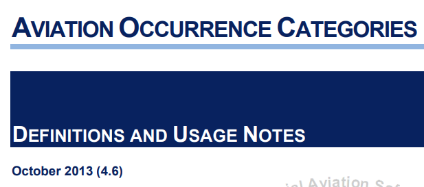
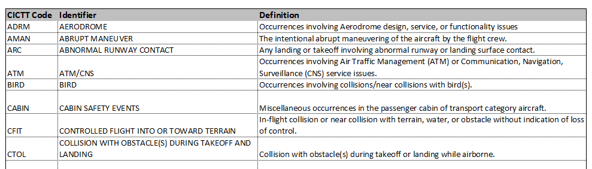
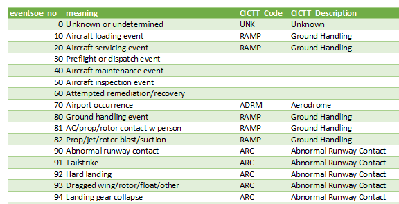
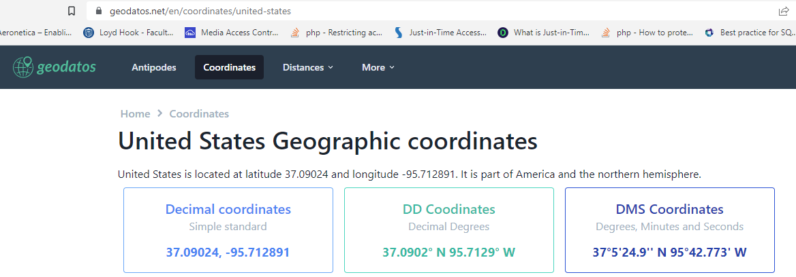
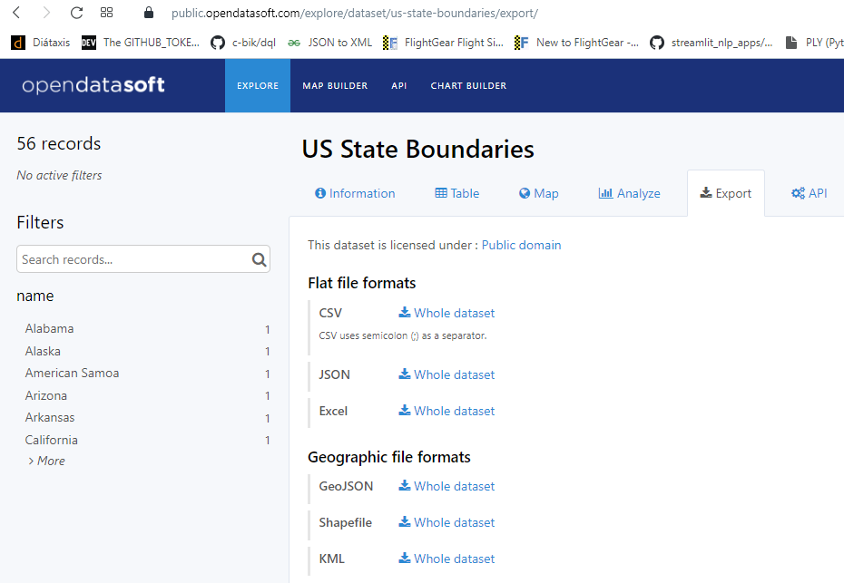
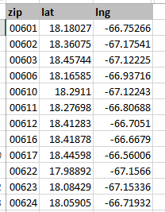
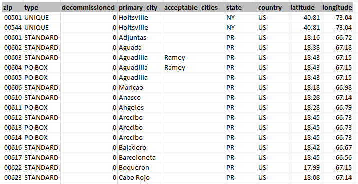

# IO-AVSTATS-DB: Data Sources

## 1. [**AVIATION OCCURRENCE CATEGORIES**](https://www.ntsb.gov/safety/data/Documents/datafiles/OccurrenceCategoryDefinitions.pdf){:target="_blank"}

Document [AVIATION OCCURRENCE CATEGORIES - DEFINITIONS AND USAGE NOTES - October 2013 (4.6)](https://www.ntsb.gov/safety/data/Documents/datafiles/OccurrenceCategoryDefinitions.pdf){:target="_blank"} used for the CICTT codes.

<kbd></kbd>

The CICTT codes found in this document were manually transferred to an Excel file.
This Excel file was then used to load the CICTT codes into the database.

<kbd></kbd>

## 2. **CICTT_SOE_MAP.csv**

The content of the database table `io_sequence_of_events` is created based on this csv file.

<kbd></kbd>

This unofficial csv file from NTSB allows to assign CICTT codes to events via the columns `eventsoe_no` and `defining_ev` of the database table `events_sequence`.

## 3. [**geodatos**](https://www.geodatos.net/en){:target="_blank"}

The decimal latitude and longitude for the USA used in the **`Countries_States/countries_states.json`** file is taken from [this website](https://www.geodatos.net/en/coordinates/united-states){:target="_blank"}.

<kbd></kbd>

The data found here was manually transferred to a JSON file.
This JSON file was then used to load the decimal US latitude and longitude into the database.

      [
        {
          "type": "country",
          "country": "USA",
          "country_name": "United States",
          "dec_latitude": 37.09024,
          "dec_longitude": -95.712891
        },
      ...
      ]

## 4. [**NTSB**](https://www.ntsb.gov/Pages/home.aspx){:target="_blank"}

The main data used in **IO-AVSTATS** is provided by the National Transportation Safety Board.
On the accident data page is the link [Downloadable data sets](https://www.ntsb.gov/safety/data/Pages/Data_Stats.aspx){:target="_blank"}, which contains the aviation accident data in MS Access format for free download.  

| File          | Created (mm/dd/yyyy) | Description                                             |
|---------------|----------------------|---------------------------------------------------------|
| `avall.zip`   | current              | Data from January 1, 2008 to today                      |
| `PRE1982.zip` | 10/27/2020           | unknown                                                 |
| `Pre2008.zip` | 09/30/2020           | Data from January 1, 1982 to December 31, 2007          |
| `upDDMON.zip` | current              | New additions and updates until DD day in the month MON |

The schemas of the two databases `avall` and `Pre2008` are identical except for the two new optional columns `dec_latitude` and `dec_longitude` in the database table `events` of the database `avall`.
Based on the NTSB document [eadmspub.pdf](https://data.ntsb.gov/avdata/FileDirectory/DownloadFile?fileID=C%3A%5Cavdata%5Ceadmspub.pdf){:target="_blank"}, the contents of the following database tables are contained in the **IO-AVSTATS-DB** database:

    - **`events`**

    - **`aircraft`**
    - **`dt_events`**
    - **`ntsb_admin`**

    - **`dt_aircraft`**
    - **`engines`**
    - **`events_sequence`**
    - **`findings`**
    - **`flight_crew`**
    - **`injury`**
    - **`narratives`**
    - **`occurrences`**

    - **`dt_flight_crew`**
    - **`flight_time`**

    - **`seq_of_events`**

## 5. [**opendatasoft**](https://www.opendatasoft.com/?hsLang=en){:target="_blank"}

The decimal latitudes and longitudes for the US states used in the **`Countries_States/countries_states.json`** file are taken from [this website](https://public.opendatasoft.com/explore/dataset/us-state-boundaries/export/){:target="_blank"}.

<kbd></kbd>

## 5. [**simplemaps**](https://simplemaps.com/){:target="_blank"}

In order to fill in the missing decimal latitudes and longitudes, free available data from **simplemaps** is used.
**simplemaps** offers postal codes and cities with their latitude and longitude.

The [US Zip Codes Database](https://simplemaps.com/data/us-zips){:target="_blank"} link provides latitude and longitude for selected US zip codes:

<kbd></kbd>

The [United States Cities Database](https://simplemaps.com/data/us-cities){:target="_blank"} link provides latitude and longitude for selected US cities:

<kbd></kbd>

## 7. [**United States Zip Codes.org**](https://www.unitedstateszipcodes.org/){:target="_blank"}

In order to fill in the missing decimal latitudes and longitudes, free available data from **United States Zip Codes.org** is used.
**United States Zip Codes.org** offers more complete postal codes but only with estimated latitudes and longitudes.

<kbd></kbd>
