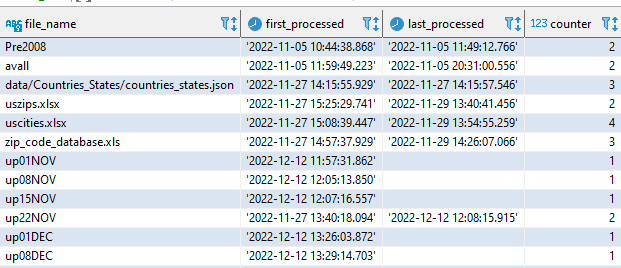

# IO-AVSTATS-DB - Data Update

Aviation accident data provided by NTSB can be found at the following [website](https://www.ntsb.gov/safety/data/Pages/Data_Stats.aspx){:target="_blank"} under **Downloadable data sets**:

<kbd></kbd>

In the database table **`io_processed_files`** you can find the previously processed files:

<kbd></kbd>

Any file can be processed several times with the process described in the following, as long as one processes also afterwards all newer files again.

All necessary processing steps can be executed with the **`run_io_avstats`** script.
The script is available in a version for Windows 10 and 11 cmd and for Ubuntu 22.04 bash shell.

## 1. Quick reference

| No. | Description                                                    |
|----:|----------------------------------------------------------------|
|   1 | Download basic simplemaps files                                |
|   2 | **Optional**: Load simplemaps data into PostgreSQL             |
|   3 | Download the ZIP Code Database file                            |
|   4 | **Optional**: Load ZIP Code Database data into PostgreSQL      |
|   5 | **Optional**: Load data from a correction file into PostgreSQL |
|   6 | Download a NTSB MS Access database file                        |
|   7 | Load NTSB MS Access database data into PostgreSQL              |
|   8 | Correct decimal US latitudes and longitudes                    |
|   9 | Verify selected NTSB data                                      |
|  10 | Refresh the PostgreSQL database schema                         |

## 2. Detailed description

### 2.1 Download basic simplemaps files

**Relevant configuration parameters**:

```
download_chunk_size = 524288
download_timeout = 10
download_file_simplemaps_us_cities_xlsx = "uscities.xlsx"
download_file_simplemaps_us_cities_zip = "simplemaps_uscities_basicv1.75.zip"
download_file_simplemaps_us_zips_xlsx = "uszips.xlsx"
download_file_simplemaps_us_zips_zip = "simplemaps_uszips_basicv1.81.zip"
download_work_dir = "data/download"
```

**Example protocol**:

```
...\io-avstats>run_io_avstats
Progress update 2023-01-12 08:52:58.915135 : ===============================================================================.
Progress update 2023-01-12 08:52:58.915635 : INFO.00.004 Start Launcher.
Progress update 2023-01-12 08:52:58.917636 : INFO.00.001 The logger is configured and ready.
Progress update 2023-01-12 08:52:58.925635 : INFO.00.005 Argument task='d_s_f'.
Progress update 2023-01-12 08:52:58.925635 : -------------------------------------------------------------------------------.
Progress update 2023-01-12 08:52:58.926135 : INFO.00.048 Downloading basic simplemaps files.
Progress update 2023-01-12 08:52:58.926135 : --------------------------------------------------------------------------------
Progress update 2023-01-12 08:52:59.124166 : INFO.00.030 The connection to the US city file 'simplemaps_uscities_basicv1.75.zip' on the simplemaps download page was successfully established.
Progress update 2023-01-12 08:52:59.625371 : INFO.00.023 From the file 'simplemaps_uscities_basicv1.75.zip' 8 chunks were downloaded.
Progress update 2023-01-12 08:52:59.658871 : INFO.00.024 The file 'simplemaps_uscities_basicv1.75.zip' was successfully unpacked.
Progress update 2023-01-12 08:52:59.736875 : INFO.00.022 The connection to the US zip code file 'simplemaps_uszips_basicv1.81.zip' on the simplemaps download page was successfully established.
Progress update 2023-01-12 08:52:59.838506 : INFO.00.023 From the file 'simplemaps_uszips_basicv1.81.zip' 8 chunks were downloaded.
Progress update 2023-01-12 08:52:59.872006 : INFO.00.024 The file 'simplemaps_uszips_basicv1.81.zip' was successfully unpacked.
Progress update 2023-01-12 08:52:59.872506 : -------------------------------------------------------------------------------.
Progress update 2023-01-12 08:52:59.872506 :        1,075,371,000 ns - Total time launcher.
Progress update 2023-01-12 08:52:59.872506 : INFO.00.006 End   Launcher.
Progress update 2023-01-12 08:52:59.872506 : ===============================================================================.
```

The downloaded files **`uscities.csv`** and **`uszips.xlsx`** must be checked with the reference files in the file directory **`data/reference`** for a match.
If there is no mismatch, then the next step can be skipped.

### 2.2 Load simplemaps data into PostgreSQL

Only necessary if the file downloaded in the previous step contains changes.

TODO

**Relevant configuration parameters**:

```
download_work_dir = "data/download"
```

**Example protocol**:

```
TODO
```

### 2.3 Download the ZIP Code Database file

The **`Personal Free`** version of the ZIP Code Database file must be downloaded manually from the **`https://www.unitedstateszipcodes.org/zip-code-database/`** website to the file directory according to the **`download_work_dir`** configuration parameter.

<kbd></kbd>

The two formats **`Excel Format (data only)`** and **`CSV Format`** must be downloaded one after the other.
The downloaded file **`zip_code_database.csv`** must be checked with the reference files in the file directory **`data/reference`** for a match.
If there is no mismatch, then the next step can be skipped.

**Relevant configuration parameters**:

```
download_work_dir = "data/download"
```

### 2.4 Load ZIP Code Database data into PostgreSQL

Only necessary if the file downloaded in the previous step contains changes.

TODO

**Relevant configuration parameters**:

```
download_work_dir = "data/download"
```

**Example protocol**:

```
TODO
```

### 2.5 Load data from a correction file into PostgreSQL

This step only needs to be performed if modified or new correction files are available.

**Relevant configuration parameters**:

```
correction_work_dir = "data/correction"
```

**Example protocol**:

```
TODO
```

### 2.6 Download a NTSB MS Access database file

**Relevant configuration parameters**:

```
download_chunk_size = 524288
download_timeout = 10
download_url_ntsb_prefix = "https://data.ntsb.gov/avdata/FileDirectory/DownloadFile?fileID=C%3A%5Cavdata%5C"
download_work_dir = "data/download"
```

**Example protocol**:

```
Progress update 2023-01-12 08:28:16.570266 : ===============================================================================.
Progress update 2023-01-12 08:28:16.570266 : INFO.00.004 Start Launcher.
Progress update 2023-01-12 08:28:16.572266 : INFO.00.001 The logger is configured and ready.
Progress update 2023-01-12 08:28:16.580766 : INFO.00.008 Arguments task='d_n_a' msaccess='up08JAN'.
Progress update 2023-01-12 08:28:16.580766 : -------------------------------------------------------------------------------.
Progress update 2023-01-12 08:28:16.580766 : INFO.00.047 Downloading NTSB MS Access database file 'up08JAN'.
Progress update 2023-01-12 08:28:16.580766 : --------------------------------------------------------------------------------
Progress update 2023-01-12 08:28:17.146039 : INFO.00.013 The connection to the MS Access database file 'up08JAN.zip' on the NTSB download page was successfully established.
Progress update 2023-01-12 08:28:17.528648 : INFO.00.014 From the file 'up08JAN.zip' 1 chunks were downloaded.
Progress update 2023-01-12 08:28:17.546649 : INFO.00.015 The file 'up08JAN.zip' was successfully unpacked.
Progress update 2023-01-12 08:28:17.557648 : INFO.00.051 msaccess_file='D:\SoftDevelopment\Projects\IO-Aero\io-avstats\data\download\IO-AVSTATS.mdb'.
Progress update 2023-01-12 08:28:17.558149 : INFO.00.051 msaccess_file='D:\SoftDevelopment\Projects\IO-Aero\io-avstats\data\download\up08JAN.sql'.
Progress update 2023-01-12 08:28:17.558149 : INFO.00.052 razorsql_jar_file='C:\Program Files\RazorSQL\razorsql.jar'.
Progress update 2023-01-12 08:28:17.558149 : INFO.00.053 razorsql_java_path='C:\Program Files\RazorSQL\jre11\bin\java'.
1673508497647: launching RazorSQL . . .
1673508497648: args . . .
-backup
IO-AVSTATS
null
null
;
null
D:\SoftDevelopment\Projects\IO-Aero\io-avstats\data\download\up08JAN.sql
NO
tables
YES
null
NO
NO
1673508497683: userName: walte
1673508497683: libraryPath: C:\Program Files\RazorSQL\jre11\bin;C:\WINDOWS\Sun\Java\bin;C:\WINDOWS\system32;C:\WINDOWS;C:\Users\walte\.virtualenvs\io-avstats-zafInMY1\Scripts;C:\Program Files (x86)\VMware\VMware Player\bin\;C:\Program Files (x86)\infogridpacific\AZARDI;C:\Program Files (x86)\NVIDIA Corporation\PhysX\Common;C:\Program Files\Calibre2\;C:\Program Files\dotnet\;C:\Program Files\Git LFS;C:\Program Files\Microsoft SQL Server\110\Tools\Binn\;C:\Program Files\NVIDIA Corporation\NVIDIA NvDLISR;C:\Program Files\Pandoc\;C:\Program Files\TortoiseGit\bin;C:\Software\GnuWin32\bin;C:\WINDOWS;C:\WINDOWS\system32;C:\WINDOWS\System32\OpenSSH\;C:\WINDOWS\System32\Wbem;C:\WINDOWS\System32\WindowsPowerShell\v1.0\;C:\Users\walte\.nimble\bin;C:\Windows;C:\Windows\system32;C:\Windows\System32\OpenSSH\;C:\Windows\System32\Wbem;C:\Windows\System32\WindowsPowerShell\v1.0\;C:\Software\.cargo\bin;C:\Software\gradle-7.6\bin;%HOME_ELIXIR%\bin;%HOME_ERLANG%\bin;%HOME_GO%\bin;%HOME_JULIA%\bin;%HOME_NIM%\bin;C:\Software\PostgreSQL\15\bin;C:\Software\poppler-0.68.0\bin;C:\Software\Python\Python310;C:\Software\Python\Python310\Scripts;C:\Software\rebar3;%HOME_RUST%\bin;C:\Software\Tesseract-OCR;C:\Software\jdk-19\bin;%KOTLIN_HOME%\bin;C:\Software\oracle\instantclient_21_8;C:\Program Files\LLVM\bin;C:\Program Files\Docker\Docker\resources\bin;C:\Program Files\Amazon\AWSCLIV2\;C:\Program Files\Git\cmd;C:\Program Files\PuTTY\;C:\Software\Gpg4win\..\GnuPG\bin;C:\Program Files\nodejs\;C:\Users\walte\.cargo\bin;C:\Users\walte\AppData\Local\Microsoft\WindowsApps;C:\Software\Microsoft VS Code\bin;C:\Users\walte\go\bin;c:\users\walte\.local\bin;C:\Users\walte\AppData\Local\JetBrains\Toolbox\scripts;C:\Users\walte\AppData\Roaming\npm;.
1673508497684: javaVersion: 11.0.13
1673508497684:
1673508497684: Verifying RazorSQL resources location.
1673508497684:
1673508497685: testing base url: / = file:/C:/Program%20Files/RazorSQL/
1673508497685:
1673508497685: testString1: file:/C:/Program%20Files/RazorSQL/razorsql.jar
1673508497685: testString2: file:/C:/Program%20Files/RazorSQL/data/base.ssql
1673508497685: testFile1: C:\Program Files\RazorSQL\razorsql.jar
1673508497685: testFile2: C:\Program Files\RazorSQL\data\base.ssql
1673508497685: both test file exists.  Base URL found.
1673508497685: resource directory: file:/C:/Program%20Files/RazorSQL/
1673508497686: user home: C:\Users\walte
1673508497687: user profile: C:\Users\walte
1673508497687: app data: C:\Users\walte\AppData\Roaming
1673508497687: checking write access to: C:\Users\walte\AppData\Roaming
1673508497687: write dir: C:\Users\walte\AppData\Roaming\RichardsonSoftware
1673508497688: can write to C:\Users\walte\AppData\Roaming
1673508497688: user.home: C:\Users\walte\AppData\Roaming
1673508497688: RazorSQL Scratch Directory: C:\Users\walte\AppData\Roaming\RazorSQL
1673508497688: RazorSQL Scratch Directory exists
1673508497688: checking for sub directories
1673508497688: razorsql launch log: C:\Users\walte\AppData\Roaming\RazorSQL\razorsql_launch_log.txt
1673508497688: launch log file = C:\Users\walte\AppData\Roaming\RazorSQL\razorsql_launch_log.txt
1673508497689: Checking for graphics properties
1673508497689: graphics properties file: C:\Users\walte\AppData\Roaming\RazorSQL\data\graphics_properties.txt
1673508497689: gOverride: null
1673508497689: not disabling advanced graphics
1673508497689: path0: file:/C:/Program%20Files/RazorSQL/data/run.ssql
1673508497689: path1: file:/C:/Program%20Files/RazorSQL/razorsql.jar
1673508497690: runArgs: true
1673508497690: showScreen: false
1673508497690: args[0]: -backup
1673508497690: args[1]: IO-AVSTATS
1673508497690: args[2]: null
1673508497690: args[3]: null
1673508497690: args[4]: ;
1673508497690: args[5]: null
1673508497691: args[6]: D:\SoftDevelopment\Projects\IO-Aero\io-avstats\data\download\up08JAN.sql
1673508497691: args[7]: NO
1673508497691: args[8]: tables
1673508497691: args[9]: YES
1673508497691: args[10]: null
1673508497691: args[11]: NO
1673508497691: args[12]: NO
1673508497691: Command: -backup
1673508497691: Running -backup
h: name = C:\Program Files\RazorSQL\data\run.ssql
h: name = C:\Program Files\RazorSQL\razorsql.jar
1673508497698: Attempting to load . . .
command found
uOne: file:/C:/Program%20Files/RazorSQL/
h: name = C:\Program Files\RazorSQL\data\run.ssql
1673508497709reading file . . .C:\Program Files\RazorSQL\data\base.ssql
1673508497735done reading . . .
1673508497745done converting
1673508497745starting lib load.
1673508497757lib load complete.
In command line processor
Max Memory: 30688.0
Current Total Memory: 2048.0
Free Memory: 1957.968734741211
1673508497835: r init
1673508497835: d init
1673508497836: get default file encoding
1673508497836: end d init
custom home directory: null
Checking for user data from old versions
1673508497838: user home: C:\Users\walte
1673508497838: user profile: C:\Users\walte
1673508497838: app data: C:\Users\walte\AppData\Roaming
1673508497838: checking write access to: C:\Users\walte\AppData\Roaming
1673508497838: write dir: C:\Users\walte\AppData\Roaming\RichardsonSoftware
1673508497838: can write to C:\Users\walte\AppData\Roaming
newHome: C:\Users\walte\AppData\Roaming\RazorSQL
dataHome: C:\Users\walte\AppData\Roaming/RazorSQL/data/
preferences file: C:\Users\walte\AppData\Roaming\RazorSQL\data\preferences.txt
Profiles Exist
1673508497849: loading icons
1673508498021: done r init
Getting connection data from: IO-AVSTATS
1673508498023: r init
1673508498023: d init
1673508498023: get default file encoding
1673508498023: end d init
custom home directory: null
Checking for user data from old versions
newHome: C:\Users\walte\AppData\Roaming\RazorSQL
dataHome: C:\Users\walte\AppData\Roaming/RazorSQL/data/
preferences file: C:\Users\walte\AppData\Roaming\RazorSQL\data\preferences.txt
Profiles Exist
1673508498023: loading icons
1673508498032: done r init
getting connection . . .
Not using SSH Tunnel
driver: sun.jdbc.odbc.JdbcOdbcDriver
classLocation: C:\Program Files\RazorSQL\drivers\common\odbc.jar
loadedCommonJars: false
commonURL: file:/C:/Program%20Files/RazorSQL/drivers/common/
commonDir: C:\Program Files\RazorSQL\drivers\common
commonFiles[0]: file:/C:/Program%20Files/RazorSQL/drivers/common/activation.jar
commonFiles[1]: file:/C:/Program%20Files/RazorSQL/drivers/common/common.jar
commonFiles[2]: file:/C:/Program%20Files/RazorSQL/drivers/common/jaxb-api.jar
commonFiles[3]: file:/C:/Program%20Files/RazorSQL/drivers/common/jaxb-core.jar
commonFiles[4]: file:/C:/Program%20Files/RazorSQL/drivers/common/jaxb-impl.jar
commonFiles[6]: file:/C:/Program%20Files/RazorSQL/drivers/common/odbc.jar
connection type: ODBC
final classLocation: C:\Program Files\RazorSQL\drivers\common\odbc.jar
classLocation file: C:\Program Files\RazorSQL\drivers\common\odbc.jar
building sql manager
Loading driver
Done loading driver
Getting connection with no login info
JdbcOdbcDriver: in initialize
OdbcApi == null
Creating new OdbcApi, nativePrefix:
JdbcOdbc constructor
Attempting to load JdbcOdbc library
Got OdbcApi: sun.jdbc.odbc.JdbcOdbc@2d127a61
Getting charset
JdbcOdbcDriver.OdbcApi.charSet: Cp1252
Connection obtained
obtained connection
database major version = 2
database product name: ACCESS
multiValueInsert: false
includeIdentifyColumns: false
Calling backup . . .
Retrieving Tables . . .
Generating Table DDL . . .
1 of 20
number of columns 93
column map size: 93
foundNull: false
2 of 20
number of columns 2
column map size: 2
foundNull: false
3 of 20
number of columns 11
column map size: 11
foundNull: false
4 of 20
number of columns 2
column map size: 2
foundNull: false
5 of 20
number of columns 6
column map size: 6
foundNull: false
6 of 20
number of columns 5
column map size: 5
foundNull: false
7 of 20
number of columns 7
column map size: 7
foundNull: false
8 of 20
number of columns 13
column map size: 13
foundNull: false
9 of 20
number of columns 17
column map size: 17
foundNull: false
10 of 20
number of columns 73
column map size: 73
foundNull: false
11 of 20
number of columns 10
column map size: 10
foundNull: false
12 of 20
number of columns 13
column map size: 13
foundNull: false
13 of 20
number of columns 33
column map size: 33
foundNull: false
14 of 20
number of columns 8
column map size: 8
foundNull: false
15 of 20
number of columns 7
column map size: 7
foundNull: false
16 of 20
number of columns 8
column map size: 8
foundNull: false
17 of 20
number of columns 5
column map size: 5
foundNull: false
18 of 20
number of columns 8
column map size: 8
foundNull: false
19 of 20
number of columns 11
column map size: 11
foundNull: false
20 of 20
number of columns 3
column map size: 3
foundNull: false
Generating Alter Table DDL . . .
1 of 20
2 of 20
3 of 20
4 of 20
5 of 20
6 of 20
7 of 20
8 of 20
9 of 20
10 of 20
11 of 20
12 of 20
13 of 20
14 of 20
15 of 20
16 of 20
17 of 20
18 of 20
19 of 20
20 of 20
backup finished
closing connection . . .
connection closed.
Shutting down logging streams
Done shutting down logging streams
Exiting . . .
Progress update 2023-01-12 08:28:18.589894 : INFO.00.011 The DDL script for the MS Access database 'up08JAN.mdb' was created successfully.
Progress update 2023-01-12 08:28:18.594395 : INFO.00.012 The DDL script for the MS Access database 'up08JAN.mdb' is identical to the reference script.
Progress update 2023-01-12 08:28:18.594395 : -------------------------------------------------------------------------------.
Progress update 2023-01-12 08:28:18.594395 :        2,140,628,800 ns - Total time launcher.
Progress update 2023-01-12 08:28:18.594395 : INFO.00.006 End   Launcher.
Progress update 2023-01-12 08:28:18.594395 : ===============================================================================.
```

### 2.7 Load NTSB MS Access database data into PostgreSQL

**Relevant configuration parameters**:

```
download_work_dir = "data/download"
```

**Example protocol**:

```
Progress update 2023-01-16 09:25:52.325684 : ===============================================================================.
Progress update 2023-01-16 09:25:52.325684 : INFO.00.004 Start Launcher.
Progress update 2023-01-16 09:25:52.327683 : INFO.00.001 The logger is configured and ready.
Progress update 2023-01-16 09:25:52.335683 : INFO.00.008 Arguments task='l_n_a' msaccess='up15JAN'.
Progress update 2023-01-16 09:25:52.335683 : -------------------------------------------------------------------------------.
Progress update 2023-01-16 09:25:52.335683 : INFO.00.049 Loading NTSB MS Access database data from file 'up15JAN'.
Progress update 2023-01-16 09:25:52.335683 : --------------------------------------------------------------------------------
Progress update 2023-01-16 09:25:52.336186 : INFO.00.054 ODBC driver='DRIVER={Microsoft Access Driver (*.mdb, *.accdb)};DBQ=D:\SoftDevelopment\Projects\IO-Aero\io-avstats\data\download\up15JAN.mdb;'.
Progress update 2023-01-16 09:25:52.555683 : INFO.00.021 The following database table is not processed: 'MSysAccessObjects'.
Progress update 2023-01-16 09:25:52.556184 : INFO.00.021 The following database table is not processed: 'MSysACEs'.
Progress update 2023-01-16 09:25:52.556184 : INFO.00.021 The following database table is not processed: 'MSysIMEXColumns'.
Progress update 2023-01-16 09:25:52.556184 : INFO.00.021 The following database table is not processed: 'MSysIMEXSpecs'.
Progress update 2023-01-16 09:25:52.556184 : INFO.00.021 The following database table is not processed: 'MSysModules2'.
Progress update 2023-01-16 09:25:52.556686 : INFO.00.021 The following database table is not processed: 'MSysNavPaneGroupCategories'.
Progress update 2023-01-16 09:25:52.556686 : INFO.00.021 The following database table is not processed: 'MSysNavPaneGroups'.
Progress update 2023-01-16 09:25:52.556686 : INFO.00.021 The following database table is not processed: 'MSysNavPaneGroupToObjects'.
Progress update 2023-01-16 09:25:52.556686 : INFO.00.021 The following database table is not processed: 'MSysNavPaneObjectIDs'.
Progress update 2023-01-16 09:25:52.556686 : INFO.00.021 The following database table is not processed: 'MSysObjects'.
Progress update 2023-01-16 09:25:52.556686 : INFO.00.021 The following database table is not processed: 'MSysQueries'.
Progress update 2023-01-16 09:25:52.556686 : INFO.00.021 The following database table is not processed: 'MSysRelationships'.
Progress update 2023-01-16 09:25:52.557185 : INFO.00.021 The following database table is not processed: 'Country'.
Progress update 2023-01-16 09:25:52.557185 : INFO.00.021 The following database table is not processed: 'ct_iaids'.
Progress update 2023-01-16 09:25:52.557185 : INFO.00.021 The following database table is not processed: 'ct_seqevt'.
Progress update 2023-01-16 09:25:52.557185 : INFO.00.021 The following database table is not processed: 'eADMSPUB_DataDictionary'.
Progress update 2023-01-16 09:25:52.557185 : INFO.00.021 The following database table is not processed: 'states'.
Progress update 2023-01-16 09:25:52.557185 :
Progress update 2023-01-16 09:25:52.557185 : Database table       : events              <-----------------------------------.
Progress update 2023-01-16 09:25:52.838376 : Updated ev_id=20001213X29593 ev_year=1989.
Progress update 2023-01-16 09:25:52.871408 : Updated ev_id=20001213X27465 ev_year=1988.
Progress update 2023-01-16 09:25:52.905410 : Updated ev_id=20001213X27634 ev_year=1989.
Progress update 2023-01-16 09:25:52.955141 : Updated ev_id=20200918X02045 ev_year=2020.
Progress update 2023-01-16 09:25:52.996748 : Updated ev_id=20210216102634 ev_year=2021.
Progress update 2023-01-16 09:25:53.030273 : Updated ev_id=20210304102711 ev_year=2021.
Progress update 2023-01-16 09:25:53.063915 : Updated ev_id=20210502103009 ev_year=2021.
Progress update 2023-01-16 09:25:53.096773 : Updated ev_id=20210816103700 ev_year=2021.
Progress update 2023-01-16 09:25:53.130270 : Updated ev_id=20210831103780 ev_year=2021.
Progress update 2023-01-16 09:25:53.163269 : Updated ev_id=20220205104597 ev_year=2022.
Progress update 2023-01-16 09:25:53.196769 : Updated ev_id=20220705105422 ev_year=2022.
Progress update 2023-01-16 09:25:53.229804 : Updated ev_id=20220725105565 ev_year=2022.
Progress update 2023-01-16 09:25:53.263251 : Updated ev_id=20220725105566 ev_year=2022.
Progress update 2023-01-16 09:25:53.296788 : Updated ev_id=20220815105738 ev_year=2022.
Progress update 2023-01-16 09:25:53.363388 : Updated ev_id=20220927106007 ev_year=2022.
Progress update 2023-01-16 09:25:53.396861 : Updated ev_id=20220928106015 ev_year=2022.
Progress update 2023-01-16 09:25:53.463199 : Updated ev_id=20221003106039 ev_year=2022.
Progress update 2023-01-16 09:25:53.496582 : Updated ev_id=20221003106046 ev_year=2022.
Progress update 2023-01-16 09:25:53.530271 : Updated ev_id=20221003106047 ev_year=2022.
Progress update 2023-01-16 09:25:53.563195 : Updated ev_id=20221003106050 ev_year=2022.
Progress update 2023-01-16 09:25:53.596735 : Updated ev_id=20221013106124 ev_year=2022.
Progress update 2023-01-16 09:25:53.629749 : Updated ev_id=20221017106138 ev_year=2022.
Progress update 2023-01-16 09:25:53.663178 : Updated ev_id=20221017106143 ev_year=2022.
Progress update 2023-01-16 09:25:53.721765 : Updated ev_id=20221018106159 ev_year=2022.
Progress update 2023-01-16 09:25:53.754898 : Updated ev_id=20221018106160 ev_year=2022.
Progress update 2023-01-16 09:25:53.788167 : Updated ev_id=20221019106163 ev_year=2022.
Progress update 2023-01-16 09:25:53.821293 : Updated ev_id=20221027106211 ev_year=2022.
Progress update 2023-01-16 09:25:53.855113 : Updated ev_id=20221031106233 ev_year=2022.
Progress update 2023-01-16 09:25:53.921437 : Updated ev_id=20221114106287 ev_year=2022.
Progress update 2023-01-16 09:25:53.954432 : Updated ev_id=20221114106288 ev_year=2022.
Progress update 2023-01-16 09:25:54.012770 : Updated ev_id=20221114106289 ev_year=2022.
Progress update 2023-01-16 09:25:54.046430 : Updated ev_id=20221116106300 ev_year=2022.
Progress update 2023-01-16 09:25:54.079555 : Updated ev_id=20221116106302 ev_year=2022.
Progress update 2023-01-16 09:25:54.113083 : Updated ev_id=20221128106378 ev_year=2022.
Progress update 2023-01-16 09:25:54.146583 : Updated ev_id=20221202106403 ev_year=2022.
Progress update 2023-01-16 09:25:54.180084 : Updated ev_id=20221206106424 ev_year=2022.
Progress update 2023-01-16 09:25:54.238083 : Updated ev_id=20221207106430 ev_year=2022.
Progress update 2023-01-16 09:25:54.271431 : Updated ev_id=20221212106441 ev_year=2022.
Progress update 2023-01-16 09:25:54.329949 : Updated ev_id=20221215106462 ev_year=2022.
Progress update 2023-01-16 09:25:54.396537 : Updated ev_id=20221219106472 ev_year=2022.
Progress update 2023-01-16 09:25:54.454690 : Updated ev_id=20221219106474 ev_year=2022.
Progress update 2023-01-16 09:25:54.571271 : Updated ev_id=20221228106500 ev_year=2022.
Progress update 2023-01-16 09:25:54.679859 : Updated ev_id=20221229106511 ev_year=2022.
Progress update 2023-01-16 09:25:54.712832 : Updated ev_id=20221230106513 ev_year=2022.
Progress update 2023-01-16 09:25:54.746248 : Updated ev_id=20221230106514 ev_year=2022.
Progress update 2023-01-16 09:25:54.804581 : Updated ev_id=20230103106531 ev_year=2022.
Progress update 2023-01-16 09:25:54.871162 : Updated ev_id=20230106106547 ev_year=2023.
Progress update 2023-01-16 09:25:55.138185 : Number rows selected :     68.
Progress update 2023-01-16 09:25:55.138185 : Number rows inserted :     21.
Progress update 2023-01-16 09:25:55.138185 : Number rows updated  :     47.
Progress update 2023-01-16 09:25:55.138686 :
Progress update 2023-01-16 09:25:55.138686 : Database table       : aircraft            <-----------------------------------.
Progress update 2023-01-16 09:25:55.246095 : Updated ev_id=20001213X29593 aircraft_key=1.
Progress update 2023-01-16 09:25:55.320934 : Updated ev_id=20001213X27465 aircraft_key=1.
Progress update 2023-01-16 09:25:55.396227 : Updated ev_id=20001213X27634 aircraft_key=1.
Progress update 2023-01-16 09:25:55.471265 : Updated ev_id=20200918X02045 aircraft_key=1.
Progress update 2023-01-16 09:25:55.546182 : Updated ev_id=20210216102634 aircraft_key=1.
Progress update 2023-01-16 09:25:55.621380 : Updated ev_id=20210304102711 aircraft_key=1.
Progress update 2023-01-16 09:25:55.697740 : Updated ev_id=20210502103009 aircraft_key=1.
Progress update 2023-01-16 09:25:55.770839 : Updated ev_id=20210816103700 aircraft_key=1.
Progress update 2023-01-16 09:25:55.846619 : Updated ev_id=20210831103780 aircraft_key=1.
Progress update 2023-01-16 09:25:55.920916 : Updated ev_id=20220205104597 aircraft_key=1.
Progress update 2023-01-16 09:25:55.995770 : Updated ev_id=20220705105422 aircraft_key=1.
Progress update 2023-01-16 09:25:56.071391 : Updated ev_id=20220725105565 aircraft_key=1.
Progress update 2023-01-16 09:25:56.146168 : Updated ev_id=20220725105566 aircraft_key=1.
Progress update 2023-01-16 09:25:56.220931 : Updated ev_id=20220815105738 aircraft_key=1.
Progress update 2023-01-16 09:25:56.320891 : Updated ev_id=20220927106007 aircraft_key=1.
Progress update 2023-01-16 09:25:56.396023 : Updated ev_id=20220928106015 aircraft_key=1.
Progress update 2023-01-16 09:25:56.496273 : Updated ev_id=20221003106039 aircraft_key=1.
Progress update 2023-01-16 09:25:56.570923 : Updated ev_id=20221003106046 aircraft_key=1.
Progress update 2023-01-16 09:25:56.646077 : Updated ev_id=20221003106047 aircraft_key=1.
Progress update 2023-01-16 09:25:56.720601 : Updated ev_id=20221003106050 aircraft_key=1.
Progress update 2023-01-16 09:25:56.795711 : Updated ev_id=20221013106124 aircraft_key=1.
Progress update 2023-01-16 09:25:56.870575 : Updated ev_id=20221017106138 aircraft_key=1.
Progress update 2023-01-16 09:25:56.945793 : Updated ev_id=20221017106143 aircraft_key=1.
Progress update 2023-01-16 09:25:57.020677 : Updated ev_id=20221018106159 aircraft_key=1.
Progress update 2023-01-16 09:25:57.096269 : Updated ev_id=20221018106160 aircraft_key=1.
Progress update 2023-01-16 09:25:57.170907 : Updated ev_id=20221019106163 aircraft_key=1.
Progress update 2023-01-16 09:25:57.245932 : Updated ev_id=20221027106211 aircraft_key=1.
Progress update 2023-01-16 09:25:57.320948 : Updated ev_id=20221031106233 aircraft_key=1.
Progress update 2023-01-16 09:25:57.429270 : Updated ev_id=20221114106287 aircraft_key=1.
Progress update 2023-01-16 09:25:57.512069 : Updated ev_id=20221114106288 aircraft_key=1.
Progress update 2023-01-16 09:25:57.587685 : Updated ev_id=20221114106289 aircraft_key=1.
Progress update 2023-01-16 09:25:57.653933 : Updated ev_id=20221116106300 aircraft_key=1.
Progress update 2023-01-16 09:25:57.728874 : Updated ev_id=20221116106302 aircraft_key=1.
Progress update 2023-01-16 09:25:57.804253 : Updated ev_id=20221128106378 aircraft_key=1.
Progress update 2023-01-16 09:25:57.879129 : Updated ev_id=20221202106403 aircraft_key=1.
Progress update 2023-01-16 09:25:57.953754 : Updated ev_id=20221206106424 aircraft_key=1.
Progress update 2023-01-16 09:25:58.029086 : Updated ev_id=20221207106430 aircraft_key=1.
Progress update 2023-01-16 09:25:58.112054 : Updated ev_id=20221212106441 aircraft_key=1.
Progress update 2023-01-16 09:25:58.186751 : Updated ev_id=20221215106462 aircraft_key=1.
Progress update 2023-01-16 09:25:58.328266 : Updated ev_id=20221219106472 aircraft_key=1.
Progress update 2023-01-16 09:25:58.395294 : Updated ev_id=20221219106474 aircraft_key=1.
Progress update 2023-01-16 09:25:58.553662 : Updated ev_id=20221228106500 aircraft_key=1.
Progress update 2023-01-16 09:25:58.678536 : Updated ev_id=20221229106511 aircraft_key=1.
Progress update 2023-01-16 09:25:58.745261 : Updated ev_id=20221230106513 aircraft_key=1.
Progress update 2023-01-16 09:25:58.820251 : Updated ev_id=20221230106514 aircraft_key=1.
Progress update 2023-01-16 09:25:58.920093 : Updated ev_id=20230103106531 aircraft_key=1.
Progress update 2023-01-16 09:25:59.020069 : Updated ev_id=20230106106547 aircraft_key=1.
Progress update 2023-01-16 09:25:59.294881 : Number rows selected :     70.
Progress update 2023-01-16 09:25:59.294881 : Number rows inserted :     23.
Progress update 2023-01-16 09:25:59.295382 : Number rows updated  :     47.
Progress update 2023-01-16 09:25:59.295382 :
Progress update 2023-01-16 09:25:59.295382 : Database table       : dt_events           <-----------------------------------.
Progress update 2023-01-16 09:25:59.370014 : Updated ev_id=20200918X02045 col_name=launch code=None.
Progress update 2023-01-16 09:25:59.595254 : Updated ev_id=20210216102634 col_name=launch code=Part.
Progress update 2023-01-16 09:25:59.619771 : Updated ev_id=20210216102634 col_name=spec_hand code=TDA.
Progress update 2023-01-16 09:25:59.728121 : Updated ev_id=20210216102634 col_name=icing_forecast_type code=NA.
Progress update 2023-01-16 09:25:59.753369 : Updated ev_id=20210216102634 col_name=turb_fc_type code=NONE.
Progress update 2023-01-16 09:25:59.828369 : Updated ev_id=20210216102634 col_name=wx_brief_src0 code=UNK.
Progress update 2023-01-16 09:25:59.861569 : Updated ev_id=20210304102711 col_name=launch code=Part.
Progress update 2023-01-16 09:25:59.886617 : Updated ev_id=20210304102711 col_name=spec_hand code=TDA.
Progress update 2023-01-16 09:25:59.911583 : Updated ev_id=20210304102711 col_name=wx_brief_src0 code=UNK.
Progress update 2023-01-16 09:25:59.936254 : Updated ev_id=20210502103009 col_name=launch code=Part.
Progress update 2023-01-16 09:25:59.961769 : Updated ev_id=20210502103009 col_name=spec_hand code=TDA.
Progress update 2023-01-16 09:26:00.161397 : Updated ev_id=20210502103009 col_name=wx_brief_src0 code=UNK.
Progress update 2023-01-16 09:26:00.186434 : Updated ev_id=20210816103700 col_name=launch code=None.
Progress update 2023-01-16 09:26:00.244595 : Updated ev_id=20210831103780 col_name=launch code=None.
Progress update 2023-01-16 09:26:00.294644 : Updated ev_id=20220205104597 col_name=launch code=None.
Progress update 2023-01-16 09:26:00.319930 : Updated ev_id=20220705105422 col_name=launch code=None.
Progress update 2023-01-16 09:26:00.420059 : Updated ev_id=20220725105565 col_name=followup_travel code=N.
Progress update 2023-01-16 09:26:00.444568 : Updated ev_id=20220725105565 col_name=launch code=None.
Progress update 2023-01-16 09:26:00.494737 : Updated ev_id=20220725105566 col_name=followup_travel code=N.
Progress update 2023-01-16 09:26:00.569736 : Updated ev_id=20220815105738 col_name=followup_travel code=N.
Progress update 2023-01-16 09:26:00.594750 : Updated ev_id=20220815105738 col_name=launch code=None.
Progress update 2023-01-16 09:26:00.644559 : Updated ev_id=20220927106007 col_name=followup_travel code=N.
Progress update 2023-01-16 09:26:00.670060 : Updated ev_id=20220927106007 col_name=launch code=None.
Progress update 2023-01-16 09:26:00.694434 : Updated ev_id=20220927106007 col_name=turb_type code=NONE.
Progress update 2023-01-16 09:26:00.720017 : Updated ev_id=20220927106007 col_name=wx_brief_src code=TVRA.
Progress update 2023-01-16 09:26:00.744537 : Updated ev_id=20220928106015 col_name=followup_travel code=N.
Progress update 2023-01-16 09:26:00.769872 : Updated ev_id=20220928106015 col_name=launch code=None.
Progress update 2023-01-16 09:26:00.794390 : Updated ev_id=20220928106015 col_name=icing_actual_amt code=NONE.
Progress update 2023-01-16 09:26:00.819757 : Updated ev_id=20220928106015 col_name=icing_actual_type code=NA.
Progress update 2023-01-16 09:26:00.844805 : Updated ev_id=20220928106015 col_name=icing_forecast_amt code=NONE.
Progress update 2023-01-16 09:26:00.894777 : Updated ev_id=20220928106015 col_name=icing_forecast_type code=NA.
Progress update 2023-01-16 09:26:00.919793 : Updated ev_id=20220928106015 col_name=turb_type code=NONE.
Progress update 2023-01-16 09:26:00.944659 : Updated ev_id=20220928106015 col_name=wx_brief_src code=NET.
Progress update 2023-01-16 09:26:00.994455 : Updated ev_id=20221003106039 col_name=followup_travel code=N.
Progress update 2023-01-16 09:26:01.019725 : Updated ev_id=20221003106039 col_name=launch code=None.
Progress update 2023-01-16 09:26:01.069772 : Updated ev_id=20221003106046 col_name=followup_travel code=N.
Progress update 2023-01-16 09:26:01.128208 : Updated ev_id=20221003106046 col_name=launch code=None.
Progress update 2023-01-16 09:26:01.153024 : Updated ev_id=20221003106046 col_name=icing_actual_amt code=NONE.
Progress update 2023-01-16 09:26:01.177713 : Updated ev_id=20221003106046 col_name=icing_actual_type code=NA.
Progress update 2023-01-16 09:26:01.203270 : Updated ev_id=20221003106046 col_name=icing_forecast_amt code=NONE.
Progress update 2023-01-16 09:26:01.227768 : Updated ev_id=20221003106046 col_name=icing_forecast_type code=NA.
Progress update 2023-01-16 09:26:01.253268 : Updated ev_id=20221003106046 col_name=turb_fc_type code=NONE.
Progress update 2023-01-16 09:26:01.277769 : Updated ev_id=20221003106046 col_name=turb_severity code=NA.
Progress update 2023-01-16 09:26:01.303270 : Updated ev_id=20221003106046 col_name=turb_type code=NONE.
Progress update 2023-01-16 09:26:01.353285 : Updated ev_id=20221003106047 col_name=launch code=None.
Progress update 2023-01-16 09:26:01.377827 : Updated ev_id=20221003106047 col_name=icing_actual_amt code=NONE.
Progress update 2023-01-16 09:26:01.403038 : Updated ev_id=20221003106047 col_name=icing_actual_type code=NA.
Progress update 2023-01-16 09:26:01.427854 : Updated ev_id=20221003106047 col_name=icing_forecast_amt code=NONE.
Progress update 2023-01-16 09:26:01.452897 : Updated ev_id=20221003106047 col_name=icing_forecast_type code=NA.
Progress update 2023-01-16 09:26:01.477754 : Updated ev_id=20221003106047 col_name=turb_fc_type code=NONE.
Progress update 2023-01-16 09:26:01.502932 : Updated ev_id=20221003106047 col_name=turb_severity code=NA.
Progress update 2023-01-16 09:26:01.527754 : Updated ev_id=20221003106047 col_name=turb_type code=NONE.
Progress update 2023-01-16 09:26:01.552890 : Updated ev_id=20221003106047 col_name=wx_brief_src code=COWX.
Progress update 2023-01-16 09:26:01.577829 : Updated ev_id=20221003106050 col_name=followup_travel code=N.
Progress update 2023-01-16 09:26:01.627829 : Updated ev_id=20221003106050 col_name=launch code=None.
Progress update 2023-01-16 09:26:01.677788 : Updated ev_id=20221013106124 col_name=launch code=None.
Progress update 2023-01-16 09:26:01.702786 : Updated ev_id=20221013106124 col_name=icing_actual_amt code=NONE.
Progress update 2023-01-16 09:26:01.727777 : Updated ev_id=20221013106124 col_name=icing_actual_type code=NA.
Progress update 2023-01-16 09:26:01.760818 : Updated ev_id=20221013106124 col_name=icing_forecast_amt code=NONE.
Progress update 2023-01-16 09:26:01.785756 : Updated ev_id=20221013106124 col_name=icing_forecast_type code=NA.
Progress update 2023-01-16 09:26:01.810852 : Updated ev_id=20221013106124 col_name=turb_fc_type code=NONE.
Progress update 2023-01-16 09:26:01.835641 : Updated ev_id=20221013106124 col_name=turb_severity code=NA.
Progress update 2023-01-16 09:26:01.860865 : Updated ev_id=20221013106124 col_name=turb_type code=NONE.
Progress update 2023-01-16 09:26:01.910935 : Updated ev_id=20221017106138 col_name=launch code=None.
Progress update 2023-01-16 09:26:02.160992 : Updated ev_id=20221017106143 col_name=launch code=None.
Progress update 2023-01-16 09:26:02.186009 : Updated ev_id=20221017106143 col_name=icing_forecast_amt code=NONE.
Progress update 2023-01-16 09:26:02.211274 : Updated ev_id=20221017106143 col_name=turb_fc_type code=NONE.
Progress update 2023-01-16 09:26:02.235965 : Updated ev_id=20221017106143 col_name=wx_brief_src code=AUTR.
Progress update 2023-01-16 09:26:02.260981 : Updated ev_id=20221018106159 col_name=followup_travel code=N.
Progress update 2023-01-16 09:26:02.285934 : Updated ev_id=20221018106159 col_name=launch code=None.
Progress update 2023-01-16 09:26:02.310774 : Updated ev_id=20221018106159 col_name=icing_actual_amt code=NONE.
Progress update 2023-01-16 09:26:02.335421 : Updated ev_id=20221018106159 col_name=icing_actual_type code=NA.
Progress update 2023-01-16 09:26:02.360772 : Updated ev_id=20221018106159 col_name=icing_forecast_amt code=NONE.
Progress update 2023-01-16 09:26:02.385581 : Updated ev_id=20221018106159 col_name=icing_forecast_type code=NA.
Progress update 2023-01-16 09:26:02.410802 : Updated ev_id=20221018106159 col_name=turb_fc_type code=NONE.
Progress update 2023-01-16 09:26:02.477587 : Updated ev_id=20221018106159 col_name=turb_severity code=NA.
Progress update 2023-01-16 09:26:02.502505 : Updated ev_id=20221018106159 col_name=turb_type code=CLRA.
Progress update 2023-01-16 09:26:02.527779 : Updated ev_id=20221018106159 col_name=wx_brief_src code=NONE.
Progress update 2023-01-16 09:26:02.552295 : Updated ev_id=20221018106160 col_name=launch code=None.
Progress update 2023-01-16 09:26:02.652426 : Updated ev_id=20221019106163 col_name=followup_travel code=N.
Progress update 2023-01-16 09:26:02.677520 : Updated ev_id=20221019106163 col_name=launch code=None.
Progress update 2023-01-16 09:26:02.927276 : Updated ev_id=20221027106211 col_name=followup_travel code=N.
Progress update 2023-01-16 09:26:02.952231 : Updated ev_id=20221027106211 col_name=launch code=None.
Progress update 2023-01-16 09:26:02.977261 : Updated ev_id=20221027106211 col_name=icing_actual_amt code=NONE.
Progress update 2023-01-16 09:26:03.002034 : Updated ev_id=20221027106211 col_name=icing_actual_type code=NA.
Progress update 2023-01-16 09:26:03.027285 : Updated ev_id=20221027106211 col_name=icing_forecast_amt code=NONE.
Progress update 2023-01-16 09:26:03.052285 : Updated ev_id=20221027106211 col_name=icing_forecast_type code=NA.
Progress update 2023-01-16 09:26:03.077284 : Updated ev_id=20221027106211 col_name=turb_fc_type code=NONE.
Progress update 2023-01-16 09:26:03.102285 : Updated ev_id=20221027106211 col_name=turb_severity code=NA.
Progress update 2023-01-16 09:26:03.127287 : Updated ev_id=20221027106211 col_name=turb_type code=NONE.
Progress update 2023-01-16 09:26:03.152286 : Updated ev_id=20221027106211 col_name=wx_brief_src code=AUTR.
Progress update 2023-01-16 09:26:03.177318 : Updated ev_id=20221031106233 col_name=followup_travel code=N.
Progress update 2023-01-16 09:26:03.202319 : Updated ev_id=20221031106233 col_name=launch code=None.
Progress update 2023-01-16 09:26:03.352254 : Updated ev_id=20221114106287 col_name=followup_travel code=N.
Progress update 2023-01-16 09:26:03.377264 : Updated ev_id=20221114106287 col_name=launch code=None.
Progress update 2023-01-16 09:26:03.627106 : Updated ev_id=20221114106288 col_name=launch code=None.
Progress update 2023-01-16 09:26:03.727384 : Updated ev_id=20221114106289 col_name=followup_travel code=N.
Progress update 2023-01-16 09:26:03.751883 : Updated ev_id=20221114106289 col_name=launch code=None.
Progress update 2023-01-16 09:26:04.035756 : Updated ev_id=20221116106300 col_name=launch code=None.
Progress update 2023-01-16 09:26:04.260458 : Updated ev_id=20221116106302 col_name=followup_travel code=N.
Progress update 2023-01-16 09:26:04.285465 : Updated ev_id=20221116106302 col_name=launch code=None.
Progress update 2023-01-16 09:26:04.485363 : Updated ev_id=20221116106302 col_name=wx_brief_src code=AUTR.
Progress update 2023-01-16 09:26:04.510296 : Updated ev_id=20221128106378 col_name=followup_travel code=N.
Progress update 2023-01-16 09:26:04.535310 : Updated ev_id=20221128106378 col_name=launch code=None.
Progress update 2023-01-16 09:26:04.585359 : Updated ev_id=20221128106378 col_name=wx_brief_src code=AUTR.
Progress update 2023-01-16 09:26:04.610256 : Updated ev_id=20221202106403 col_name=launch code=None.
Progress update 2023-01-16 09:26:04.635413 : Updated ev_id=20221202106403 col_name=icing_actual_amt code=NONE.
Progress update 2023-01-16 09:26:04.659934 : Updated ev_id=20221202106403 col_name=icing_actual_type code=NA.
Progress update 2023-01-16 09:26:04.685457 : Updated ev_id=20221202106403 col_name=icing_forecast_amt code=NONE.
Progress update 2023-01-16 09:26:04.709989 : Updated ev_id=20221202106403 col_name=icing_forecast_type code=NA.
Progress update 2023-01-16 09:26:04.735275 : Updated ev_id=20221202106403 col_name=turb_type code=TERR.
Progress update 2023-01-16 09:26:04.768543 : Updated ev_id=20221202106403 col_name=wx_brief_src code=NET.
Progress update 2023-01-16 09:26:04.793543 : Updated ev_id=20221206106424 col_name=launch code=None.
Progress update 2023-01-16 09:26:04.818542 : Updated ev_id=20221206106424 col_name=icing_actual_amt code=NONE.
Progress update 2023-01-16 09:26:04.843543 : Updated ev_id=20221206106424 col_name=icing_actual_type code=NA.
Progress update 2023-01-16 09:26:04.868434 : Updated ev_id=20221206106424 col_name=icing_forecast_amt code=NONE.
Progress update 2023-01-16 09:26:04.901754 : Updated ev_id=20221206106424 col_name=icing_forecast_type code=NA.
Progress update 2023-01-16 09:26:04.926755 : Updated ev_id=20221206106424 col_name=turb_fc_type code=NONE.
Progress update 2023-01-16 09:26:04.951987 : Updated ev_id=20221206106424 col_name=turb_severity code=NA.
Progress update 2023-01-16 09:26:04.976438 : Updated ev_id=20221206106424 col_name=turb_type code=NONE.
Progress update 2023-01-16 09:26:05.001778 : Updated ev_id=20221206106424 col_name=wx_brief_src code=AUTR.
Progress update 2023-01-16 09:26:05.026541 : Updated ev_id=20221207106430 col_name=followup_travel code=N.
Progress update 2023-01-16 09:26:05.052120 : Updated ev_id=20221207106430 col_name=launch code=None.
Progress update 2023-01-16 09:26:05.076620 : Updated ev_id=20221212106441 col_name=launch code=None.
Progress update 2023-01-16 09:26:05.102120 : Updated ev_id=20221215106462 col_name=launch code=None.
Progress update 2023-01-16 09:26:05.210257 : Updated ev_id=20221219106472 col_name=launch code=None.
Progress update 2023-01-16 09:26:05.234773 : Updated ev_id=20221219106474 col_name=followup_travel code=N.
Progress update 2023-01-16 09:26:05.260275 : Updated ev_id=20221219106474 col_name=launch code=None.
Progress update 2023-01-16 09:26:05.609940 : Updated ev_id=20221228106500 col_name=launch code=None.
Progress update 2023-01-16 09:26:05.634756 : Updated ev_id=20221228106500 col_name=spec_hand code=TDA.
Progress update 2023-01-16 09:26:05.734939 : Updated ev_id=20221229106511 col_name=launch code=Part.
Progress update 2023-01-16 09:26:05.984671 : Updated ev_id=20221230106513 col_name=launch code=None.
Progress update 2023-01-16 09:26:06.034605 : Updated ev_id=20221230106514 col_name=launch code=None.
Progress update 2023-01-16 09:26:06.118228 : Updated ev_id=20230103106531 col_name=launch code=None.
Progress update 2023-01-16 09:26:06.168157 : Updated ev_id=20230106106547 col_name=followup_travel code=N.
Progress update 2023-01-16 09:26:06.193171 : Updated ev_id=20230106106547 col_name=launch code=None.
Progress update 2023-01-16 09:26:06.884758 : Number rows selected :    288.
Progress update 2023-01-16 09:26:06.885258 : Number rows inserted :    152.
Progress update 2023-01-16 09:26:06.885258 : Number rows updated  :    136.
Progress update 2023-01-16 09:26:06.885258 :
Progress update 2023-01-16 09:26:06.885258 : Database table       : ntsb_admin          <-----------------------------------.
Progress update 2023-01-16 09:26:06.951759 : Updated ev_id=20001213X29593.
Progress update 2023-01-16 09:26:06.976258 : Updated ev_id=20001213X27465.
Progress update 2023-01-16 09:26:07.001759 : Updated ev_id=20001213X27634.
Progress update 2023-01-16 09:26:07.026297 : Updated ev_id=20200918X02045.
Progress update 2023-01-16 09:26:07.051423 : Updated ev_id=20210216102634.
Progress update 2023-01-16 09:26:07.076445 : Updated ev_id=20210304102711.
Progress update 2023-01-16 09:26:07.101556 : Updated ev_id=20210502103009.
Progress update 2023-01-16 09:26:07.151704 : Updated ev_id=20210816103700.
Progress update 2023-01-16 09:26:07.176319 : Updated ev_id=20210831103780.
Progress update 2023-01-16 09:26:07.201278 : Updated ev_id=20220205104597.
Progress update 2023-01-16 09:26:07.226275 : Updated ev_id=20220705105422.
Progress update 2023-01-16 09:26:07.251311 : Updated ev_id=20220725105565.
Progress update 2023-01-16 09:26:07.275990 : Updated ev_id=20220725105566.
Progress update 2023-01-16 09:26:07.301506 : Updated ev_id=20220815105738.
Progress update 2023-01-16 09:26:07.393083 : Updated ev_id=20220927106007.
Progress update 2023-01-16 09:26:07.418182 : Updated ev_id=20220928106015.
Progress update 2023-01-16 09:26:07.467990 : Updated ev_id=20221003106039.
Progress update 2023-01-16 09:26:07.492993 : Updated ev_id=20221003106046.
Progress update 2023-01-16 09:26:07.517987 : Updated ev_id=20221003106047.
Progress update 2023-01-16 09:26:07.551023 : Updated ev_id=20221003106050.
Progress update 2023-01-16 09:26:07.600802 : Updated ev_id=20221013106124.
Progress update 2023-01-16 09:26:07.626533 : Updated ev_id=20221017106138.
Progress update 2023-01-16 09:26:07.659533 : Updated ev_id=20221017106143.
Progress update 2023-01-16 09:26:07.684599 : Updated ev_id=20221018106159.
Progress update 2023-01-16 09:26:07.709097 : Updated ev_id=20221018106160.
Progress update 2023-01-16 09:26:07.734249 : Updated ev_id=20221019106163.
Progress update 2023-01-16 09:26:07.759081 : Updated ev_id=20221027106211.
Progress update 2023-01-16 09:26:07.784493 : Updated ev_id=20221031106233.
Progress update 2023-01-16 09:26:07.834507 : Updated ev_id=20221114106287.
Progress update 2023-01-16 09:26:07.858941 : Updated ev_id=20221114106288.
Progress update 2023-01-16 09:26:07.892839 : Updated ev_id=20221114106289.
Progress update 2023-01-16 09:26:07.917425 : Updated ev_id=20221116106300.
Progress update 2023-01-16 09:26:07.942561 : Updated ev_id=20221116106302.
Progress update 2023-01-16 09:26:07.967674 : Updated ev_id=20221128106378.
Progress update 2023-01-16 09:26:07.992673 : Updated ev_id=20221202106403.
Progress update 2023-01-16 09:26:08.017674 : Updated ev_id=20221206106424.
Progress update 2023-01-16 09:26:08.042675 : Updated ev_id=20221207106430.
Progress update 2023-01-16 09:26:08.067673 : Updated ev_id=20221212106441.
Progress update 2023-01-16 09:26:08.101175 : Updated ev_id=20221215106462.
Progress update 2023-01-16 09:26:08.151174 : Updated ev_id=20221219106472.
Progress update 2023-01-16 09:26:08.184189 : Updated ev_id=20221219106474.
Progress update 2023-01-16 09:26:08.292283 : Updated ev_id=20221228106500.
Progress update 2023-01-16 09:26:08.367684 : Updated ev_id=20221229106511.
Progress update 2023-01-16 09:26:08.392384 : Updated ev_id=20221230106513.
Progress update 2023-01-16 09:26:08.425778 : Updated ev_id=20221230106514.
Progress update 2023-01-16 09:26:08.484382 : Updated ev_id=20230103106531.
Progress update 2023-01-16 09:26:08.534307 : Updated ev_id=20230106106547.
Progress update 2023-01-16 09:26:08.801098 : Number rows selected :     68.
Progress update 2023-01-16 09:26:08.801098 : Number rows inserted :     21.
Progress update 2023-01-16 09:26:08.801098 : Number rows updated  :     47.
Progress update 2023-01-16 09:26:08.801098 :
Progress update 2023-01-16 09:26:08.801598 : Database table       : dt_aircraft         <-----------------------------------.
Progress update 2023-01-16 09:26:08.942438 : Updated ev_id=20200918X02045 aircraft_key=1 col_name=acft_awy_cert code=STN.
Progress update 2023-01-16 09:26:09.167330 : Updated ev_id=20200918X02045 aircraft_key=1 col_name=aircar_cert code=None.
Progress update 2023-01-16 09:26:09.192438 : Updated ev_id=20200918X02045 aircraft_key=1 col_name=airspc_type code=CLG.
Progress update 2023-01-16 09:26:09.242455 : Updated ev_id=20200918X02045 aircraft_key=1 col_name=instm_appr0 code=NONE.
Progress update 2023-01-16 09:26:09.267487 : Updated ev_id=20200918X02045 aircraft_key=1 col_name=landing_gear1 code=TRI.
Progress update 2023-01-16 09:26:09.325759 : Updated ev_id=20200918X02045 aircraft_key=1 col_name=type_clear0 code=NONE.
Progress update 2023-01-16 09:26:09.350671 : Updated ev_id=20200918X02045 aircraft_key=1 col_name=vfr_appr code=FLND.
Progress update 2023-01-16 09:26:09.375673 : Updated ev_id=20210216102634 aircraft_key=1 col_name=acft_awy_cert code=STN.
Progress update 2023-01-16 09:26:09.400591 : Updated ev_id=20210216102634 aircraft_key=1 col_name=addtl_equip0 code=UNK.
Progress update 2023-01-16 09:26:09.433865 : Updated ev_id=20210216102634 aircraft_key=1 col_name=aircar_cert code=COAC.
Progress update 2023-01-16 09:26:09.484175 : Updated ev_id=20210216102634 aircraft_key=1 col_name=type_clear0 code=NONE.
Progress update 2023-01-16 09:26:09.567278 : Updated ev_id=20210304102711 aircraft_key=1 col_name=acft_awy_cert code=STN.
Progress update 2023-01-16 09:26:09.592275 : Updated ev_id=20210304102711 aircraft_key=1 col_name=acft_awy_cert code=STU.
Progress update 2023-01-16 09:26:09.642347 : Updated ev_id=20210304102711 aircraft_key=1 col_name=addtl_equip code=EFB.
Progress update 2023-01-16 09:26:09.675390 : Updated ev_id=20210304102711 aircraft_key=1 col_name=addtl_equip code=STWS.
Progress update 2023-01-16 09:26:09.700867 : Updated ev_id=20210304102711 aircraft_key=1 col_name=aircar_cert code=None.
Progress update 2023-01-16 09:26:09.725382 : Updated ev_id=20210304102711 aircraft_key=1 col_name=elt_oper_no_reason code=OTHR.
Progress update 2023-01-16 09:26:09.750684 : Updated ev_id=20210304102711 aircraft_key=1 col_name=instm_appr0 code=NONE.
Progress update 2023-01-16 09:26:09.775183 : Updated ev_id=20210304102711 aircraft_key=1 col_name=landing_gear1 code=TRI.
Progress update 2023-01-16 09:26:09.800897 : Updated ev_id=20210304102711 aircraft_key=1 col_name=landing_surf code=GRAS.
Progress update 2023-01-16 09:26:09.825427 : Updated ev_id=20210304102711 aircraft_key=1 col_name=rwy_cond1 code=VEGE.
Progress update 2023-01-16 09:26:09.858935 : Updated ev_id=20210304102711 aircraft_key=1 col_name=type_clear0 code=NONE.
Progress update 2023-01-16 09:26:09.883617 : Updated ev_id=20210304102711 aircraft_key=1 col_name=vfr_appr0 code=NONE.
Progress update 2023-01-16 09:26:09.908987 : Updated ev_id=20210502103009 aircraft_key=1 col_name=acft_awy_cert code=STN.
Progress update 2023-01-16 09:26:09.933669 : Updated ev_id=20210502103009 aircraft_key=1 col_name=addtl_equip0 code=UNK.
Progress update 2023-01-16 09:26:09.958747 : Updated ev_id=20210502103009 aircraft_key=1 col_name=aircar_cert code=AGR.
Progress update 2023-01-16 09:26:09.983505 : Updated ev_id=20210502103009 aircraft_key=1 col_name=airspc_type code=CLG.
Progress update 2023-01-16 09:26:10.009089 : Updated ev_id=20210502103009 aircraft_key=1 col_name=instm_appr0 code=NONE.
Progress update 2023-01-16 09:26:10.042187 : Updated ev_id=20210502103009 aircraft_key=1 col_name=type_clear0 code=NONE.
Progress update 2023-01-16 09:26:10.067318 : Updated ev_id=20210502103009 aircraft_key=1 col_name=vfr_appr0 code=NONE.
Progress update 2023-01-16 09:26:10.250479 : Updated ev_id=20210816103700 aircraft_key=1 col_name=aircar_cert code=None.
Progress update 2023-01-16 09:26:10.516968 : Updated ev_id=20210831103780 aircraft_key=1 col_name=acft_awy_cert code=STN.
Progress update 2023-01-16 09:26:10.566779 : Updated ev_id=20210831103780 aircraft_key=1 col_name=aircar_cert code=None.
Progress update 2023-01-16 09:26:10.592365 : Updated ev_id=20210831103780 aircraft_key=1 col_name=airspc_type code=CLE.
Progress update 2023-01-16 09:26:10.658788 : Updated ev_id=20210831103780 aircraft_key=1 col_name=landing_gear1 code=TRI.
Progress update 2023-01-16 09:26:10.708858 : Updated ev_id=20210831103780 aircraft_key=1 col_name=type_clear0 code=NONE.
Progress update 2023-01-16 09:26:10.900109 : Updated ev_id=20220705105422 aircraft_key=1 col_name=aircar_cert code=None.
Progress update 2023-01-16 09:26:11.366584 : Updated ev_id=20220725105565 aircraft_key=1 col_name=aircar_cert code=None.
Progress update 2023-01-16 09:26:11.683262 : Updated ev_id=20220725105566 aircraft_key=1 col_name=aircar_cert code=None.
Progress update 2023-01-16 09:26:12.401060 : Updated ev_id=20220927106007 aircraft_key=1 col_name=acft_awy_cert code=SPR.
Progress update 2023-01-16 09:26:12.440280 : Updated ev_id=20220927106007 aircraft_key=1 col_name=acft_awy_cert code=STN.
Progress update 2023-01-16 09:26:12.458441 : Updated ev_id=20220927106007 aircraft_key=1 col_name=addtl_equip code=ADSB.
Progress update 2023-01-16 09:26:12.483279 : Updated ev_id=20220927106007 aircraft_key=1 col_name=addtl_equip code=AOAI.
Progress update 2023-01-16 09:26:12.533387 : Updated ev_id=20220927106007 aircraft_key=1 col_name=addtl_equip code=AUTO.
Progress update 2023-01-16 09:26:12.558386 : Updated ev_id=20220927106007 aircraft_key=1 col_name=addtl_equip code=HGPS.
Progress update 2023-01-16 09:26:12.583084 : Updated ev_id=20220927106007 aircraft_key=1 col_name=addtl_equip code=STWS.
Progress update 2023-01-16 09:26:12.608152 : Updated ev_id=20220927106007 aircraft_key=1 col_name=aircar_cert code=None.
Progress update 2023-01-16 09:26:12.632942 : Updated ev_id=20220927106007 aircraft_key=1 col_name=airspc_type code=CLG.
Progress update 2023-01-16 09:26:12.658280 : Updated ev_id=20220927106007 aircraft_key=1 col_name=elt_oper_no_reason code=UNK.
Progress update 2023-01-16 09:26:12.682698 : Updated ev_id=20220927106007 aircraft_key=1 col_name=instm_appr0 code=NONE.
Progress update 2023-01-16 09:26:12.708279 : Updated ev_id=20220927106007 aircraft_key=1 col_name=landing_gear1 code=TRI.
Progress update 2023-01-16 09:26:12.732779 : Updated ev_id=20220927106007 aircraft_key=1 col_name=landing_surf code=ASPH.
Progress update 2023-01-16 09:26:12.757935 : Updated ev_id=20220927106007 aircraft_key=1 col_name=rwy_cond1 code=DRY.
Progress update 2023-01-16 09:26:12.783179 : Updated ev_id=20220927106007 aircraft_key=1 col_name=type_clear code=VFR.
Progress update 2023-01-16 09:26:12.808281 : Updated ev_id=20220927106007 aircraft_key=1 col_name=vfr_appr code=FSTP.
Progress update 2023-01-16 09:26:12.832851 : Updated ev_id=20220927106007 aircraft_key=1 col_name=vfr_appr code=TPAT.
Progress update 2023-01-16 09:26:12.858028 : Updated ev_id=20220928106015 aircraft_key=1 col_name=acft_awy_cert code=STN.
Progress update 2023-01-16 09:26:12.883057 : Updated ev_id=20220928106015 aircraft_key=1 col_name=addtl_equip code=ADSB.
Progress update 2023-01-16 09:26:12.916297 : Updated ev_id=20220928106015 aircraft_key=1 col_name=aircar_cert code=141.
Progress update 2023-01-16 09:26:12.941114 : Updated ev_id=20220928106015 aircraft_key=1 col_name=airspc_type code=CLG.
Progress update 2023-01-16 09:26:12.966240 : Updated ev_id=20220928106015 aircraft_key=1 col_name=instm_appr0 code=NONE.
Progress update 2023-01-16 09:26:12.991097 : Updated ev_id=20220928106015 aircraft_key=1 col_name=rwy_cond1 code=DRY.
Progress update 2023-01-16 09:26:13.016816 : Updated ev_id=20220928106015 aircraft_key=1 col_name=type_clear code=VFR.
Progress update 2023-01-16 09:26:13.049817 : Updated ev_id=20220928106015 aircraft_key=1 col_name=vfr_appr code=SIFL.
Progress update 2023-01-16 09:26:13.124817 : Updated ev_id=20221003106039 aircraft_key=1 col_name=aircar_cert code=None.
Progress update 2023-01-16 09:26:13.174816 : Updated ev_id=20221003106039 aircraft_key=1 col_name=landing_gear1 code=TRI.
Progress update 2023-01-16 09:26:13.382836 : Updated ev_id=20221003106046 aircraft_key=1 col_name=aircar_cert code=None.
Progress update 2023-01-16 09:26:13.482738 : Updated ev_id=20221003106046 aircraft_key=1 col_name=landing_surf code=ASPH.
Progress update 2023-01-16 09:26:13.624518 : Updated ev_id=20221003106047 aircraft_key=1 col_name=acft_awy_cert code=SPE.
Progress update 2023-01-16 09:26:13.649520 : Updated ev_id=20221003106047 aircraft_key=1 col_name=addtl_equip code=EPFD.
Progress update 2023-01-16 09:26:13.674761 : Updated ev_id=20221003106047 aircraft_key=1 col_name=addtl_equip code=STWS.
Progress update 2023-01-16 09:26:13.699278 : Updated ev_id=20221003106047 aircraft_key=1 col_name=aircar_cert code=None.
Progress update 2023-01-16 09:26:13.724774 : Updated ev_id=20221003106047 aircraft_key=1 col_name=airspc_type code=CLG.
Progress update 2023-01-16 09:26:13.807650 : Updated ev_id=20221003106047 aircraft_key=1 col_name=landing_gear1 code=TAIL.
Progress update 2023-01-16 09:26:13.833150 : Updated ev_id=20221003106047 aircraft_key=1 col_name=type_clear0 code=NONE.
Progress update 2023-01-16 09:26:13.991226 : Updated ev_id=20221003106050 aircraft_key=1 col_name=aircar_cert code=None.
Progress update 2023-01-16 09:26:14.074261 : Updated ev_id=20221003106050 aircraft_key=1 col_name=instm_appr0 code=NONE.
Progress update 2023-01-16 09:26:14.132733 : Updated ev_id=20221003106050 aircraft_key=1 col_name=landing_surf code=ASPH.
Progress update 2023-01-16 09:26:14.157597 : Updated ev_id=20221003106050 aircraft_key=1 col_name=rwy_cond1 code=DRY.
Progress update 2023-01-16 09:26:14.473868 : Updated ev_id=20221013106124 aircraft_key=1 col_name=aircar_cert code=None.
Progress update 2023-01-16 09:26:14.740576 : Updated ev_id=20221017106138 aircraft_key=1 col_name=aircar_cert code=None.
Progress update 2023-01-16 09:26:15.007362 : Updated ev_id=20221017106143 aircraft_key=1 col_name=acft_awy_cert code=SPE.
Progress update 2023-01-16 09:26:15.032361 : Updated ev_id=20221017106143 aircraft_key=1 col_name=addtl_equip code=ADSB.
Progress update 2023-01-16 09:26:15.057315 : Updated ev_id=20221017106143 aircraft_key=1 col_name=addtl_equip code=AFPC.
Progress update 2023-01-16 09:26:15.088872 : Updated ev_id=20221017106143 aircraft_key=1 col_name=addtl_equip code=DREC.
Progress update 2023-01-16 09:26:15.115890 : Updated ev_id=20221017106143 aircraft_key=1 col_name=addtl_equip code=EMFD.
Progress update 2023-01-16 09:26:15.140407 : Updated ev_id=20221017106143 aircraft_key=1 col_name=aircar_cert code=None.
Progress update 2023-01-16 09:26:15.174058 : Updated ev_id=20221017106143 aircraft_key=1 col_name=airspc_type code=CLG.
Progress update 2023-01-16 09:26:15.198580 : Updated ev_id=20221017106143 aircraft_key=1 col_name=instm_appr0 code=NONE.
Progress update 2023-01-16 09:26:15.223917 : Updated ev_id=20221017106143 aircraft_key=1 col_name=landing_gear1 code=TAIL.
Progress update 2023-01-16 09:26:15.248795 : Updated ev_id=20221017106143 aircraft_key=1 col_name=landing_surf code=GRAS.
Progress update 2023-01-16 09:26:15.273760 : Updated ev_id=20221017106143 aircraft_key=1 col_name=rwy_cond1 code=DRY.
Progress update 2023-01-16 09:26:15.298797 : Updated ev_id=20221017106143 aircraft_key=1 col_name=type_clear0 code=NONE.
Progress update 2023-01-16 09:26:15.332420 : Updated ev_id=20221017106143 aircraft_key=1 col_name=vfr_appr code=PLND.
Progress update 2023-01-16 09:26:15.356941 : Updated ev_id=20221017106143 aircraft_key=1 col_name=vfr_appr code=STIN.
Progress update 2023-01-16 09:26:15.382484 : Updated ev_id=20221018106159 aircraft_key=1 col_name=acft_awy_cert code=LTSP.
Progress update 2023-01-16 09:26:15.407299 : Updated ev_id=20221018106159 aircraft_key=1 col_name=acft_awy_cert code=STN.
Progress update 2023-01-16 09:26:15.432553 : Updated ev_id=20221018106159 aircraft_key=1 col_name=addtl_equip0 code=UNK.
Progress update 2023-01-16 09:26:15.457067 : Updated ev_id=20221018106159 aircraft_key=1 col_name=aircar_cert code=None.
Progress update 2023-01-16 09:26:15.491065 : Updated ev_id=20221018106159 aircraft_key=1 col_name=airspc_type code=CLG.
Progress update 2023-01-16 09:26:15.540436 : Updated ev_id=20221018106159 aircraft_key=1 col_name=landing_gear1 code=TAIL.
Progress update 2023-01-16 09:26:15.565530 : Updated ev_id=20221018106159 aircraft_key=1 col_name=type_clear0 code=NONE.
Progress update 2023-01-16 09:26:15.673784 : Updated ev_id=20221018106160 aircraft_key=1 col_name=aircar_cert code=None.
Progress update 2023-01-16 09:26:16.006780 : Updated ev_id=20221019106163 aircraft_key=1 col_name=aircar_cert code=None.
Progress update 2023-01-16 09:26:16.115162 : Updated ev_id=20221019106163 aircraft_key=1 col_name=landing_gear1 code=TAIL.
Progress update 2023-01-16 09:26:16.240495 : Updated ev_id=20221027106211 aircraft_key=1 col_name=acft_awy_cert code=STN.
Progress update 2023-01-16 09:26:16.273601 : Updated ev_id=20221027106211 aircraft_key=1 col_name=addtl_equip code=ADSB.
Progress update 2023-01-16 09:26:16.298627 : Updated ev_id=20221027106211 aircraft_key=1 col_name=aircar_cert code=None.
Progress update 2023-01-16 09:26:16.323584 : Updated ev_id=20221027106211 aircraft_key=1 col_name=airspc_type code=CLG.
Progress update 2023-01-16 09:26:16.348786 : Updated ev_id=20221027106211 aircraft_key=1 col_name=instm_appr0 code=NONE.
Progress update 2023-01-16 09:26:16.373642 : Updated ev_id=20221027106211 aircraft_key=1 col_name=landing_gear1 code=TRI.
Progress update 2023-01-16 09:26:16.448797 : Updated ev_id=20221027106211 aircraft_key=1 col_name=type_clear0 code=NONE.
Progress update 2023-01-16 09:26:16.582092 : Updated ev_id=20221031106233 aircraft_key=1 col_name=aircar_cert code=None.
Progress update 2023-01-16 09:26:16.607101 : Updated ev_id=20221031106233 aircraft_key=1 col_name=airspc_type code=CLG.
Progress update 2023-01-16 09:26:16.640069 : Updated ev_id=20221031106233 aircraft_key=1 col_name=instm_appr0 code=NONE.
Progress update 2023-01-16 09:26:16.715649 : Updated ev_id=20221031106233 aircraft_key=1 col_name=type_clear1 code=UNK.
Progress update 2023-01-16 09:26:16.748398 : Updated ev_id=20221031106233 aircraft_key=1 col_name=vfr_appr code=FLND.
Progress update 2023-01-16 09:26:16.906763 : Updated ev_id=20221114106287 aircraft_key=1 col_name=aircar_cert code=None.
Progress update 2023-01-16 09:26:17.165084 : Updated ev_id=20221114106288 aircraft_key=1 col_name=aircar_cert code=None.
Progress update 2023-01-16 09:26:17.531559 : Updated ev_id=20221114106289 aircraft_key=1 col_name=aircar_cert code=None.
Progress update 2023-01-16 09:26:18.023375 : Updated ev_id=20221116106300 aircraft_key=1 col_name=aircar_cert code=None.
Progress update 2023-01-16 09:26:18.073368 : Updated ev_id=20221116106300 aircraft_key=1 col_name=instm_appr0 code=NONE.
Progress update 2023-01-16 09:26:18.131868 : Updated ev_id=20221116106300 aircraft_key=1 col_name=landing_surf code=ASPH.
Progress update 2023-01-16 09:26:18.231529 : Updated ev_id=20221116106302 aircraft_key=1 col_name=acft_awy_cert code=STN.
Progress update 2023-01-16 09:26:18.414941 : Updated ev_id=20221116106302 aircraft_key=1 col_name=aircar_cert code=None.
Progress update 2023-01-16 09:26:18.447803 : Updated ev_id=20221116106302 aircraft_key=1 col_name=airspc_type code=CLE.
Progress update 2023-01-16 09:26:18.506261 : Updated ev_id=20221116106302 aircraft_key=1 col_name=instm_appr0 code=NONE.
Progress update 2023-01-16 09:26:18.531301 : Updated ev_id=20221116106302 aircraft_key=1 col_name=landing_gear1 code=TRI.
Progress update 2023-01-16 09:26:18.556338 : Updated ev_id=20221116106302 aircraft_key=1 col_name=landing_surf code=ASPH.
Progress update 2023-01-16 09:26:18.581370 : Updated ev_id=20221116106302 aircraft_key=1 col_name=rwy_cond1 code=DRY.
Progress update 2023-01-16 09:26:18.689936 : Updated ev_id=20221116106302 aircraft_key=1 col_name=vfr_appr code=TPAT.
Progress update 2023-01-16 09:26:18.714434 : Updated ev_id=20221128106378 aircraft_key=1 col_name=acft_awy_cert code=STN.
Progress update 2023-01-16 09:26:18.739634 : Updated ev_id=20221128106378 aircraft_key=1 col_name=addtl_equip code=ADSB.
Progress update 2023-01-16 09:26:18.772723 : Updated ev_id=20221128106378 aircraft_key=1 col_name=addtl_equip code=AFPC.
Progress update 2023-01-16 09:26:18.798316 : Updated ev_id=20221128106378 aircraft_key=1 col_name=addtl_equip code=AOAI.
Progress update 2023-01-16 09:26:18.831285 : Updated ev_id=20221128106378 aircraft_key=1 col_name=addtl_equip code=AUTO.
Progress update 2023-01-16 09:26:18.856584 : Updated ev_id=20221128106378 aircraft_key=1 col_name=addtl_equip code=EMFD.
Progress update 2023-01-16 09:26:18.881583 : Updated ev_id=20221128106378 aircraft_key=1 col_name=addtl_equip code=EPFD.
Progress update 2023-01-16 09:26:18.906584 : Updated ev_id=20221128106378 aircraft_key=1 col_name=addtl_equip code=OBWX.
Progress update 2023-01-16 09:26:18.931083 : Updated ev_id=20221128106378 aircraft_key=1 col_name=addtl_equip code=STWS.
Progress update 2023-01-16 09:26:18.956583 : Updated ev_id=20221128106378 aircraft_key=1 col_name=aircar_cert code=None.
Progress update 2023-01-16 09:26:18.989195 : Updated ev_id=20221128106378 aircraft_key=1 col_name=airspc_type code=CLG.
Progress update 2023-01-16 09:26:19.014897 : Updated ev_id=20221128106378 aircraft_key=1 col_name=instm_appr0 code=NONE.
Progress update 2023-01-16 09:26:19.039418 : Updated ev_id=20221128106378 aircraft_key=1 col_name=landing_gear1 code=TRI.
Progress update 2023-01-16 09:26:19.064642 : Updated ev_id=20221128106378 aircraft_key=1 col_name=landing_surf code=CONC.
Progress update 2023-01-16 09:26:19.097678 : Updated ev_id=20221128106378 aircraft_key=1 col_name=rwy_cond1 code=DRY.
Progress update 2023-01-16 09:26:19.122966 : Updated ev_id=20221128106378 aircraft_key=1 col_name=type_clear code=VFR.
Progress update 2023-01-16 09:26:19.156191 : Updated ev_id=20221128106378 aircraft_key=1 col_name=vfr_appr code=TPAT.
Progress update 2023-01-16 09:26:19.181068 : Updated ev_id=20221202106403 aircraft_key=1 col_name=acft_awy_cert code=SPE.
Progress update 2023-01-16 09:26:19.205943 : Updated ev_id=20221202106403 aircraft_key=1 col_name=addtl_equip code=HGPS.
Progress update 2023-01-16 09:26:19.231349 : Updated ev_id=20221202106403 aircraft_key=1 col_name=aircar_cert code=None.
Progress update 2023-01-16 09:26:19.264487 : Updated ev_id=20221202106403 aircraft_key=1 col_name=airspc_type code=CLG.
Progress update 2023-01-16 09:26:19.289666 : Updated ev_id=20221202106403 aircraft_key=1 col_name=instm_appr0 code=NONE.
Progress update 2023-01-16 09:26:19.314310 : Updated ev_id=20221202106403 aircraft_key=1 col_name=landing_gear1 code=TRI.
Progress update 2023-01-16 09:26:19.347772 : Updated ev_id=20221202106403 aircraft_key=1 col_name=rwy_cond1 code=ROUG.
Progress update 2023-01-16 09:26:19.381310 : Updated ev_id=20221202106403 aircraft_key=1 col_name=rwy_cond1 code=VEGE.
Progress update 2023-01-16 09:26:19.406411 : Updated ev_id=20221202106403 aircraft_key=1 col_name=type_clear0 code=NONE.
Progress update 2023-01-16 09:26:19.430977 : Updated ev_id=20221202106403 aircraft_key=1 col_name=vfr_appr code=NOE.
Progress update 2023-01-16 09:26:19.456507 : Updated ev_id=20221206106424 aircraft_key=1 col_name=acft_awy_cert code=STN.
Progress update 2023-01-16 09:26:19.489474 : Updated ev_id=20221206106424 aircraft_key=1 col_name=addtl_equip code=AUTO.
Progress update 2023-01-16 09:26:19.514445 : Updated ev_id=20221206106424 aircraft_key=1 col_name=addtl_equip code=EPFD.
Progress update 2023-01-16 09:26:19.539445 : Updated ev_id=20221206106424 aircraft_key=1 col_name=addtl_equip code=STWS.
Progress update 2023-01-16 09:26:19.564675 : Updated ev_id=20221206106424 aircraft_key=1 col_name=aircar_cert code=None.
Progress update 2023-01-16 09:26:19.597894 : Updated ev_id=20221206106424 aircraft_key=1 col_name=airspc_type code=CLE.
Progress update 2023-01-16 09:26:19.622827 : Updated ev_id=20221206106424 aircraft_key=1 col_name=elt_oper_no_reason code=UNK.
Progress update 2023-01-16 09:26:19.647783 : Updated ev_id=20221206106424 aircraft_key=1 col_name=instm_appr0 code=NONE.
Progress update 2023-01-16 09:26:19.705821 : Updated ev_id=20221206106424 aircraft_key=1 col_name=landing_gear1 code=TAIL.
Progress update 2023-01-16 09:26:19.731323 : Updated ev_id=20221206106424 aircraft_key=1 col_name=landing_surf code=ASPH.
Progress update 2023-01-16 09:26:19.764324 : Updated ev_id=20221206106424 aircraft_key=1 col_name=rwy_cond1 code=DRY.
Progress update 2023-01-16 09:26:19.789321 : Updated ev_id=20221206106424 aircraft_key=1 col_name=type_clear0 code=NONE.
Progress update 2023-01-16 09:26:19.822575 : Updated ev_id=20221206106424 aircraft_key=1 col_name=vfr_appr0 code=NONE.
Progress update 2023-01-16 09:26:21.214209 : Updated ev_id=20221228106500 aircraft_key=1 col_name=addtl_equip code=ADSB.
Progress update 2023-01-16 09:26:21.238992 : Updated ev_id=20221228106500 aircraft_key=1 col_name=addtl_equip code=DREC.
Progress update 2023-01-16 09:26:21.264270 : Updated ev_id=20221228106500 aircraft_key=1 col_name=addtl_equip code=EMFD.
Progress update 2023-01-16 09:26:21.297469 : Updated ev_id=20221228106500 aircraft_key=1 col_name=addtl_equip code=EPFD.
Progress update 2023-01-16 09:26:23.213395 : Number rows selected :    522.
Progress update 2023-01-16 09:26:23.213395 : Number rows inserted :    347.
Progress update 2023-01-16 09:26:23.213895 : Number rows updated  :    175.
Progress update 2023-01-16 09:26:23.213895 :
Progress update 2023-01-16 09:26:23.213895 : Database table       : engines             <-----------------------------------.
Progress update 2023-01-16 09:26:24.288188 : Number rows selected :     33.
Progress update 2023-01-16 09:26:24.288689 : Number rows inserted :     33.
Progress update 2023-01-16 09:26:24.288689 :
Progress update 2023-01-16 09:26:24.288689 : Database table       : events_sequence     <-----------------------------------.
Progress update 2023-01-16 09:26:24.371962 : Updated ev_id=20200918X02045 Aircraft_Key=1 Occurrence_No=1.
Progress update 2023-01-16 09:26:24.404906 : Updated ev_id=20200918X02045 Aircraft_Key=1 Occurrence_No=2.
Progress update 2023-01-16 09:26:24.571582 : Updated ev_id=20210502103009 Aircraft_Key=1 Occurrence_No=1.
Progress update 2023-01-16 09:26:24.604598 : Updated ev_id=20210816103700 Aircraft_Key=1 Occurrence_No=1.
Progress update 2023-01-16 09:26:24.638293 : Updated ev_id=20210831103780 Aircraft_Key=1 Occurrence_No=1.
Progress update 2023-01-16 09:26:24.671353 : Updated ev_id=20220205104597 Aircraft_Key=1 Occurrence_No=1.
Progress update 2023-01-16 09:26:24.705073 : Updated ev_id=20220705105422 Aircraft_Key=1 Occurrence_No=1.
Progress update 2023-01-16 09:26:24.771788 : Updated ev_id=20220725105565 Aircraft_Key=1 Occurrence_No=1.
Progress update 2023-01-16 09:26:24.871267 : Updated ev_id=20220725105566 Aircraft_Key=1 Occurrence_No=1.
Progress update 2023-01-16 09:26:24.971742 : Updated ev_id=20220815105738 Aircraft_Key=1 Occurrence_No=1.
Progress update 2023-01-16 09:26:25.038095 : Updated ev_id=20220927106007 Aircraft_Key=1 Occurrence_No=1.
Progress update 2023-01-16 09:26:25.071264 : Updated ev_id=20220928106015 Aircraft_Key=1 Occurrence_No=1.
Progress update 2023-01-16 09:26:25.137949 : Updated ev_id=20221003106039 Aircraft_Key=1 Occurrence_No=1.
Progress update 2023-01-16 09:26:25.171449 : Updated ev_id=20221003106046 Aircraft_Key=1 Occurrence_No=1.
Progress update 2023-01-16 09:26:25.230023 : Updated ev_id=20221003106047 Aircraft_Key=1 Occurrence_No=1.
Progress update 2023-01-16 09:26:25.346266 : Updated ev_id=20221003106050 Aircraft_Key=1 Occurrence_No=1.
Progress update 2023-01-16 09:26:25.379249 : Updated ev_id=20221013106124 Aircraft_Key=1 Occurrence_No=1.
Progress update 2023-01-16 09:26:25.413185 : Updated ev_id=20221017106138 Aircraft_Key=1 Occurrence_No=1.
Progress update 2023-01-16 09:26:25.445926 : Updated ev_id=20221017106143 Aircraft_Key=1 Occurrence_No=1.
Progress update 2023-01-16 09:26:25.479479 : Updated ev_id=20221018106159 Aircraft_Key=1 Occurrence_No=1.
Progress update 2023-01-16 09:26:25.645975 : Updated ev_id=20221019106163 Aircraft_Key=1 Occurrence_No=1.
Progress update 2023-01-16 09:26:25.679504 : Updated ev_id=20221027106211 Aircraft_Key=1 Occurrence_No=1.
Progress update 2023-01-16 09:26:25.779159 : Updated ev_id=20221031106233 Aircraft_Key=1 Occurrence_No=1.
Progress update 2023-01-16 09:26:25.813056 : Updated ev_id=20221031106233 Aircraft_Key=1 Occurrence_No=2.
Progress update 2023-01-16 09:26:25.879717 : Updated ev_id=20221114106287 Aircraft_Key=1 Occurrence_No=1.
Progress update 2023-01-16 09:26:25.979371 : Updated ev_id=20221114106288 Aircraft_Key=1 Occurrence_No=1.
Progress update 2023-01-16 09:26:26.045953 : Updated ev_id=20221116106300 Aircraft_Key=1 Occurrence_No=1.
Progress update 2023-01-16 09:26:26.079663 : Updated ev_id=20221116106302 Aircraft_Key=1 Occurrence_No=1.
Progress update 2023-01-16 09:26:26.112447 : Updated ev_id=20221128106378 Aircraft_Key=1 Occurrence_No=1.
Progress update 2023-01-16 09:26:26.179447 : Updated ev_id=20221202106403 Aircraft_Key=1 Occurrence_No=1.
Progress update 2023-01-16 09:26:26.212637 : Updated ev_id=20221206106424 Aircraft_Key=1 Occurrence_No=1.
Progress update 2023-01-16 09:26:26.270963 : Updated ev_id=20221207106430 Aircraft_Key=1 Occurrence_No=1.
Progress update 2023-01-16 09:26:26.303971 : Updated ev_id=20221212106441 Aircraft_Key=1 Occurrence_No=1.
Progress update 2023-01-16 09:26:26.337971 : Updated ev_id=20221215106462 Aircraft_Key=1 Occurrence_No=1.
Progress update 2023-01-16 09:26:26.404388 : Updated ev_id=20221219106472 Aircraft_Key=1 Occurrence_No=1.
Progress update 2023-01-16 09:26:26.437402 : Updated ev_id=20221219106474 Aircraft_Key=1 Occurrence_No=1.
Progress update 2023-01-16 09:26:26.645827 : Updated ev_id=20221228106500 Aircraft_Key=1 Occurrence_No=1.
Progress update 2023-01-16 09:26:26.828970 : Updated ev_id=20221230106513 Aircraft_Key=1 Occurrence_No=1.
Progress update 2023-01-16 09:26:26.862432 : Updated ev_id=20221230106514 Aircraft_Key=1 Occurrence_No=1.
Progress update 2023-01-16 09:26:26.929155 : Updated ev_id=20230103106531 Aircraft_Key=1 Occurrence_No=1.
Progress update 2023-01-16 09:26:26.996155 : Updated ev_id=20230106106547 Aircraft_Key=1 Occurrence_No=1.
Progress update 2023-01-16 09:26:27.320954 : Number rows selected :     88.
Progress update 2023-01-16 09:26:27.320954 : Number rows inserted :     47.
Progress update 2023-01-16 09:26:27.320954 : Number rows updated  :     41.
Progress update 2023-01-16 09:26:27.320954 :
Progress update 2023-01-16 09:26:27.321454 : Database table       : findings            <-----------------------------------.
Progress update 2023-01-16 09:26:29.595326 : Number rows selected :     68.
Progress update 2023-01-16 09:26:29.595326 : Number rows inserted :     68.
Progress update 2023-01-16 09:26:29.595825 :
Progress update 2023-01-16 09:26:29.595825 : Database table       : flight_crew         <-----------------------------------.
Progress update 2023-01-16 09:26:30.786031 : Number rows selected :     39.
Progress update 2023-01-16 09:26:30.786532 : Number rows inserted :     39.
Progress update 2023-01-16 09:26:30.786532 :
Progress update 2023-01-16 09:26:30.786532 : Database table       : injury              <-----------------------------------.
Progress update 2023-01-16 09:26:31.152910 : Updated ev_id=20200918X02045 aircraft_key=1 inj_person_category=Crew injury_level=NONE.
Progress update 2023-01-16 09:26:31.186087 : Updated ev_id=20200918X02045 aircraft_key=1 inj_person_category=Crew injury_level=TOTL.
Progress update 2023-01-16 09:26:31.219790 : Updated ev_id=20200918X02045 aircraft_key=1 inj_person_category=Pass injury_level=NONE.
Progress update 2023-01-16 09:26:31.252603 : Updated ev_id=20200918X02045 aircraft_key=1 inj_person_category=Pass injury_level=TOTL.
Progress update 2023-01-16 09:26:31.286270 : Updated ev_id=20210216102634 aircraft_key=1 inj_person_category=Crew injury_level=FATL.
Progress update 2023-01-16 09:26:31.386288 : Updated ev_id=20210216102634 aircraft_key=1 inj_person_category=Crew injury_level=TOTL.
Progress update 2023-01-16 09:26:31.419450 : Updated ev_id=20210216102634 aircraft_key=1 inj_person_category=Pass injury_level=FATL.
Progress update 2023-01-16 09:26:31.544215 : Updated ev_id=20210216102634 aircraft_key=1 inj_person_category=Pass injury_level=TOTL.
Progress update 2023-01-16 09:26:31.577970 : Updated ev_id=20210304102711 aircraft_key=1 inj_person_category=Crew injury_level=FATL.
Progress update 2023-01-16 09:26:31.610971 : Updated ev_id=20210304102711 aircraft_key=1 inj_person_category=Crew injury_level=TOTL.
Progress update 2023-01-16 09:26:31.644505 : Updated ev_id=20210502103009 aircraft_key=1 inj_person_category=Crew injury_level=FATL.
Progress update 2023-01-16 09:26:31.678004 : Updated ev_id=20210502103009 aircraft_key=1 inj_person_category=Crew injury_level=TOTL.
Progress update 2023-01-16 09:26:31.711002 : Updated ev_id=20210816103700 aircraft_key=1 inj_person_category=Crew injury_level=NONE.
Progress update 2023-01-16 09:26:31.736003 : Updated ev_id=20210816103700 aircraft_key=1 inj_person_category=Crew injury_level=TOTL.
Progress update 2023-01-16 09:26:31.786004 : Updated ev_id=20210831103780 aircraft_key=1 inj_person_category=Crew injury_level=FATL.
Progress update 2023-01-16 09:26:31.811003 : Updated ev_id=20210831103780 aircraft_key=1 inj_person_category=Crew injury_level=SERS.
Progress update 2023-01-16 09:26:31.844505 : Updated ev_id=20210831103780 aircraft_key=1 inj_person_category=Crew injury_level=MINR.
Progress update 2023-01-16 09:26:31.878027 : Updated ev_id=20210831103780 aircraft_key=1 inj_person_category=Crew injury_level=NONE.
Progress update 2023-01-16 09:26:31.911019 : Updated ev_id=20210831103780 aircraft_key=1 inj_person_category=Crew injury_level=TOTL.
Progress update 2023-01-16 09:26:31.944517 : Updated ev_id=20210831103780 aircraft_key=1 inj_person_category=Pass injury_level=FATL.
Progress update 2023-01-16 09:26:31.978019 : Updated ev_id=20210831103780 aircraft_key=1 inj_person_category=Pass injury_level=SERS.
Progress update 2023-01-16 09:26:32.003018 : Updated ev_id=20210831103780 aircraft_key=1 inj_person_category=Pass injury_level=MINR.
Progress update 2023-01-16 09:26:32.027562 : Updated ev_id=20210831103780 aircraft_key=1 inj_person_category=Pass injury_level=NONE.
Progress update 2023-01-16 09:26:32.052788 : Updated ev_id=20210831103780 aircraft_key=1 inj_person_category=Pass injury_level=TOTL.
Progress update 2023-01-16 09:26:32.085759 : Updated ev_id=20220205104597 aircraft_key=1 inj_person_category=Crew injury_level=FATL.
Progress update 2023-01-16 09:26:32.185769 : Updated ev_id=20220205104597 aircraft_key=1 inj_person_category=Crew injury_level=TOTL.
Progress update 2023-01-16 09:26:32.211124 : Updated ev_id=20220205104597 aircraft_key=1 inj_person_category=Pass injury_level=FATL.
Progress update 2023-01-16 09:26:32.319473 : Updated ev_id=20220205104597 aircraft_key=1 inj_person_category=Pass injury_level=TOTL.
Progress update 2023-01-16 09:26:32.352583 : Updated ev_id=20220705105422 aircraft_key=1 inj_person_category=Crew injury_level=NONE.
Progress update 2023-01-16 09:26:32.386290 : Updated ev_id=20220705105422 aircraft_key=1 inj_person_category=Crew injury_level=TOTL.
Progress update 2023-01-16 09:26:32.419319 : Updated ev_id=20220725105565 aircraft_key=1 inj_person_category=Crew injury_level=NONE.
Progress update 2023-01-16 09:26:32.444325 : Updated ev_id=20220725105565 aircraft_key=1 inj_person_category=Crew injury_level=TOTL.
Progress update 2023-01-16 09:26:32.469306 : Updated ev_id=20220725105566 aircraft_key=1 inj_person_category=Crew injury_level=NONE.
Progress update 2023-01-16 09:26:32.494318 : Updated ev_id=20220725105566 aircraft_key=1 inj_person_category=Crew injury_level=TOTL.
Progress update 2023-01-16 09:26:32.519320 : Updated ev_id=20220725105566 aircraft_key=1 inj_person_category=Pass injury_level=NONE.
Progress update 2023-01-16 09:26:32.552735 : Updated ev_id=20220725105566 aircraft_key=1 inj_person_category=Pass injury_level=TOTL.
Progress update 2023-01-16 09:26:32.585739 : Updated ev_id=20220815105738 aircraft_key=1 inj_person_category=Crew injury_level=NONE.
Progress update 2023-01-16 09:26:32.611290 : Updated ev_id=20220815105738 aircraft_key=1 inj_person_category=Crew injury_level=TOTL.
Progress update 2023-01-16 09:26:32.635796 : Updated ev_id=20220815105738 aircraft_key=1 inj_person_category=Pass injury_level=NONE.
Progress update 2023-01-16 09:26:32.685941 : Updated ev_id=20220815105738 aircraft_key=1 inj_person_category=Pass injury_level=TOTL.
Progress update 2023-01-16 09:26:32.969496 : Updated ev_id=20220927106007 aircraft_key=1 inj_person_category=Crew injury_level=FATL.
Progress update 2023-01-16 09:26:33.002496 : Updated ev_id=20220927106007 aircraft_key=1 inj_person_category=Crew injury_level=NONE.
Progress update 2023-01-16 09:26:33.027498 : Updated ev_id=20220927106007 aircraft_key=1 inj_person_category=Crew injury_level=TOTL.
Progress update 2023-01-16 09:26:33.060772 : Updated ev_id=20220927106007 aircraft_key=1 inj_person_category=Pass injury_level=FATL.
Progress update 2023-01-16 09:26:33.094271 : Updated ev_id=20220927106007 aircraft_key=1 inj_person_category=Pass injury_level=NONE.
Progress update 2023-01-16 09:26:33.127771 : Updated ev_id=20220927106007 aircraft_key=1 inj_person_category=Pass injury_level=TOTL.
Progress update 2023-01-16 09:26:33.161274 : Updated ev_id=20220928106015 aircraft_key=1 inj_person_category=Crew injury_level=MINR.
Progress update 2023-01-16 09:26:33.193789 : Updated ev_id=20220928106015 aircraft_key=1 inj_person_category=Crew injury_level=TOTL.
Progress update 2023-01-16 09:26:33.227824 : Updated ev_id=20221003106039 aircraft_key=1 inj_person_category=Crew injury_level=NONE.
Progress update 2023-01-16 09:26:33.252342 : Updated ev_id=20221003106039 aircraft_key=1 inj_person_category=Crew injury_level=TOTL.
Progress update 2023-01-16 09:26:33.277786 : Updated ev_id=20221003106046 aircraft_key=1 inj_person_category=Crew injury_level=FATL.
Progress update 2023-01-16 09:26:33.302269 : Updated ev_id=20221003106046 aircraft_key=1 inj_person_category=Crew injury_level=SERS.
Progress update 2023-01-16 09:26:33.327369 : Updated ev_id=20221003106046 aircraft_key=1 inj_person_category=Crew injury_level=MINR.
Progress update 2023-01-16 09:26:33.352487 : Updated ev_id=20221003106046 aircraft_key=1 inj_person_category=Crew injury_level=TOTL.
Progress update 2023-01-16 09:26:33.385771 : Updated ev_id=20221003106046 aircraft_key=1 inj_person_category=Pass injury_level=FATL.
Progress update 2023-01-16 09:26:33.418875 : Updated ev_id=20221003106046 aircraft_key=1 inj_person_category=Pass injury_level=SERS.
Progress update 2023-01-16 09:26:33.452796 : Updated ev_id=20221003106046 aircraft_key=1 inj_person_category=Pass injury_level=MINR.
Progress update 2023-01-16 09:26:33.477466 : Updated ev_id=20221003106046 aircraft_key=1 inj_person_category=Pass injury_level=NONE.
Progress update 2023-01-16 09:26:33.502765 : Updated ev_id=20221003106046 aircraft_key=1 inj_person_category=Pass injury_level=TOTL.
Progress update 2023-01-16 09:26:33.527301 : Updated ev_id=20221003106047 aircraft_key=1 inj_person_category=Crew injury_level=NONE.
Progress update 2023-01-16 09:26:33.552455 : Updated ev_id=20221003106047 aircraft_key=1 inj_person_category=Crew injury_level=TOTL.
Progress update 2023-01-16 09:26:33.577490 : Updated ev_id=20221003106050 aircraft_key=1 inj_person_category=Crew injury_level=NONE.
Progress update 2023-01-16 09:26:33.602488 : Updated ev_id=20221003106050 aircraft_key=1 inj_person_category=Crew injury_level=TOTL.
Progress update 2023-01-16 09:26:33.635988 : Updated ev_id=20221013106124 aircraft_key=1 inj_person_category=Crew injury_level=NONE.
Progress update 2023-01-16 09:26:33.668990 : Updated ev_id=20221013106124 aircraft_key=1 inj_person_category=Crew injury_level=TOTL.
Progress update 2023-01-16 09:26:33.701989 : Updated ev_id=20221017106138 aircraft_key=1 inj_person_category=Crew injury_level=NONE.
Progress update 2023-01-16 09:26:33.727487 : Updated ev_id=20221017106138 aircraft_key=1 inj_person_category=Crew injury_level=TOTL.
Progress update 2023-01-16 09:26:33.751988 : Updated ev_id=20221017106143 aircraft_key=1 inj_person_category=Crew injury_level=NONE.
Progress update 2023-01-16 09:26:33.777488 : Updated ev_id=20221017106143 aircraft_key=1 inj_person_category=Crew injury_level=TOTL.
Progress update 2023-01-16 09:26:33.810504 : Updated ev_id=20221018106159 aircraft_key=1 inj_person_category=Crew injury_level=NONE.
Progress update 2023-01-16 09:26:33.835789 : Updated ev_id=20221018106159 aircraft_key=1 inj_person_category=Crew injury_level=TOTL.
Progress update 2023-01-16 09:26:33.860477 : Updated ev_id=20221018106159 aircraft_key=1 inj_person_category=Pass injury_level=NONE.
Progress update 2023-01-16 09:26:33.885844 : Updated ev_id=20221018106159 aircraft_key=1 inj_person_category=Pass injury_level=TOTL.
Progress update 2023-01-16 09:26:33.910454 : Updated ev_id=20221018106160 aircraft_key=1 inj_person_category=Crew injury_level=NONE.
Progress update 2023-01-16 09:26:33.935984 : Updated ev_id=20221018106160 aircraft_key=1 inj_person_category=Crew injury_level=TOTL.
Progress update 2023-01-16 09:26:33.960497 : Updated ev_id=20221019106163 aircraft_key=1 inj_person_category=Crew injury_level=NONE.
Progress update 2023-01-16 09:26:33.985611 : Updated ev_id=20221019106163 aircraft_key=1 inj_person_category=Crew injury_level=TOTL.
Progress update 2023-01-16 09:26:34.010356 : Updated ev_id=20221019106163 aircraft_key=1 inj_person_category=Pass injury_level=NONE.
Progress update 2023-01-16 09:26:34.035655 : Updated ev_id=20221019106163 aircraft_key=1 inj_person_category=Pass injury_level=TOTL.
Progress update 2023-01-16 09:26:34.060683 : Updated ev_id=20221027106211 aircraft_key=1 inj_person_category=Crew injury_level=NONE.
Progress update 2023-01-16 09:26:34.085902 : Updated ev_id=20221027106211 aircraft_key=1 inj_person_category=Crew injury_level=TOTL.
Progress update 2023-01-16 09:26:34.110904 : Updated ev_id=20221031106233 aircraft_key=1 inj_person_category=Crew injury_level=NONE.
Progress update 2023-01-16 09:26:34.135789 : Updated ev_id=20221031106233 aircraft_key=1 inj_person_category=Crew injury_level=TOTL.
Progress update 2023-01-16 09:26:34.168772 : Updated ev_id=20221114106287 aircraft_key=1 inj_person_category=Crew injury_level=FATL.
Progress update 2023-01-16 09:26:34.202726 : Updated ev_id=20221114106287 aircraft_key=1 inj_person_category=Crew injury_level=SERS.
Progress update 2023-01-16 09:26:34.235274 : Updated ev_id=20221114106287 aircraft_key=1 inj_person_category=Crew injury_level=MINR.
Progress update 2023-01-16 09:26:34.260792 : Updated ev_id=20221114106287 aircraft_key=1 inj_person_category=Crew injury_level=NONE.
Progress update 2023-01-16 09:26:34.285303 : Updated ev_id=20221114106287 aircraft_key=1 inj_person_category=Crew injury_level=TOTL.
Progress update 2023-01-16 09:26:34.310573 : Updated ev_id=20221114106287 aircraft_key=1 inj_person_category=Pass injury_level=FATL.
Progress update 2023-01-16 09:26:34.335585 : Updated ev_id=20221114106287 aircraft_key=1 inj_person_category=Pass injury_level=SERS.
Progress update 2023-01-16 09:26:34.360585 : Updated ev_id=20221114106287 aircraft_key=1 inj_person_category=Pass injury_level=MINR.
Progress update 2023-01-16 09:26:34.385584 : Updated ev_id=20221114106287 aircraft_key=1 inj_person_category=Pass injury_level=NONE.
Progress update 2023-01-16 09:26:34.418584 : Updated ev_id=20221114106287 aircraft_key=1 inj_person_category=Pass injury_level=TOTL.
Progress update 2023-01-16 09:26:34.452085 : Updated ev_id=20221114106288 aircraft_key=1 inj_person_category=Crew injury_level=NONE.
Progress update 2023-01-16 09:26:34.477084 : Updated ev_id=20221114106288 aircraft_key=1 inj_person_category=Crew injury_level=TOTL.
Progress update 2023-01-16 09:26:34.501584 : Updated ev_id=20221114106289 aircraft_key=1 inj_person_category=Crew injury_level=MINR.
Progress update 2023-01-16 09:26:34.527084 : Updated ev_id=20221114106289 aircraft_key=1 inj_person_category=Crew injury_level=NONE.
Progress update 2023-01-16 09:26:34.552085 : Updated ev_id=20221114106289 aircraft_key=1 inj_person_category=Crew injury_level=TOTL.
Progress update 2023-01-16 09:26:34.577099 : Updated ev_id=20221116106300 aircraft_key=1 inj_person_category=Crew injury_level=NONE.
Progress update 2023-01-16 09:26:34.601802 : Updated ev_id=20221116106300 aircraft_key=1 inj_person_category=Crew injury_level=TOTL.
Progress update 2023-01-16 09:26:34.677054 : Updated ev_id=20221116106302 aircraft_key=1 inj_person_category=Crew injury_level=FATL.
Progress update 2023-01-16 09:26:34.701820 : Updated ev_id=20221116106302 aircraft_key=1 inj_person_category=Crew injury_level=SERS.
Progress update 2023-01-16 09:26:34.727309 : Updated ev_id=20221116106302 aircraft_key=1 inj_person_category=Crew injury_level=MINR.
Progress update 2023-01-16 09:26:34.777037 : Updated ev_id=20221116106302 aircraft_key=1 inj_person_category=Crew injury_level=NONE.
Progress update 2023-01-16 09:26:34.801555 : Updated ev_id=20221116106302 aircraft_key=1 inj_person_category=Crew injury_level=TOTL.
Progress update 2023-01-16 09:26:34.826833 : Updated ev_id=20221116106302 aircraft_key=1 inj_person_category=Pass injury_level=FATL.
Progress update 2023-01-16 09:26:34.851865 : Updated ev_id=20221116106302 aircraft_key=1 inj_person_category=Pass injury_level=SERS.
Progress update 2023-01-16 09:26:34.877113 : Updated ev_id=20221116106302 aircraft_key=1 inj_person_category=Pass injury_level=MINR.
Progress update 2023-01-16 09:26:34.901897 : Updated ev_id=20221116106302 aircraft_key=1 inj_person_category=Pass injury_level=NONE.
Progress update 2023-01-16 09:26:34.926794 : Updated ev_id=20221116106302 aircraft_key=1 inj_person_category=Pass injury_level=TOTL.
Progress update 2023-01-16 09:26:34.951833 : Updated ev_id=20221128106378 aircraft_key=1 inj_person_category=Crew injury_level=NONE.
Progress update 2023-01-16 09:26:34.976863 : Updated ev_id=20221128106378 aircraft_key=1 inj_person_category=Crew injury_level=TOTL.
Progress update 2023-01-16 09:26:35.001878 : Updated ev_id=20221128106378 aircraft_key=1 inj_person_category=Pass injury_level=NONE.
Progress update 2023-01-16 09:26:35.026911 : Updated ev_id=20221128106378 aircraft_key=1 inj_person_category=Pass injury_level=TOTL.
Progress update 2023-01-16 09:26:35.051772 : Updated ev_id=20221202106403 aircraft_key=1 inj_person_category=Crew injury_level=NONE.
Progress update 2023-01-16 09:26:35.077206 : Updated ev_id=20221202106403 aircraft_key=1 inj_person_category=Crew injury_level=TOTL.
Progress update 2023-01-16 09:26:35.101792 : Updated ev_id=20221206106424 aircraft_key=1 inj_person_category=Crew injury_level=NONE.
Progress update 2023-01-16 09:26:35.126792 : Updated ev_id=20221206106424 aircraft_key=1 inj_person_category=Crew injury_level=TOTL.
Progress update 2023-01-16 09:26:35.151592 : Updated ev_id=20221206106424 aircraft_key=1 inj_person_category=Pass injury_level=NONE.
Progress update 2023-01-16 09:26:35.177122 : Updated ev_id=20221206106424 aircraft_key=1 inj_person_category=Pass injury_level=TOTL.
Progress update 2023-01-16 09:26:35.468494 : Updated ev_id=20221212106441 aircraft_key=1 inj_person_category=Crew injury_level=NONE.
Progress update 2023-01-16 09:26:35.493504 : Updated ev_id=20221212106441 aircraft_key=1 inj_person_category=Crew injury_level=TOTL.
Progress update 2023-01-16 09:26:35.976457 : Updated ev_id=20221219106474 aircraft_key=1 inj_person_category=Crew injury_level=SERS.
Progress update 2023-01-16 09:26:36.001997 : Updated ev_id=20221219106474 aircraft_key=1 inj_person_category=Crew injury_level=TOTL.
Progress update 2023-01-16 09:26:36.026488 : Updated ev_id=20221219106474 aircraft_key=1 inj_person_category=Pass injury_level=MINR.
Progress update 2023-01-16 09:26:36.060085 : Updated ev_id=20221219106474 aircraft_key=1 inj_person_category=Pass injury_level=TOTL.
Progress update 2023-01-16 09:26:36.309836 : Updated ev_id=20221228106500 aircraft_key=1 inj_person_category=Crew injury_level=SERS.
Progress update 2023-01-16 09:26:36.334870 : Updated ev_id=20221228106500 aircraft_key=1 inj_person_category=Crew injury_level=TOTL.
Progress update 2023-01-16 09:26:36.359841 : Updated ev_id=20221228106500 aircraft_key=1 inj_person_category=Pass injury_level=SERS.
Progress update 2023-01-16 09:26:36.384811 : Updated ev_id=20221228106500 aircraft_key=1 inj_person_category=Pass injury_level=MINR.
Progress update 2023-01-16 09:26:36.409952 : Updated ev_id=20221228106500 aircraft_key=1 inj_person_category=Pass injury_level=TOTL.
Progress update 2023-01-16 09:26:36.551405 : Updated ev_id=20221229106511 aircraft_key=1 inj_person_category=Crew injury_level=FATL.
Progress update 2023-01-16 09:26:36.576562 : Updated ev_id=20221229106511 aircraft_key=1 inj_person_category=Crew injury_level=TOTL.
Progress update 2023-01-16 09:26:36.601288 : Updated ev_id=20221229106511 aircraft_key=1 inj_person_category=Pass injury_level=FATL.
Progress update 2023-01-16 09:26:36.634778 : Updated ev_id=20221229106511 aircraft_key=1 inj_person_category=Pass injury_level=TOTL.
Progress update 2023-01-16 09:26:36.659800 : Updated ev_id=20221230106513 aircraft_key=1 inj_person_category=Crew injury_level=MINR.
Progress update 2023-01-16 09:26:36.684800 : Updated ev_id=20221230106513 aircraft_key=1 inj_person_category=Crew injury_level=TOTL.
Progress update 2023-01-16 09:26:36.709582 : Updated ev_id=20221230106513 aircraft_key=1 inj_person_category=Pass injury_level=NONE.
Progress update 2023-01-16 09:26:36.735093 : Updated ev_id=20221230106513 aircraft_key=1 inj_person_category=Pass injury_level=TOTL.
Progress update 2023-01-16 09:26:36.759621 : Updated ev_id=20221230106514 aircraft_key=1 inj_person_category=Crew injury_level=NONE.
Progress update 2023-01-16 09:26:36.785137 : Updated ev_id=20221230106514 aircraft_key=1 inj_person_category=Crew injury_level=TOTL.
Progress update 2023-01-16 09:26:36.810122 : Updated ev_id=20221230106514 aircraft_key=1 inj_person_category=Pass injury_level=NONE.
Progress update 2023-01-16 09:26:36.835120 : Updated ev_id=20221230106514 aircraft_key=1 inj_person_category=Pass injury_level=TOTL.
Progress update 2023-01-16 09:26:36.909635 : Updated ev_id=20230103106531 aircraft_key=1 inj_person_category=Crew injury_level=FATL.
Progress update 2023-01-16 09:26:36.935136 : Updated ev_id=20230103106531 aircraft_key=1 inj_person_category=Crew injury_level=TOTL.
Progress update 2023-01-16 09:26:36.960136 : Updated ev_id=20230103106531 aircraft_key=1 inj_person_category=Pass injury_level=FATL.
Progress update 2023-01-16 09:26:36.985139 : Updated ev_id=20230103106531 aircraft_key=1 inj_person_category=Pass injury_level=TOTL.
Progress update 2023-01-16 09:26:37.784543 : Number rows selected :    256.
Progress update 2023-01-16 09:26:37.784543 : Number rows inserted :    109.
Progress update 2023-01-16 09:26:37.784543 : Number rows updated  :    147.
Progress update 2023-01-16 09:26:37.785043 :
Progress update 2023-01-16 09:26:37.785043 : Database table       : narratives          <-----------------------------------.
Progress update 2023-01-16 09:26:37.909197 : Updated ev_id=20200918X02045 aircraft_key=1.
Progress update 2023-01-16 09:26:37.934707 : Updated ev_id=20210216102634 aircraft_key=1.
Progress update 2023-01-16 09:26:37.967726 : Updated ev_id=20210304102711 aircraft_key=1.
Progress update 2023-01-16 09:26:37.993011 : Updated ev_id=20210502103009 aircraft_key=1.
Progress update 2023-01-16 09:26:38.017745 : Updated ev_id=20210816103700 aircraft_key=1.
Progress update 2023-01-16 09:26:38.042744 : Updated ev_id=20210831103780 aircraft_key=1.
Progress update 2023-01-16 09:26:38.867709 : Number rows selected :     38.
Progress update 2023-01-16 09:26:38.867709 : Number rows inserted :     32.
Progress update 2023-01-16 09:26:38.867709 : Number rows updated  :      6.
Progress update 2023-01-16 09:26:38.868209 :
Progress update 2023-01-16 09:26:38.868209 : Database table       : occurrences         <-----------------------------------.
Progress update 2023-01-16 09:26:38.868708 : Number rows selected :      0.
Progress update 2023-01-16 09:26:38.868708 :
Progress update 2023-01-16 09:26:38.868708 : Database table       : dt_flight_crew      <-----------------------------------.
Progress update 2023-01-16 09:26:44.524794 : Number rows selected :    217.
Progress update 2023-01-16 09:26:44.524794 : Number rows inserted :    217.
Progress update 2023-01-16 09:26:44.524794 :
Progress update 2023-01-16 09:26:44.525299 : Database table       : flight_time         <-----------------------------------.
Progress update 2023-01-16 09:26:57.087527 : Number rows selected :    462.
Progress update 2023-01-16 09:26:57.088026 : Number rows inserted :    462.
Progress update 2023-01-16 09:26:57.088026 :
Progress update 2023-01-16 09:26:57.088026 : Database table       : seq_of_events       <-----------------------------------.
Progress update 2023-01-16 09:26:57.088526 : Number rows selected :      0.
Progress update 2023-01-16 09:26:57.234200 : INFO.00.065 Cleansing PostgreSQL data.
Progress update 2023-01-16 09:26:57.234200 : --------------------------------------------------------------------------------
Progress update 2023-01-16 09:26:57.295905 : INFO.00.066 Cleansing table 'aircraft' column 'acft_category'.
Progress update 2023-01-16 09:27:02.305586 : --------------------------------------------------------------------------------
Progress update 2023-01-16 09:27:02.305586 : INFO.00.066 Cleansing table 'aircraft' column 'dest_country'.
Progress update 2023-01-16 09:27:07.283576 : --------------------------------------------------------------------------------
Progress update 2023-01-16 09:27:07.283576 : INFO.00.066 Cleansing table 'aircraft' column 'dprt_country'.
Progress update 2023-01-16 09:27:12.369610 : --------------------------------------------------------------------------------
Progress update 2023-01-16 09:27:12.369610 : INFO.00.066 Cleansing table 'aircraft' column 'far_part'.
Progress update 2023-01-16 09:27:17.360712 : --------------------------------------------------------------------------------
Progress update 2023-01-16 09:27:17.360712 : INFO.00.066 Cleansing table 'aircraft' column 'oper_country'.
Progress update 2023-01-16 09:27:22.341240 : --------------------------------------------------------------------------------
Progress update 2023-01-16 09:27:22.341240 : INFO.00.066 Cleansing table 'aircraft' column 'owner_country'.
Progress update 2023-01-16 09:27:27.286241 : --------------------------------------------------------------------------------
Progress update 2023-01-16 09:27:27.286741 : INFO.00.066 Cleansing table 'aircraft' column 'regis_no'.
Progress update 2023-01-16 09:27:32.179184 : --------------------------------------------------------------------------------
Progress update 2023-01-16 09:27:32.179686 : INFO.00.066 Cleansing table 'events' column 'ev_city'.
Progress update 2023-01-16 09:27:34.191276 : --------------------------------------------------------------------------------
Progress update 2023-01-16 09:27:34.191276 : INFO.00.066 Cleansing table 'events' column 'ev_site_zipcode'.
Progress update 2023-01-16 09:27:36.143345 : --------------------------------------------------------------------------------
Progress update 2023-01-16 09:27:36.143847 : INFO.00.066 Cleansing table 'events' column 'latitude'.
Progress update 2023-01-16 09:27:38.145150 : --------------------------------------------------------------------------------
Progress update 2023-01-16 09:27:38.145150 : INFO.00.066 Cleansing table 'events' column 'longitude'.
Progress update 2023-01-16 09:27:40.083226 : -------------------------------------------------------------------------------.
Progress update 2023-01-16 09:27:40.083727 :      107,878,043,100 ns - Total time launcher.
Progress update 2023-01-16 09:27:40.083727 : INFO.00.006 End   Launcher.
Progress update 2023-01-16 09:27:40.083727 : ===============================================================================.
```

### 2.7.1 Data quality check

**Query**:

```sql92
SELECT count(*) "Count",
       'Events Total' "Description"
  FROM events e
 UNION
SELECT count(*) ,
       'Events Total with Fatalities'
  FROM events e
 WHERE inj_tot_f > 0
 UNION
SELECT count(*) ,
       'Events US'
  FROM events e
 WHERE ev_state IS NOT NULL
   AND ev_state IN (SELECT state
                      FROM io_states is2)
 UNION
SELECT count(*) ,
       'Events US with Fatalities'
  FROM events e
 WHERE inj_tot_f > 0
   AND ev_state IS NOT NULL
   AND ev_state IN (SELECT state
                      FROM io_states is2)
 UNION
SELECT count(*) "Count",
       'Events Total since 1982' "Description"
  FROM events e
 WHERE ev_year >= 1982
 UNION
SELECT count(*) ,
       'Events Total with Fatalities since 1982'
  FROM events e
 WHERE ev_year >= 1982
   AND inj_tot_f > 0
 UNION
SELECT count(*) ,
       'Events US since 1982'
  FROM events e
 WHERE ev_year >= 1982
   AND ev_state IS NOT NULL
   AND ev_state IN (SELECT state
                      FROM io_states is2)
 UNION
SELECT count(*) ,
       'Events US with Fatalities since 1982'
  FROM events e
 WHERE ev_year >= 1982
   AND inj_tot_f > 0
   AND ev_state IS NOT NULL
   AND ev_state IN (SELECT state
                      FROM io_states is2)
 UNION
SELECT count(*) "Count",
       'Events Total since 2008' "Description"
  FROM events e
 WHERE ev_year >= 2008
 UNION
SELECT count(*) ,
       'Events Total with Fatalities since 2008'
  FROM events e
 WHERE ev_year >= 2008
   AND inj_tot_f > 0
 UNION
SELECT count(*) ,
       'Events US since 2008'
  FROM events e
 WHERE ev_year >= 2008
   AND ev_state IS NOT NULL
   AND ev_state IN (SELECT state
                      FROM io_states is2)
 UNION
SELECT count(*) ,
       'Events US with Fatalities since 2008'
  FROM events e
 WHERE ev_year >= 2008
   AND inj_tot_f > 0
   AND ev_state IS NOT NULL
   AND ev_state IN (SELECT state
                      FROM io_states is2)
 ORDER BY 2
```

**Results**:

```
Count|Description                            |
-----+---------------------------------------+
88137|Events Total                           |
88130|Events Total since 1982                |
25101|Events Total since 2008                |
17585|Events Total with Fatalities           |
17579|Events Total with Fatalities since 1982|
 5269|Events Total with Fatalities since 2008|
81137|Events US                              |
81130|Events US since 1982                   |
20780|Events US since 2008                   |
14695|Events US with Fatalities              |
14689|Events US with Fatalities since 1982   |
 3507|Events US with Fatalities since 2008   | 
```

### 2.8 Correct decimal US latitudes and longitudes

**Example protocol**:

```
Progress update 2023-01-16 09:27:41.778726 : ===============================================================================.
Progress update 2023-01-16 09:27:41.778726 : INFO.00.004 Start Launcher.
Progress update 2023-01-16 09:27:41.780726 : INFO.00.001 The logger is configured and ready.
Progress update 2023-01-16 09:27:41.788726 : INFO.00.005 Argument task='c_l_l'.
Progress update 2023-01-16 09:27:41.788726 : -------------------------------------------------------------------------------.
Progress update 2023-01-16 09:27:41.789226 : INFO.00.040 Correct decimal US latitudes and longitudes.
Progress update 2023-01-16 09:27:41.789226 : --------------------------------------------------------------------------------
Progress update 2023-01-16 09:27:44.416583 : INFO.00.063 Processed data source 'events'.
Progress update 2023-01-16 09:27:44.416583 : Number cols deleted  :  60555.
Progress update 2023-01-16 09:27:44.417085 : --------------------------------------------------------------------------------
Progress update 2023-01-16 09:30:10.684557 : Number of rows so far read :   5000.
Progress update 2023-01-16 09:32:28.330104 : Number of rows so far read :  10000.
Progress update 2023-01-16 09:34:50.466584 : Number of rows so far read :  15000.
Progress update 2023-01-16 09:37:13.344024 : Number of rows so far read :  20000.
Progress update 2023-01-16 09:39:38.271089 : Number of rows so far read :  25000.
Progress update 2023-01-16 09:42:46.261400 : Number of rows so far read :  30000.
Progress update 2023-01-16 09:45:12.146757 : Number of rows so far read :  35000.
Progress update 2023-01-16 09:47:34.599286 : Number of rows so far read :  40000.
Progress update 2023-01-16 09:50:45.705403 : Number of rows so far read :  45000.
Progress update 2023-01-16 09:53:13.215463 : Number of rows so far read :  50000.
Progress update 2023-01-16 09:55:35.309867 : Number of rows so far read :  55000.
Progress update 2023-01-16 09:57:55.963085 : Number of rows so far read :  60000.
Progress update 2023-01-16 10:00:15.441278 : Number of rows so far read :  65000.
Progress update 2023-01-16 10:02:35.487519 : Number of rows so far read :  70000.
Progress update 2023-01-16 10:05:02.537260 : Number of rows so far read :  75000.
Progress update 2023-01-16 10:07:27.215332 : Number of rows so far read :  80000.
Progress update 2023-01-16 10:09:58.574435 : Number of rows so far read :  85000.
Progress update 2023-01-16 10:12:17.019808 : Number of rows so far read :  90000.
Progress update 2023-01-16 10:14:42.030164 : Number of rows so far read :  95000.
Progress update 2023-01-16 10:17:06.340379 : Number of rows so far read : 100000.
Progress update 2023-01-16 10:19:32.258984 : Number of rows so far read : 105000.
Progress update 2023-01-16 10:21:54.054036 : Number of rows so far read : 110000.
Progress update 2023-01-16 10:24:17.247891 : Number of rows so far read : 115000.
Progress update 2023-01-16 10:26:36.710021 : Number of rows so far read : 120000.
Progress update 2023-01-16 10:28:57.246684 : Number of rows so far read : 125000.
Progress update 2023-01-16 10:31:17.783404 : Number of rows so far read : 130000.
Progress update 2023-01-16 10:33:43.385509 : Number of rows so far read : 135000.
Progress update 2023-01-16 10:33:45.354511 : Number rows selected : 135070.
Progress update 2023-01-16 10:33:45.354511 : Number rows updated  : 135070.
Progress update 2023-01-16 10:33:45.354511 : -------------------------------------------------------------------------------.
Progress update 2023-01-16 10:33:45.354511 :    3,963,712,784,700 ns - Total time launcher.
Progress update 2023-01-16 10:33:45.354511 : INFO.00.006 End   Launcher.
Progress update 2023-01-16 10:33:45.354511 : ===============================================================================.
```

### 2.8.1 Data quality check

**Query Total:**:

```sql92
SELECT count(*) "Count",
       io_dec_lat_lng_actions
  FROM events 
 WHERE io_dec_lat_lng_actions IS NOT NULL 
 GROUP BY io_dec_lat_lng_actions 
 ORDER BY io_dec_lat_lng_actions
```

**Results**:

```
Count|io_dec_lat_lng_actions                                                                                                                                                                                                                                         |
-----+---------------------------------------------------------------------------------------------------------------------------------------------------------------------------------------------------------------------------------------------------------------+
  510|ERROR.00.915 Unknown US zip code & ERROR.00.916 Unknown US state and city & INFO.00.035 Correction based on US state                                                                                                                                           |
 4087|ERROR.00.915 Unknown US zip code & INFO.00.034 Correction based on US state and city                                                                                                                                                                           |
  585|ERROR.00.916 Unknown US state and city & INFO.00.035 Correction based on US state                                                                                                                                                                              |
    5|ERROR.00.922 Invalid US state id & ERROR.00.915 Unknown US zip code & ERROR.00.916 Unknown US state and city & ERROR.00.917 Unknown US state & INFO.00.036 Correction based on US country                                                                      |
    4|ERROR.00.922 Invalid US state id & ERROR.00.915 Unknown US zip code & ERROR.00.916 Unknown US state and city & INFO.00.036 Correction based on US country                                                                                                      |
   13|ERROR.00.922 Invalid US state id & ERROR.00.916 Unknown US state and city & ERROR.00.917 Unknown US state & INFO.00.036 Correction based on US country                                                                                                         |
   14|ERROR.00.922 Invalid US state id & ERROR.00.916 Unknown US state and city & INFO.00.036 Correction based on US country                                                                                                                                         |
    8|ERROR.00.922 Invalid US state id & INFO.00.033 Correction based on US zip code                                                                                                                                                                                 |
    3|ERROR.00.922 Invalid US state id & INFO.00.034 Correction based on US state and city                                                                                                                                                                           |
   91|ERROR.00.922 Invalid US state id & INFO.00.037 Correction based on latitude and longitude                                                                                                                                                                      |
    1|ERROR.00.922 Invalid US state id & INFO.00.037 Correction based on latitude and longitude & ERROR.00.920 Invalid latitude string & ERROR.00.921 Invalid longitude string & ERROR.00.915 Unknown US zip code & ERROR.00.916 Unknown US state and city & ERROR.00|
    2|ERROR.00.922 Invalid US state id & INFO.00.037 Correction based on latitude and longitude & ERROR.00.921 Invalid longitude string                                                                                                                              |
42684|INFO.00.033 Correction based on US zip code                                                                                                                                                                                                                    |
 1293|INFO.00.034 Correction based on US state and city                                                                                                                                                                                                              |
10959|INFO.00.037 Correction based on latitude and longitude                                                                                                                                                                                                         |
  101|INFO.00.037 Correction based on latitude and longitude & ERROR.00.920 Invalid latitude string                                                                                                                                                                  |
    4|INFO.00.037 Correction based on latitude and longitude & ERROR.00.920 Invalid latitude string & ERROR.00.921 Invalid longitude string & ERROR.00.915 Unknown US zip code & INFO.00.034 Correction based on US state and city                                   |
   64|INFO.00.037 Correction based on latitude and longitude & ERROR.00.920 Invalid latitude string & ERROR.00.921 Invalid longitude string & INFO.00.033 Correction based on US zip code                                                                            |
  123|INFO.00.037 Correction based on latitude and longitude & ERROR.00.921 Invalid longitude string                                                                                                                                                                 |  
```

**Query Total since 1982:**:

```sql92
SELECT count(*) "Count",
       io_dec_lat_lng_actions
  FROM events 
 WHERE ev_year >= 1982
   AND io_dec_lat_lng_actions IS NOT NULL 
 GROUP BY io_dec_lat_lng_actions 
 ORDER BY io_dec_lat_lng_actions
```

**Results**:

```
Count|io_dec_lat_lng_actions                                                                                                                                                                                                                                         |
-----+---------------------------------------------------------------------------------------------------------------------------------------------------------------------------------------------------------------------------------------------------------------+
  510|ERROR.00.915 Unknown US zip code & ERROR.00.916 Unknown US state and city & INFO.00.035 Correction based on US state                                                                                                                                           |
 4087|ERROR.00.915 Unknown US zip code & INFO.00.034 Correction based on US state and city                                                                                                                                                                           |
  585|ERROR.00.916 Unknown US state and city & INFO.00.035 Correction based on US state                                                                                                                                                                              |
    5|ERROR.00.922 Invalid US state id & ERROR.00.915 Unknown US zip code & ERROR.00.916 Unknown US state and city & ERROR.00.917 Unknown US state & INFO.00.036 Correction based on US country                                                                      |
    4|ERROR.00.922 Invalid US state id & ERROR.00.915 Unknown US zip code & ERROR.00.916 Unknown US state and city & INFO.00.036 Correction based on US country                                                                                                      |
   13|ERROR.00.922 Invalid US state id & ERROR.00.916 Unknown US state and city & ERROR.00.917 Unknown US state & INFO.00.036 Correction based on US country                                                                                                         |
   14|ERROR.00.922 Invalid US state id & ERROR.00.916 Unknown US state and city & INFO.00.036 Correction based on US country                                                                                                                                         |
    8|ERROR.00.922 Invalid US state id & INFO.00.033 Correction based on US zip code                                                                                                                                                                                 |
    3|ERROR.00.922 Invalid US state id & INFO.00.034 Correction based on US state and city                                                                                                                                                                           |
   91|ERROR.00.922 Invalid US state id & INFO.00.037 Correction based on latitude and longitude                                                                                                                                                                      |
    1|ERROR.00.922 Invalid US state id & INFO.00.037 Correction based on latitude and longitude & ERROR.00.920 Invalid latitude string & ERROR.00.921 Invalid longitude string & ERROR.00.915 Unknown US zip code & ERROR.00.916 Unknown US state and city & ERROR.00|
    2|ERROR.00.922 Invalid US state id & INFO.00.037 Correction based on latitude and longitude & ERROR.00.921 Invalid longitude string                                                                                                                              |
42680|INFO.00.033 Correction based on US zip code                                                                                                                                                                                                                    |
 1292|INFO.00.034 Correction based on US state and city                                                                                                                                                                                                              |
10957|INFO.00.037 Correction based on latitude and longitude                                                                                                                                                                                                         |
  101|INFO.00.037 Correction based on latitude and longitude & ERROR.00.920 Invalid latitude string                                                                                                                                                                  |
    4|INFO.00.037 Correction based on latitude and longitude & ERROR.00.920 Invalid latitude string & ERROR.00.921 Invalid longitude string & ERROR.00.915 Unknown US zip code & INFO.00.034 Correction based on US state and city                                   |
   64|INFO.00.037 Correction based on latitude and longitude & ERROR.00.920 Invalid latitude string & ERROR.00.921 Invalid longitude string & INFO.00.033 Correction based on US zip code                                                                            |
  123|INFO.00.037 Correction based on latitude and longitude & ERROR.00.921 Invalid longitude string                                                                                                                                                                 |  
```

**Query Total since 2008:**:

```sql92
SELECT count(*) "Count",
       io_dec_lat_lng_actions
  FROM events 
 WHERE ev_year >= 2008
   AND io_dec_lat_lng_actions IS NOT NULL 
 GROUP BY io_dec_lat_lng_actions 
 ORDER BY io_dec_lat_lng_actions
```

**Results**:

```
Count|io_dec_lat_lng_actions                                                                                                                                   |
-----+---------------------------------------------------------------------------------------------------------------------------------------------------------+
    1|ERROR.00.915 Unknown US zip code & ERROR.00.916 Unknown US state and city & INFO.00.035 Correction based on US state                                     |
    6|ERROR.00.915 Unknown US zip code & INFO.00.034 Correction based on US state and city                                                                     |
    5|ERROR.00.916 Unknown US state and city & INFO.00.035 Correction based on US state                                                                        |
    1|ERROR.00.922 Invalid US state id & ERROR.00.915 Unknown US zip code & ERROR.00.916 Unknown US state and city & INFO.00.036 Correction based on US country|
    7|ERROR.00.922 Invalid US state id & ERROR.00.916 Unknown US state and city & ERROR.00.917 Unknown US state & INFO.00.036 Correction based on US country   |
   10|ERROR.00.922 Invalid US state id & ERROR.00.916 Unknown US state and city & INFO.00.036 Correction based on US country                                   |
   13|INFO.00.033 Correction based on US zip code                                                                                                              |
   33|INFO.00.034 Correction based on US state and city                                                                                                        |   
```

### 2.9 Verify selected NTSB data

**Relevant configuration parameters**:

```
max_deviation_latitude = 0.01
max_deviation_longitude = 0.01
```

**Example protocol**:

```
Progress update 2023-01-16 10:33:47.133010 : ===============================================================================.
Progress update 2023-01-16 10:33:47.133511 : INFO.00.004 Start Launcher.
Progress update 2023-01-16 10:33:47.135511 : INFO.00.001 The logger is configured and ready.
Progress update 2023-01-16 10:33:47.143511 : INFO.00.005 Argument task='v_n_d'.
Progress update 2023-01-16 10:33:47.143511 : -------------------------------------------------------------------------------.
Progress update 2023-01-16 10:33:47.144011 : INFO.00.043 Verify selected NTSB data.
Progress update 2023-01-16 10:33:47.144011 : --------------------------------------------------------------------------------
Progress update 2023-01-16 10:33:48.217208 : INFO.00.063 Processed data source 'events'.
Progress update 2023-01-16 10:33:48.217708 : Number cols deleted  :  27414.
Progress update 2023-01-16 10:33:48.217708 : --------------------------------------------------------------------------------
Progress update 2023-01-16 10:33:48.275754 : INFO.00.064 Verification of table 'events' column(s) 'latitude & longitude'.
Progress update 2023-01-16 10:33:48.275754 : --------------------------------------------------------------------------------
Progress update 2023-01-16 10:33:49.321737 : Number of rows so far read :   5000.
Progress update 2023-01-16 10:33:54.316361 : Number of rows so far read :  10000.
Progress update 2023-01-16 10:34:41.069621 : Number of rows so far read :  15000.
Progress update 2023-01-16 10:35:59.814873 : Number of rows so far read :  20000.
Progress update 2023-01-16 10:37:17.285336 : Number of rows so far read :  25000.
Progress update 2023-01-16 10:38:31.156688 : Number of rows so far read :  30000.
Progress update 2023-01-16 10:39:36.502213 : Number rows errors   :  12408.
Progress update 2023-01-16 10:39:36.502213 : --------------------------------------------------------------------------------
Progress update 2023-01-16 10:39:36.502213 : INFO.00.064 Verification of table 'events' column(s) 'ev_city'.
Progress update 2023-01-16 10:39:37.430249 : Number rows errors   :   6042.
Progress update 2023-01-16 10:39:37.430249 : --------------------------------------------------------------------------------
Progress update 2023-01-16 10:39:37.430749 : INFO.00.064 Verification of table 'events' column(s) 'ev_city & ev_site_zipcode'.
Progress update 2023-01-16 10:39:38.446519 : Number rows errors   :  16531.
Progress update 2023-01-16 10:39:38.447019 : --------------------------------------------------------------------------------
Progress update 2023-01-16 10:39:38.447019 : INFO.00.064 Verification of table 'events' column(s) 'ev_state'.
Progress update 2023-01-16 10:39:38.913231 : Number rows errors   :    290.
Progress update 2023-01-16 10:39:38.913732 : --------------------------------------------------------------------------------
Progress update 2023-01-16 10:39:38.913732 : INFO.00.064 Verification of table 'events' column(s) 'ev_site_zipcode'.
Progress update 2023-01-16 10:39:39.246277 : Number rows errors   :   6039.
Progress update 2023-01-16 10:39:39.246777 : --------------------------------------------------------------------------------
Progress update 2023-01-16 10:39:39.247777 : Number rows selected :  34397.
Progress update 2023-01-16 10:39:39.247777 : Number rows updated  :  41310.
Progress update 2023-01-16 10:39:39.247777 : Number rows errors   :  41310.
Progress update 2023-01-16 10:39:39.247777 : -------------------------------------------------------------------------------.
Progress update 2023-01-16 10:39:39.247777 :      352,238,265,700 ns - Total time launcher.
Progress update 2023-01-16 10:39:39.247777 : INFO.00.006 End   Launcher.
Progress update 2023-01-16 10:39:39.248277 : ===============================================================================.
```

### 2.9.1 Data quality check

**Query Total:**:

```sql92
SELECT count(*) "Count",
       'Latitude deviation' "Description"
  FROM events e
 WHERE io_dec_latitude_deviating IS NOT NULL 
 UNION
SELECT count(*),
       'Longitude deviation'
  FROM events e
 WHERE io_dec_longitude_deviating IS NOT NULL 
 UNION
SELECT count(*) ,
       'Invalid Latitude'
  FROM events e
 WHERE io_invalid_latitude IS NOT NULL 
 UNION
SELECT count(*) ,
       'Invalid Longitude'
  FROM events e
 WHERE io_invalid_longitude IS NOT NULL 
 UNION
SELECT count(*) ,
       'Invalid US City'
  FROM events e
 WHERE io_invalid_us_city IS NOT NULL 
 UNION
SELECT count(*) ,
       'Invalid US City & Zipcode'
  FROM events e
 WHERE io_invalid_us_city_zipcode IS NOT NULL 
 UNION
SELECT count(*) ,
       'Invalid US State'
  FROM events e
 WHERE io_invalid_us_state IS NOT NULL 
 UNION
SELECT count(*) ,
       'Invalid US Zipcode'
  FROM events e
 WHERE io_invalid_us_zipcode IS NOT NULL 
 ORDER BY 2
```

**Results**:

```
Count|Description              |
-----+-------------------------+
 3807|Invalid Latitude         |
 4131|Invalid Longitude        |
 6042|Invalid US City          |
16531|Invalid US City & Zipcode|
  290|Invalid US State         |
 6039|Invalid US Zipcode       |
 3726|Latitude deviation       |
 3655|Longitude deviation      | 
```

**Query US until 2008:**:

```sql92
SELECT count(*) "Count",
       'Latitude deviation' "Description"
  FROM events e
 WHERE ev_year < 2008 
   AND io_dec_latitude_deviating IS NOT NULL 
 UNION
SELECT count(*),
       'Longitude deviation'
  FROM events e
 WHERE ev_year < 2008 
   AND io_dec_longitude_deviating IS NOT NULL 
 UNION
SELECT count(*) ,
       'Invalid Latitude'
  FROM events e
 WHERE ev_year < 2008 
   AND io_invalid_latitude IS NOT NULL 
 UNION
SELECT count(*) ,
       'Invalid Longitude'
  FROM events e
 WHERE ev_year < 2008 
   AND io_invalid_longitude IS NOT NULL 
 UNION
SELECT count(*) ,
       'Invalid US City'
  FROM events e
 WHERE ev_year < 2008 
   AND io_invalid_us_city IS NOT NULL 
 UNION
SELECT count(*) ,
       'Invalid US City & Zipcode'
  FROM events e
 WHERE ev_year < 2008 
   AND io_invalid_us_city_zipcode IS NOT NULL 
 UNION
SELECT count(*) ,
       'Invalid US State'
  FROM events e
 WHERE ev_year < 2008 
   AND io_invalid_us_state IS NOT NULL 
 UNION
SELECT count(*) ,
       'Invalid US Zipcode'
  FROM events e
 WHERE ev_year < 2008 
   AND io_invalid_us_zipcode IS NOT NULL 
 ORDER BY 2
```

**Results**:

```
Count|Description              |
-----+-------------------------+
  172|Invalid Latitude         |
  196|Invalid Longitude        |
 4851|Invalid US City          |
12421|Invalid US City & Zipcode|
  123|Invalid US State         |
 5113|Invalid US Zipcode       |
    1|Latitude deviation       |
    0|Longitude deviation      |    
```

**Query US Accidents since 2008:**:

```sql92
SELECT count(*) "Count",
       'Latitude deviation' "Description"
  FROM events e
 WHERE ev_year >= 2008 
   AND io_dec_latitude_deviating IS NOT NULL 
 UNION
SELECT count(*),
       'Longitude deviation'
  FROM events e
 WHERE ev_year >= 2008 
   AND io_dec_longitude_deviating IS NOT NULL 
 UNION
SELECT count(*) ,
       'Invalid Latitude'
  FROM events e
 WHERE ev_year >= 2008 
   AND io_invalid_latitude IS NOT NULL 
 UNION
SELECT count(*) ,
       'Invalid Longitude'
  FROM events e
 WHERE ev_year >= 2008 
   AND io_invalid_longitude IS NOT NULL 
 UNION
SELECT count(*) ,
       'Invalid US City'
  FROM events e
 WHERE ev_year >= 2008 
   AND io_invalid_us_city IS NOT NULL 
 UNION
SELECT count(*) ,
       'Invalid US City & Zipcode'
  FROM events e
 WHERE ev_year >= 2008 
   AND io_invalid_us_city_zipcode IS NOT NULL 
 UNION
SELECT count(*) ,
       'Invalid US State'
  FROM events e
 WHERE ev_year >= 2008 
   AND io_invalid_us_state IS NOT NULL 
 UNION
SELECT count(*) ,
       'Invalid US Zipcode'
  FROM events e
 WHERE ev_year >= 2008 
   AND io_invalid_us_zipcode IS NOT NULL 
 ORDER BY 2
```

**Results**:

```
Count|Description              |
-----+-------------------------+
 3635|Invalid Latitude         |
 3935|Invalid Longitude        |
 1191|Invalid US City          |
 4110|Invalid US City & Zipcode|
  167|Invalid US State         |
  926|Invalid US Zipcode       |
 3725|Latitude deviation       |
 3655|Longitude deviation      | 
```

### 2.10 Refresh the PostgreSQL database schema

**Example protocol**:

```
Progress update 2023-01-16 10:39:40.950692 : ===============================================================================.
Progress update 2023-01-16 10:39:40.950692 : INFO.00.004 Start Launcher.
Progress update 2023-01-16 10:39:40.952692 : INFO.00.001 The logger is configured and ready.
Progress update 2023-01-16 10:39:40.961193 : INFO.00.005 Argument task='r_d_s'.
Progress update 2023-01-16 10:39:40.961193 : -------------------------------------------------------------------------------.
Progress update 2023-01-16 10:39:40.961193 : INFO.00.071 Refreshing the database schema.
Progress update 2023-01-16 10:39:40.961193 : --------------------------------------------------------------------------------
Progress update 2023-01-16 10:40:10.615007 : INFO.00.069 Materialized database view is refreshed: io_app_ae1982.
Progress update 2023-01-16 10:40:10.615007 : -------------------------------------------------------------------------------.
Progress update 2023-01-16 10:40:10.615509 :       29,787,813,400 ns - Total time launcher.
Progress update 2023-01-16 10:40:10.615509 : INFO.00.006 End   Launcher.
Progress update 2023-01-16 10:40:10.615509 : ===============================================================================.
```
