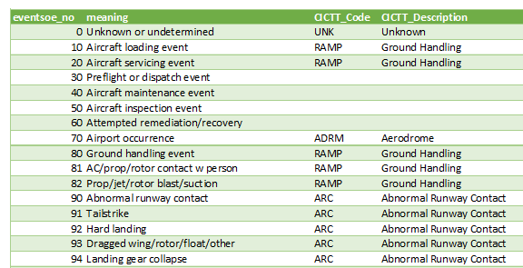
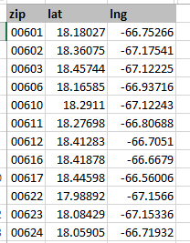

# IO-AVSTATS-DB - Data Update

## 1. **AVIATION OCCURRENCE CATEGORIES**

The data found here was manually transferred from the document [AVIATION OCCURRENCE CATEGORIES - DEFINITIONS AND USAGE NOTES - October 2013 (4.6)](https://www.ntsb.gov/safety/data/Documents/datafiles/OccurrenceCategoryDefinitions.pdf) to an MS Excel file.
The filename of this MS Excel file is expected in the configuration parameter **`download_file_aviation_occurrence_categories_xlsx`** and can be processed with the task **`a_o_c`** (Load aviation occurrence categories into PostgreSQL).  

<kbd></kbd>

## 2. **CICTT_SOE_MAP**

This unofficial csv file from NTSB allows to assign CICTT codes to events via the columns `eventsoe_no` and `defining_ev` of the database table `events_sequence`.
The filename of this csv file is expected in the configuration parameter **`download_file_sequence_of_events_csv`** and can be processed with the task **`l_s_e`** (Load sequence of events data into PostgreSQL).  

<kbd></kbd>

## 3. **geodatos** and **opendatasoft**

The data found here was manually transferred to a JSON file.
The filename of this JSON file is expected in the configuration parameter **`download_file_countries_states_json`** and can be processed with the task **`l_c_s`** (Load country and state data into PostgreSQL).  

      [
        {
          "type": "country",
          "country": "USA",
          "country_name": "United States",
          "dec_latitude": 37.09024,
          "dec_longitude": -95.712891
        },
        {
          "type": "state",
          "country": "USA",
          "state": "AK",
          "state_name": "Alaska",
          "dec_latitude": 63.7431630974,
          "dec_longitude": -151.594035116
        },
        {
          "type": "state",
          "country": "USA",
          "state": "AL",
          "state_name": "Alabama",
          "dec_latitude": 32.7570463396,
          "dec_longitude": -86.844525962
        },
      ...
      ]

## 4. **NTSB**

Data from an **NTSB** MS Access database is loaded into a PostgreSQL database using the following processing logic:

1. at first, it is checked which database tables are present in the MS Access database
2. the found database tables are processed in the following order:

    - **`events`**

    - **`aircraft`**
    - **`dt_events`**
    - **`ntsb_admin`**

    - **`dt_aircraft`**
    - **`engines`**
    - **`events_sequence`**
    - **`findings`**
    - **`flight_crew`**
    - **`injury`**
    - **`narratives`**
    - **`occurrences`**

    - **`dt_flight_crew`**
    - **`flight_time`**

    - **`seq_of_events`**

3. Each of the listed database tables, if present in the MS Access database, will be processed with the following logic:

    3.1 First, all rows and columns are read from the MS Access database.

    3.2 Each of the found rows is processed with the following logic:
   
        3.2.1 Attempt to insert the row into the PostgreSQL database with an
              INSERT operation.

        3.2.2 If an exception UniqueViolation occurs, it tries to update the  
              existing row in the PostgreSQL database - but only if one of  
              the columns from the MS Access database differs from the same 
              column in the PostgreSQL database.
   
    3.3 Finally, the number of selected, inserted and modified rows is logged.

4. An entry is made in the database table **`io_msaccess_file`** for the processed MS Access database.

## 5. **simplemaps**

From the **simplemaps** databases **`United States Cities`** and **`US Zip Codes`** the free MS Excel files are used to maintain the PostgreSQL database table **`io_lat_lng`**.

Database **`United States Cities`**

<kbd></kbd>

Database **`US Zip Codes`**

<kbd></kbd>

Database table **`io_lat_lng`**

<kbd></kbd>

Data from the **simplemaps** flat files **`uscities.xlsx`** and **`uszips.xlsx`** is loaded into a PostgreSQL database using the following processing logic:

1. the existing data with column **`source`** equal to **`simplemaps United States Cities Database`** or **`simplemaps US Zip Codes Database`** are deleted,

2. the database **`United States Cities`** is processed, whereby for each zip code in the column **`zips`** an entry in the PostgreSQL table **`io_lat_lng`** is created (not updated) - as latitude and longitude the corresponding values of the affected city are used, with column **`type`** equal to **`ZIPCODE`** and column **`source`** equal to **`simplemaps United States Cities Database`**,

3. the database **`US Zip Codes`** is processed, whereby for each zip code an entry in the PostgreSQL table **`io_lat_lng`** is created or updated with column **`type`** equal to **`ZIPCODE`** and column **`source`** equal to **`simplemaps US Zip Codes Database`**,

4. the database **`United States Cities`** is processed, whereby for each city an entry in the PostgreSQL table **`io_lat_lng`** is created or updated with column **`type`** equal to **`CITY`** and column **`source`** equal to **`simplemaps United States Cities Database`**,

5. the existing rows of the database table **`io_lat_lng`** with column **`source`** equal to **`average`** are deleted,

6. from the lines of the database table **`io_lat_lng`** of **`type`** **`ZIPCODE`** the average of latitude and longitude per city is determined and this value is stored as latitude and longitude of this city in the database table **`io_lat_lng`** with **`source`** equal to **`average`**.   

## `6`. **United States Zip Codes.org**

Data from the **Zip Codes.org** flat file **`zip_code_database.xls`** is loaded into a PostgreSQL database using the following processing logic:

1. the existing data with column **`source`** equal to **`Zip Codes.org ZIP Code Database`** are deleted,

2. the Excel rows of **`type`** equals **`STANDARD`** and **`country`** equals **`US`** are inserted or updated in the database table **`io_lat_lng`** with column **`source`** equal to **`Zip Codes.org ZIP Code Database`**,

3. the existing rows of the database table **`io_lat_lng`** with column **`source`** equal to **`average`** are deleted,

4. from the lines of the database table **`io_lat_lng`** of **`type`** **`ZIPCODE`** the average of latitude and longitude per city is determined and this value is stored as latitude and longitude of this city in the database table **`io_lat_lng`** with **`source`** equal to **`average`**.   

```
      type   |source                                  |count|
      -------+----------------------------------------+-----+
      CITY   |average                                 |14392|
      CITY   |simplemaps United States Cities Database|30351|
      ZIPCODE|simplemaps United States Cities Database|14235|
      ZIPCODE|simplemaps US Zip Codes Database        |33784|
      ZIPCODE|Zip Codes.org ZIP Code Database         |13367|
```
