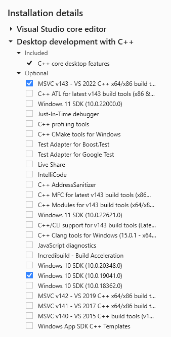

# Release Notes

## Version 1.4.2 

Release Date: 21.02.2023

### 1. New Features

- Indices
    - io_app_ae1982.far_parts  
    - io_app_ae1982.cictt_codes  
    - io_app_ae1982.preventable_events  
    - io_app_ae1982.tll_parameters  
- Role
    - guest

### 2. Modified Features

- Replace USER by ROLE 
- View io_app_ae1982: enhancements and bug fixes

### 3. Deleted Features

- Indices
    - aircraft.far_part  
    - io_pk_ntsb.source  
    - io_pk_ntsb.table_name  
- Maintain the new database table io_pk_ntsb to track and process deletions in NTSB in the IO-AVSTATS-DB database:
    - l_p_k - Load NTSB primary keys into PostgreSQL 
    - p_p_k - Process NTSB data deletions in PostgreSQL 
- Table
    - io_pk_ntsb

### 4. Applied Software (Windows-specific)

**Important**: All software components should be installed in the 64 bit version!

| Software                                                                                                                           | Version   | Remark           | Status  |
|:-----------------------------------------------------------------------------------------------------------------------------------|:----------|:-----------------|---------|
| [7-Zip](https://www.7-zip.org){:target="_blank"}                                                                                   | 22.01     |                  |         |
| [Docker Desktop](https://docs.docker.com/desktop/release-notes/){:target="_blank"}                                                 | 4.16.3    |                  |         |
| [The LLVM Compiler Infrastructure](https://llvm.org){:target="_blank"}                                                             | 15.0.7    | Windows-specific |         |
| [Make for Windows](http://gnuwin32.sourceforge.net/packages/make.htm){:target="_blank"}                                            | 3.81      | Windows-specific |         |
| [MS Access Database Engine 2016 Redistributable](https://www.microsoft.com/en-us/download/details.aspx?id=54920){:target="_blank"} | 8/11/2020 | Windows-specific |         |
| [PostgreSQL](https://www.enterprisedb.com/downloads/postgres-postgresql-downloads){:target="_blank"}                               | 15.2      |                  | upgrade |
| [Python](https://www.python.org/downloads/){:target="_blank"}                                                                      | 3.10.10   |                  | upgrade |
| [RazorSQL](https://razorsql.com/download_win.html){:target="_blank"}                                                               | 10.3.0    |                  |         |
| [Visual Studio Community 2022](https://visualstudio.microsoft.com/vs){:target="_blank"}                                            | 2022      | Windows-specific |         |  

#### 4.1 Minimal Requirements Visual Studio Community 2022

<kbd></kbd>

