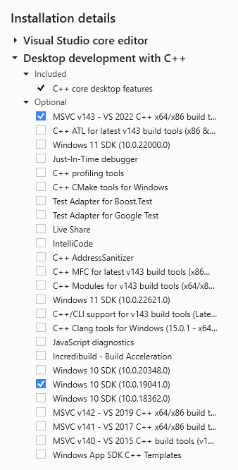

# Release History

## Version 23.01.22

Release Date: 23.01.2023

### 1. Modified Features

- Cleared PANDAS warnings.
- Improved AE1982 performance.

### 2. Applied Software

**Important**: All software components should be installed in the 64 bit version!

| Software                                                                                                                                  | Version   | Remark           | Status |
|:------------------------------------------------------------------------------------------------------------------------------------------|:----------|:-----------------|--------|
| [7-Zip](https://www.7-zip.org){:target="_blank"}                                                                                          | 22.01     |                  |        |
| [Docker Compose](https://docs.docker.com/compose/release-notes/){:target="_blank"}                                                        | 2.15.1    |                  |        |
| [Docker Desktop](https://www.docker.com/products/docker-desktop/){:target="_blank"}                                                       | 4.16.1    |                  |        |
| [IO-AVSTATS-DB](https://github.com/io-aero/io-avstats-db){:target="_blank"}                                                               | 1.3.1     |                  |        |
| [The LLVM Compiler Infrastructure](https://llvm.org){:target="_blank"}                                                                    | 15.0.7    | Windows-specific |        |
| [Make for Windows](http://gnuwin32.sourceforge.net/packages/make.htm){:target="_blank"}                                                   | 3.81      | Windows-specific |        |
| [Microsoft Access Database Engine 2016 Redistributable](https://www.microsoft.com/en-us/download/details.aspx?id=54920){:target="_blank"} | 8/11/2020 | Windows-specific |        |
| [PostgreSQL](https://www.postgresql.org){:target="_blank"}                                                                                | 15.1      |                  |        |
| [Python](https://www.python.org){:target="_blank"}                                                                                        | 3.10.9    |                  |        |
| [RazorSQL](https://razorsql.com/download_win.html){:target="_blank"}                                                                      | 10.2.0    |                  |        |
| [Visual Studio Community 2022](https://visualstudio.microsoft.com/vs){:target="_blank"}                                                   | 2022      | Windows-specific |        |  

#### 2.1 Minimal Requirements Visual Studio Community 2022

<kbd></kbd>

### 3. Processed files

#### 3.1 [NTSB - National Transport Safety Board](https://www.ntsb.gov/Pages/home.aspx){:target="_blank"}

##### Data source `up22JAN.zip`

- Download link: [here](https://data.ntsb.gov/avdata/FileDirectory/DownloadFile?fileID=C%3A%5Cavdata%5Cup22JAN.zip){:target="_blank"}
- Version: 1/22/2023 3:00:31 AM
- Purpose: update of aviation accident data available for public use

## Version 23.01.15

Release Date: 16.01.2023

### 1. Modified Features

- Application aaus1982 renamed to ae1982.
- Application pdus1982 renamed to pd1982.
- Package streamlit_apps renamed to ioavstats.

### 2. Applied Software

**Important**: All software components should be installed in the 64 bit version!

| Software                                                                                                                                  | Version   | Remark           | Status  |
|:------------------------------------------------------------------------------------------------------------------------------------------|:----------|:-----------------|---------|
| [7-Zip](https://www.7-zip.org){:target="_blank"}                                                                                          | 22.01     |                  |         |
| [Docker Compose](https://docs.docker.com/compose/release-notes/){:target="_blank"}                                                        | 2.15.1    |                  |         |
| [Docker Desktop](https://www.docker.com/products/docker-desktop/){:target="_blank"}                                                       | 4.16.1    |                  |         |
| [IO-AVSTATS-DB](https://github.com/io-aero/io-avstats-db){:target="_blank"}                                                               | 1.3.0     |                  |         |
| [The LLVM Compiler Infrastructure](https://llvm.org){:target="_blank"}                                                                    | 15.0.7    | Windows-specific | upgrade |
| [Make for Windows](http://gnuwin32.sourceforge.net/packages/make.htm){:target="_blank"}                                                   | 3.81      | Windows-specific |         |
| [Microsoft Access Database Engine 2016 Redistributable](https://www.microsoft.com/en-us/download/details.aspx?id=54920){:target="_blank"} | 8/11/2020 | Windows-specific |         |
| [PostgreSQL](https://www.postgresql.org){:target="_blank"}                                                                                | 15.1      |                  |         |
| [Python](https://www.python.org){:target="_blank"}                                                                                        | 3.10.9    |                  |         |
| [RazorSQL](https://razorsql.com/download_win.html){:target="_blank"}                                                                      | 10.2.0    |                  |         |
| [Visual Studio Community 2022](https://visualstudio.microsoft.com/vs){:target="_blank"}                                                   | 2022      | Windows-specific |         |  

#### 2.1 Minimal Requirements Visual Studio Community 2022

<kbd></kbd>

### 3. Processed files

#### 3.1 [NTSB - National Transport Safety Board](https://www.ntsb.gov/Pages/home.aspx){:target="_blank"}

##### Data source `up08JAN.zip`

- Download link: [here](https://data.ntsb.gov/avdata/FileDirectory/DownloadFile?fileID=C%3A%5Cavdata%5Cup15JAN.zip){:target="_blank"}
- Version: 	1/15/2023 3:00:20 AM
- Purpose: update of aviation accident data available for public use

## Version 23.01.08

Release Date: 14.01.2023

### 1. New Features

- Pie charts-

### 2. Modified Features

- Bar charts.

### 3. Applied Software

**Important**: All software components should be installed in the 64 bit version!

| Software                                                                                                                                  | Version   | Remark           | Status  |
|:------------------------------------------------------------------------------------------------------------------------------------------|:----------|:-----------------|---------|
| [7-Zip](https://www.7-zip.org){:target="_blank"}                                                                                          | 22.01     |                  |         |
| [Docker Compose](https://docs.docker.com/compose/release-notes/){:target="_blank"}                                                        | 2.15.1    |                  | Upgrade |
| [Docker Desktop](https://www.docker.com/products/docker-desktop/){:target="_blank"}                                                       | 4.16.1    |                  |         |
| [IO-AVSTATS-DB](https://github.com/io-aero/io-avstats-db){:target="_blank"}                                                               | 1.2.6     |                  | Upgrade |
| [The LLVM Compiler Infrastructure](https://llvm.org){:target="_blank"}                                                                    | 15.0.6    | Windows-specific |         |
| [Make for Windows](http://gnuwin32.sourceforge.net/packages/make.htm){:target="_blank"}                                                   | 3.81      | Windows-specific |         |
| [Microsoft Access Database Engine 2016 Redistributable](https://www.microsoft.com/en-us/download/details.aspx?id=54920){:target="_blank"} | 8/11/2020 | Windows-specific |         |
| [PostgreSQL](https://www.postgresql.org){:target="_blank"}                                                                                | 15.1      |                  |         |
| [Python](https://www.python.org){:target="_blank"}                                                                                        | 3.10.9    |                  |         |
| [RazorSQL](https://razorsql.com/download_win.html){:target="_blank"}                                                                      | 10.2.0    |                  |         |
| [Visual Studio Community 2022](https://visualstudio.microsoft.com/vs){:target="_blank"}                                                   | 2022      | Windows-specific |         |  

#### 3.1 Minimal Requirements Visual Studio Community 2022

<kbd></kbd>

### 4. Processed files

#### 4.1 [NTSB - National Transport Safety Board](https://www.ntsb.gov/Pages/home.aspx){:target="_blank"}

##### Data source `up08JAN.zip`

- Download link: [here](https://data.ntsb.gov/avdata/FileDirectory/DownloadFile?fileID=C%3A%5Cavdata%5Cup08JAN.zip){:target="_blank"}
- Version: 	1/8/2023 3:00:13 AM
- Purpose: update of aviation accident data available for public use

## Version 23.01.01

Release Date: 03.01.2023

### 2. Modified Features

- Introducing download buttons
- Introducing multi select controls
- Optional data usage until 1982

### 3. Applied Software

**Important**: All software components should be installed in the 64 bit version!

| Software                                                                                                                                  | Version   | Remark           | Status |
|:------------------------------------------------------------------------------------------------------------------------------------------|:----------|:-----------------|--------|
| [7-Zip](https://www.7-zip.org){:target="_blank"}                                                                                          | 22.01     |                  |        |
| [Docker Compose](https://docs.docker.com/compose/release-notes/){:target="_blank"}                                                        | 2.14.2    |                  |        |
| [Docker Desktop](https://www.docker.com/products/docker-desktop/){:target="_blank"}                                                       | 4.15.0    |                  |        |
| [IO-AVSTATS-DB](https://github.com/io-aero/io-avstats-db){:target="_blank"}                                                               | 1.2.3     |                  |        |
| [The LLVM Compiler Infrastructure](https://llvm.org){:target="_blank"}                                                                    | 15.0.6    | Windows-specific |        |
| [Make for Windows](http://gnuwin32.sourceforge.net/packages/make.htm){:target="_blank"}                                                   | 3.81      | Windows-specific |        |
| [Microsoft Access Database Engine 2016 Redistributable](https://www.microsoft.com/en-us/download/details.aspx?id=54920){:target="_blank"} | 8/11/2020 | Windows-specific |        |
| [PostgreSQL](https://www.postgresql.org){:target="_blank"}                                                                                | 15.1      |                  |        |
| [Python](https://www.python.org){:target="_blank"}                                                                                        | 3.10.9    |                  |        |
| [RazorSQL](https://razorsql.com/download_win.html){:target="_blank"}                                                                      | 10.2.0    |                  |        |
| [Visual Studio Community 2022](https://visualstudio.microsoft.com/vs){:target="_blank"}                                                   | 2022      | Windows-specific |        |  

#### 3.1 Minimal Requirements Visual Studio Community 2022

<kbd></kbd>

### 4. Processed files

#### 4.1 [NTSB - National Transport Safety Board](https://www.ntsb.gov/Pages/home.aspx){:target="_blank"}

##### Data source `up01JAN.zip`

- Download link: [here](https://data.ntsb.gov/avdata/FileDirectory/DownloadFile?fileID=C%3A%5Cavdata%5Cup01KJAN.zip){:target="_blank"}
- Version: 	1/1/2023 3:00:19 AM
- Purpose: update of aviation accident data available for public use

## Version 22.12.22 

Release Date: 23.12.2022

### 1. New Features

- New documentation: How to ...

### 2. Modified Features

- Documentation: minor corrections 

### 3. Applied Software

**Important**: All software components should be installed in the 64 bit version!

| Software                                                                                                                                                                  | Version   | Remark           | Status  |
|:--------------------------------------------------------------------------------------------------------------------------------------------------------------------------|:----------|:-----------------|---------|
| [7-Zip](https://www.7-zip.org){:target="_blank"}                                                                                                                          | 22.01     |                  |         |
| [Docker Compose](https://docs.docker.com/compose/release-notes/){:target="_blank"}                                                                                        | 2.14.2    |                  | upgrade |
| [Docker Desktop](https://www.docker.com/products/docker-desktop/){:target="_blank"}                                                                                       | 4.15.0    |                  |         |
| [IO-AVSTATS-DB](https://github.com/io-aero/io-avstats-db){:target="_blank"}                                                                                               | 1.2.2     |                  |         |
| [The LLVM Compiler Infrastructure](https://llvm.org){:target="_blank"}                                                                                                    | 15.0.6    | Windows-specific | upgrade |
| [Make for Windows](http://gnuwin32.sourceforge.net/packages/make.htm){:target="_blank"}                                                                                   | 3.81      | Windows-specific |         |
| [Microsoft Access Database Engine 2016 Redistributable](https://www.microsoft.com/en-us/download/details.aspx?id=54920){:target="_blank"}                                 | 8/11/2020 | Windows-specific |         |
| [PostgreSQL](https://www.postgresql.org){:target="_blank"}                                                                                                                | 15.1      |                  |         |
| [Python](https://www.python.org){:target="_blank"}                                                                                                                        | 3.10.9    |                  |         |
| [RazorSQL](https://razorsql.com/index.html?adid=jq15&gclid=CjwKCAjwtp2bBhAGEiwAOZZTuNpdSvtB0l2gVp3Pc9ON8lOz4wRlVJxKPndX2tOatTlrTijCLVC6BRoCSqUQAvD_BwE){:target="_blank"} | 10.2.0    |                  |         |
| [Visual Studio Community 2022](https://visualstudio.microsoft.com/vs){:target="_blank"}                                                                                   | 2022      | Windows-specific |         |  

#### 3.1 Minimal Requirements Visual Studio Community 2022

<kbd></kbd>

### 4. Processed files

#### 4.1 [NTSB - National Transport Safety Board](https://www.ntsb.gov/Pages/home.aspx){:target="_blank"}

##### Data source `up22DEC.zip`

- Download link: [here](https://data.ntsb.gov/avdata/FileDirectory/DownloadFile?fileID=C%3A%5Cavdata%5Cup22DEC.zip){:target="_blank"}
- Version: 12/22/2022 3:00:46 AM
- Purpose: update of aviation accident data available for public use

## Version 22.12.15 

Release Date: 18.12.2022

### 1. New Features

- New documentation: How to add NTSB accident files

### 2. Modified Features

- Application fae1982: 
  - extended filter options.

### 3. Applied Software (Windows-specific)

**Important**: All software components should be installed in the 64 bit version!

| Software                                                                                                                                                                  | Version   | Remark | Status |
|:--------------------------------------------------------------------------------------------------------------------------------------------------------------------------|:----------|:-------|--------|
| [7-Zip](https://www.7-zip.org){:target="_blank"}                                                                                                                          | 22.01     |        | new    |
| [Docker Compose](https://docs.docker.com/compose/release-notes/){:target="_blank"}                                                                                        | 2.14.0    |        | new    |
| [Docker Desktop](https://www.docker.com/products/docker-desktop/){:target="_blank"}                                                                                       | 4.15.0    |        |        |
| [IO-AVSTATS-DB](https://github.com/io-aero/io-avstats-db){:target="_blank"}                                                                                               | 1.2.1     |        |        |
| [The LLVM Compiler Infrastructure](https://llvm.org){:target="_blank"}                                                                                                    | 15.0.4    |        |        |
| [Make for Windows](http://gnuwin32.sourceforge.net/packages/make.htm){:target="_blank"}                                                                                   | 3.81      |        |        |
| [Microsoft Access Database Engine 2016 Redistributable](https://www.microsoft.com/en-us/download/details.aspx?id=54920){:target="_blank"}                                 | 8/11/2020 |        |        |
| [PostgreSQL](https://www.postgresql.org){:target="_blank"}                                                                                                                | 15.1      |        |        |
| [Python](https://www.python.org){:target="_blank"}                                                                                                                        | 3.10.9    |        |        |
| [RazorSQL](https://razorsql.com/index.html?adid=jq15&gclid=CjwKCAjwtp2bBhAGEiwAOZZTuNpdSvtB0l2gVp3Pc9ON8lOz4wRlVJxKPndX2tOatTlrTijCLVC6BRoCSqUQAvD_BwE){:target="_blank"} | 10.2.0    |        |        |
| [Visual Studio Community 2022](https://visualstudio.microsoft.com/vs){:target="_blank"}                                                                                   | 2022      |        |        |  

#### 3.1 Minimal Requirements Visual Studio Community 2022

<kbd></kbd>

### 4. Processed files

#### 4.1 [NTSB - National Transport Safety Board](https://www.ntsb.gov/Pages/home.aspx){:target="_blank"}

##### Data source `up15DEC.zip`

- Download link: [here](https://data.ntsb.gov/avdata/FileDirectory/DownloadFile?fileID=C%3A%5Cavdata%5Cup15DEC.zip){:target="_blank"}
- Version: 12/15/2022 3:00:31 AM
- Purpose: update of aviation accident data available for public use

## Version 22.12.08 

Release Date: 12.12.2022

### 1. New Features

- Docker Compose usage
- Making available in AWS
- Streamlit application: fae1982 - Fatal Aircraft Accidents in the US since 1982
- Streamlit application: pd1982 - Profiling Data for the US since 1982

### 2. Applied Software (Windows-specific)

**Important**: All software components should be installed in the 64 bit version!

| Software                                                                                                                                                                  | Version   | Remark | Status |
|:--------------------------------------------------------------------------------------------------------------------------------------------------------------------------|:----------|:-------|--------|
| [Docker Desktop](https://www.docker.com/products/docker-desktop/){:target="_blank"}                                                                                       | 4.15.0    |        |        |
| [IO-AVSTATS-DB](https://github.com/io-aero/io-avstats-db){:target="_blank"}                                                                                               | 1.1.1     |        |        |
| [The LLVM Compiler Infrastructure](https://llvm.org){:target="_blank"}                                                                                                    | 15.0.4    |        |        |
| [Make for Windows](http://gnuwin32.sourceforge.net/packages/make.htm){:target="_blank"}                                                                                   | 3.81      |        |        |
| [Microsoft Access Database Engine 2016 Redistributable](https://www.microsoft.com/en-us/download/details.aspx?id=54920){:target="_blank"}                                 | 8/11/2020 |        |        |
| [PostgreSQL](https://www.postgresql.org){:target="_blank"}                                                                                                                | 15.1      |        |        |
| [Python](https://www.python.org){:target="_blank"}                                                                                                                        | 3.10.9    |        |        |
| [RazorSQL](https://razorsql.com/index.html?adid=jq15&gclid=CjwKCAjwtp2bBhAGEiwAOZZTuNpdSvtB0l2gVp3Pc9ON8lOz4wRlVJxKPndX2tOatTlrTijCLVC6BRoCSqUQAvD_BwE){:target="_blank"} | 10.2.0    |        |        |
| [Visual Studio Community 2022](https://visualstudio.microsoft.com/vs){:target="_blank"}                                                                                   | 2022      |        |        |  

#### 2.1 Minimal Requirements Visual Studio Community 2022

<kbd></kbd>

### 3. Processed files

#### 3.1 [geodatos - Information and maps of the world](https://www.geodatos.net/en){:target="_blank"}

- Link: [here](https://www.geodatos.net/en/coordinates/united-states){:target="_blank"}
- Version: n/a
- Purpose: latitude and longitude of the USA

#### 3.2 [NTSB - National Transport Safety Board](https://www.ntsb.gov/Pages/home.aspx){:target="_blank"}

##### Data source `up01NOV.zip`

- Download link: [here](https://data.ntsb.gov/avdata/FileDirectory/DownloadFile?fileID=C%3A%5Cavdata%5Cup01NOV.zip){:target="_blank"}
- Version: 11/01/2022 3:00:31 AM
- Purpose: update of aviation accident data available for public use

##### Data source `up08NOV.zip`

- Download link: [here](https://data.ntsb.gov/avdata/FileDirectory/DownloadFile?fileID=C%3A%5Cavdata%5Cup08NOV.zip){:target="_blank"}
- Version: 	11/08/2022 3:00:51 AM
- Purpose: update of aviation accident data available for public use

##### Data source `up15NOV.zip`

- Download link: [here](https://data.ntsb.gov/avdata/FileDirectory/DownloadFile?fileID=C%3A%5Cavdata%5Cup15NOV.zip){:target="_blank"}
- Version: 11/15/2022 3:00:15 AM
- Purpose: update of aviation accident data available for public use

##### Data source `up22NOV.zip`

- Download link: [here](https://data.ntsb.gov/avdata/FileDirectory/DownloadFile?fileID=C%3A%5Cavdata%5Cup22NOV.zip){:target="_blank"}
- Version: 11/22/2022 3:00:14 AM
- Purpose: update of aviation accident data available for public use

##### Data source `up01DEC.zip`

- Download link: [here](https://data.ntsb.gov/avdata/FileDirectory/DownloadFile?fileID=C%3A%5Cavdata%5Cup01DEC.zip){:target="_blank"}
- Version: 12/01/2022 3:00:13 AM
- Purpose: update of aviation accident data available for public use

##### Data source `up08DEC.zip`

- Download link: [here](https://data.ntsb.gov/avdata/FileDirectory/DownloadFile?fileID=C%3A%5Cavdata%5Cup08DEC.zip){:target="_blank"}
- Version: 	12/08/2022 3:00:40 AM
- Purpose: update of aviation accident data available for public use

##### Data source `avall.zip`

- Download link: [here](https://data.ntsb.gov/avdata/FileDirectory/DownloadFile?fileID=C%3A%5Cavdata%5Cavall.zip){:target="_blank"}
- Version: 11/1/2022 6:49:29 AM
- Purpose: aviation accident data available for public use from January 1, 2008, to November 1, 2022

##### Data source `Pre2008.zip`

- Download link: [here](https://data.ntsb.gov/avdata/FileDirectory/DownloadFile?fileID=C%3A%5Cavdata%5CPre2008.zip){:target="_blank"}
- Version: 9/30/2020 12:51:56 PM
- Purpose: aviation accident data available for public use before January 1, 2008

#### 3.3 [opendatasoft](https://www.opendatasoft.com/?hsLang=en){:target="_blank"}

##### Data source `US State Boundaries`

- Download link: [here](https://public.opendatasoft.com/explore/dataset/us-state-boundaries/export/){:target="_blank"}
- Version: June 27, 2017 3:41 PM
- Purpose: US States and their latitude and longitude

#### 3.4 [simplemaps - Interactive Maps and Data](https://simplemaps.com/){:target="_blank"}

##### Data source `United States Cities Database`

- Download link: [here](https://simplemaps.com/data/us-cities){:target="_blank"}
- Version: v1.75 - Basic
- Purpose: US cities and their latitude and longitude with emphasis on accurate latitudes and longitudes

##### Data source `US Zip Codes Database`

- Download link: [here](https://simplemaps.com/data/us-zips){:target="_blank"}
- Version: v1.81 - Basic
- Purpose: US postal codes and their latitude and longitude with emphasis on accurate latitudes and longitudes

#### 3.5 [United States Zip Codes.org](https://www.unitedstateszipcodes.org){:target="_blank"}

##### Data source `ZIP Code Database`

- Download link: [here](https://www.unitedstateszipcodes.org/zip-code-database/){:target="_blank"}
- Version: Updated for 2022 - Personal Free
- Purpose: US zip codes and their estimated latitude and longitude with emphasis on complete zip codes
